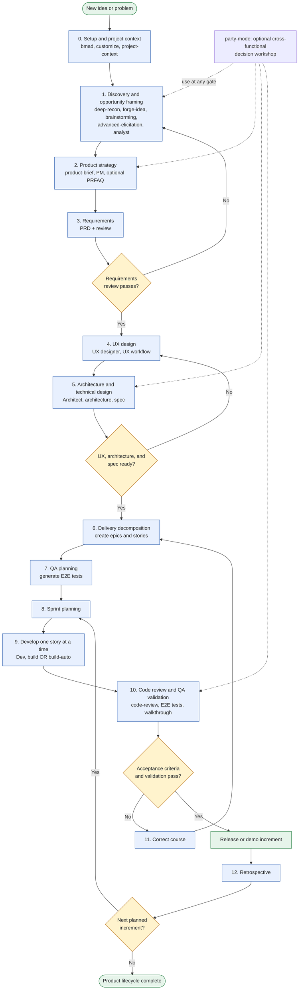

# BMAD Skills by Role and Development Lifecycle

This document organizes the BMAD skills configured in this repository by role and by a practical software development lifecycle. BMAD is iterative, so teams may return to earlier phases after reviews, validation, or changes.

## Development Lifecycle

| Phase | Role / Group | BMAD skills | Typical outcome |
|---:|---|---|---|
| 0 | **BMAD setup and orchestration** | [`bmad`](planning/.agents/skills/bmad), [`bmad-customize`](planning/.agents/skills/bmad-customize), [`bmad-project-context`](planning/.agents/skills/bmad-project-context) | Configure BMAD and establish project context |
| 1 | **Product strategy / Discovery** | [`bmad-deep-recon`](planning/.agents/skills/bmad-deep-recon), [`bmad-forge-idea`](planning/.agents/skills/bmad-forge-idea), [`bmad-brainstorming`](planning/.agents/skills/bmad-brainstorming), [`bmad-advanced-elicitation`](planning/.agents/skills/bmad-advanced-elicitation), [`bmad-agent-analyst`](planning/.agents/skills/bmad-agent-analyst) | Understand the problem, users, market, constraints, and opportunity |
| 2 | **Product management** | [`bmad-agent-pm`](planning/.agents/skills/bmad-agent-pm), [`bmad-product-brief`](planning/.agents/skills/bmad-product-brief), [`bmad-prfaq`](planning/.agents/skills/bmad-prfaq) | Define product vision, customer value, goals, and success criteria |
| 3 | **Requirements / Product analysis** | [`bmad-prd`](planning/.agents/skills/bmad-prd), [`bmad-review`](planning/.agents/skills/bmad-review) | Produce and validate the product requirements document |
| 4 | **UX / Design** | [`bmad-agent-ux-designer`](planning/.agents/skills/bmad-agent-ux-designer), [`bmad-ux`](planning/.agents/skills/bmad-ux) | Define user flows, interaction design, usability expectations, and UX requirements |
| 5 | **Architecture / Technical design** | [`bmad-agent-architect`](planning/.agents/skills/bmad-agent-architect), [`bmad-architecture`](planning/.agents/skills/bmad-architecture), [`bmad-spec`](planning/.agents/skills/bmad-spec) | Decide system structure, technologies, interfaces, constraints, and technical approach |
| 6 | **Delivery decomposition** | [`bmad-create-epics-and-stories`](planning/.agents/skills/bmad-create-epics-and-stories) | Convert product, UX, and technical requirements into epics and user stories |
| 7 | **QA planning** | [`bmad-qa-generate-e2e-tests`](planning/.agents/skills/bmad-qa-generate-e2e-tests) | Define end-to-end scenarios and acceptance coverage before implementation |
| 8 | **Agile planning** | [`bmad-sprint-planning`](planning/.agents/skills/bmad-sprint-planning) | Select sprint scope, sequence work, and identify dependencies |
| 9 | **Software development** | [`bmad-agent-dev`](planning/.agents/skills/bmad-agent-dev), [`bmad-build`](planning/.agents/skills/bmad-build), [`bmad-build-auto`](planning/.agents/skills/bmad-build-auto) | Implement stories, integrate components, and complete the planned increment |
| 10 | **Code quality / QA validation** | [`bmad-code-review`](planning/.agents/skills/bmad-code-review), [`bmad-qa-generate-e2e-tests`](planning/.agents/skills/bmad-qa-generate-e2e-tests), [`bmad-walkthrough`](planning/.agents/skills/bmad-walkthrough) | Review implementation, execute or refine E2E validation, and demonstrate the feature |
| 11 | **Change management** | [`bmad-correct-course`](planning/.agents/skills/bmad-correct-course) | Re-plan when requirements, priorities, risks, or implementation assumptions change |
| 12 | **Retrospective / Continuous improvement** | [`bmad-retrospective`](planning/.agents/skills/bmad-retrospective) | Capture lessons learned and improve the next sprint or lifecycle iteration |

## Cross-Functional Skill

| Role | Skill | When to use it |
|---|---|---|
| **All roles / Multi-agent collaboration** | [`bmad-party-mode`](planning/.agents/skills/bmad-party-mode) | Bring multiple BMAD roles together to debate decisions, review artifacts, or solve cross-functional problems |

## Simplified Execution Flow

Loop-back paths: a failed requirements review returns to Discovery; UX/architecture not ready loops back to UX design; a failed acceptance check runs Correct Course before returning to Delivery decomposition; after a Retrospective, the next increment returns to Sprint planning (Setup runs once per project, not per iteration).

## Roles and Workflows

Roles such as Analyst, PM, Architect, UX Designer, Developer, and QA are personas. Skills such as PRD, Architecture, Build, Code Review, and Retrospective are the workflows those roles use.
