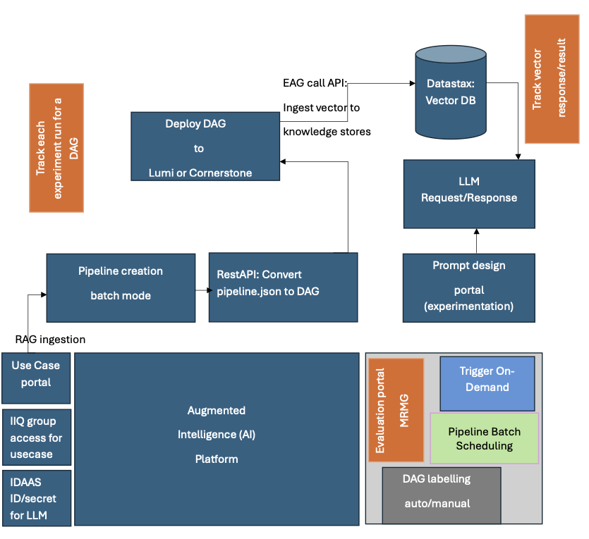
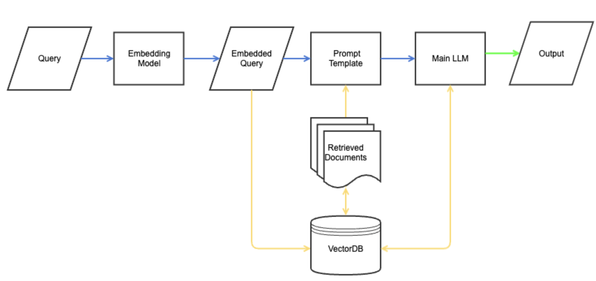
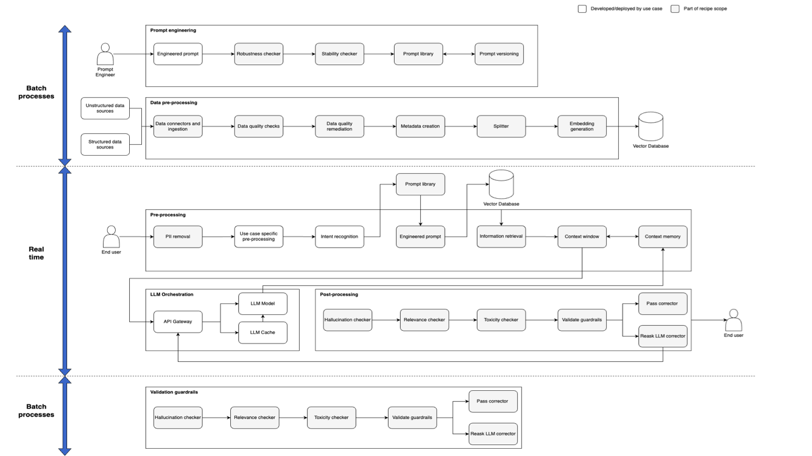
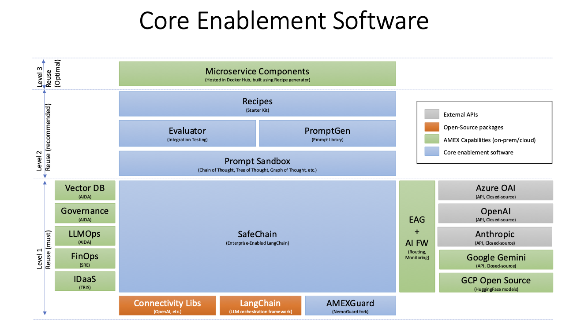

This page describes approved enterprise mediation platforms for TECH06.61 Integration standard.

- - -

# AI/ML Prescriptive ADR
   
|Choose One [X]                                          | ADR Type    |   Description  | 
| -------------------------------------------------------| ----------  | -----------------|
|                                                        |architecture |Describes a solution that a team proposes about the architecture of an Initiative/Platform, or to be applied across the Enterprise. This can also set a precedent in that future problems having the same patterns might be able to leverage the same solutions.   |
|                                                        |buildvsbuy  |Describes a choice that a team proposes on the implementation of a building block (i.e. Buy, Build, Reuse)   |
| X                                                      | prescriptive |Describes various prescriptions that a team proposes based on certain patterns. In most cases, prescriptions are expressed in the form of a decision tree.   |

# ADR Status History

|Author                                                  | Status    |   Date           | Deciders |
| -------------------------------------------------------| ----------| -----------------|----------|
| Manjusha Ravindranath, Saugata Chatterjee, Mike Zoratti |Proposed  | January 13 2025  |N/A            |
| N/A                                                     |  |   |Amol Salunkhe  |
| N/A                                                     |  |   |Andras Ferenczi|
| N/A                                                     |  |   |Mike Zoratti   |

## Context and Problem Statement

This is an ADR encapsulating the "routing logic" for when a foundational technology should be used by a particular team. In order to make the above determination as well as to identify overlaps and reduce redundancies in future development of these tools, an assessment on the Generative AI capabilities being offered by the tools and their implementations was conducted.
 
## Decision Drivers

In order to determine an initial recommendation, the two tools were evaluated based on the following criteria:

| Criteria                     | Description                                                                                                                                                                               |
| ---------------------------- | ----------------------------------------------------------------------------------------------------------------------------------------------------------------------------------------- |
| Business - Fit to Purpose    | Items concerning primary functionalities for the solution.                                                                                                                                |
| Architecture / Modernization | Items on code quality and extensibility – a necessary consideration in an enterprise offering.                                                                                            |
| Future Proofing              | Concerns on expanding the chosen solution in future development iterations.                                                                                                               |
| Configurability              | Solutions will need to provide multiple functionalities to client applications and thus should be configuration-driven to simplify interactions.                                          |
| Observability                | These solutions would be leveraged by other client applications and will be deployed for enterprise use it is necessary to maintain observability throughout executions of their scripts. |

## Options

Option 1: AIDA 

AIDA is an enterprise AI/ML platform that provides a seamless unified MLOPS journey by enabling AI/ML users to fully and responsibly leverage AXP data and compute assets to generate actionable real time decision insights for the enterprise. AIDA uses Airflow operators to create batch workflows for OLAP (Analytical and Data Processing) systems.

Core Capabilities:

Basic RAG FeatureOps - Augmented Intelligence (AI) platform is a platform for development and maintenance of GenAI usecases, enabling basic RAG ingestion and retrieval, rapid experimentation, with a prompt design capability for experimentation, pipeline creation capability and evaluation and labelling capabilities. 

 

More information about capabilities are to be found in the GitHub link provided in the code and documentation section.

Option 2: Safechain Framework

Generative AI (GenAI) Knowledge Retrieval Safechain Framework, is a comprehensive guide to streamline the development of knowledge retrieval applications. 

Core Capabilities:

A 'recipe' within this framework refers to a common set of procedures and architectural components that facilitate the creation and deployment of Generative AI services.  The purpose of recipes is to detail the essential ingredients — components, tools, and methodologies — required to deploy effective GenAI applications in line with standard organizational guidelines mainly for realtime services. Recipes Uses Python Fast API services and safe chain to create realtime microservice components for OLTP (Transaction Processing) systems.

 

More information about capabilities are to be found in the GitHub link provided in the code and documentation section.

A usecase can decide to use the ingestion process for an application in a batch fashion bootstrapped using AI platform pipeline studio, while inference-time interaction may be facilitated using a microservice bootstrapped using the Recipes framework.

 

Option 3: ConfigML-Model-Training Framework

The ConfigML Model Framework is designed to revolutionize the way AI and ML models are trained, fine-tuned, and retrained by providing an intuitive, configuration-based framework that empowers developers and data scientists. The framework caters to data science teams within the organisation requiring data and AI/ML model observability frameworks. It offers a structured approach to detect the drift in data and model, whether it be unstructured (textual) or tabular data, enhancing productivity and efficiency. These are reusable and scalable across use-case within Digital workplace and can also be shared at Amex enterprise level as best practices.

Core Capabilities:

The ConfigML-Model framework is designed to simplify the training and fine-tuning of AI/ML models, specifically focusing on BERT models for classification and NER (Named Entity Recognition). Additionally, it seamlessly integrates with Optuna and Ray Tune for hyperparameter optimization and MLflow for experiment tracking and artifact storage.

Option 4: Convo Chef

Convo-Chef is a configuration driven, big data enabled, plug & play Natural Language Processing (NLP) framework for text pre-processing and rule-based NLP. It bridges the gap between unstructured text data and actionable insights, ensuring that businesses can thrive in today's data-driven world. With unparalleled flexibility, efficiency, and context-aware problem-solving capabilities, this framework is aimed to help solve or assist in enterprise Amex text based problems. 

Core Capabilities:

Convo Chef prepares text data for NLP tasks, streamlining processes like data unification, cleansing, and tagging. It optimises text for better NLP algorithm performance. Purpose of Convo Chef is to transform unstructured text data into a strategic asset, empowering the enterprise to leverage it for competitive advantages.

Option 5: One Assist

One Assist provides technical support to our colleagues with best-in-class customer service in the form of self-help knowledge based articles and other AI-powered solutions. It simplifies Colleague Service Experience with focus on First Contact Resolution & Intelligent Servicing and creates solutions with Artificial Intelligence and Machine Learning.

Core Capabilities:

The One Assist Framework is a comprehensive chatbot development solution designed to empower teams in creating advanced conversational agents with minimal coding effort. It offers a unified development experience by enabling developers to integrate and manage modular components that are independent, scalable, and secure.With a focus on flexibility, the framework supports highly customizable user experiences while ensuring consistent application performance. Compatible with both web and Slack platforms. Framework supports both traditional models and generative AI (GenAI) technologies for developing intelligent conversational chatbots.

Option 6: Finance Insight Assistant

Core Capabilities:

Create an accessible interface for driving data finding, transformation, consolidation, and extraction from Lumi data lake to accelerate the speed to report / output delivery, increase productivity, standardize our approach, and reduce risk of manual errors.

Option 7: Investor Relations Assistant

Core Capabilities:

Accelerate the preparation of senior management meeting materials to increase IR team capacity to meet with investors (e.g., public appearances as well as private investor meetings, etc.) Allows users to generate first-draft of senior management investor engagement documentation that consists of Q&A pairs and investor profiles. Investor Relations Assistant will be powered by LLM and Embedding models that simulates human conversation to solve repetitive tasks of generating summary of relevant sections from multiple source documents, create question answer pairs from given corpus of documents and a user query. The Existing Services are IR Backend Services, Information retrieval, Prompt Engine, Response formatting/Template fitting and Databases (Postgres/PG Vector),Semantic Search and RAG (LLM/GPT) etc.

Option 8: Ask Amex

Core Capabilities:

Ask Amex Messaging a middleware for message routing and decision making, creating conversation id, saving chat history, management between card member and the customer care professional.

Option 9: One Find AI Powered Cognitive Search

Core Capabilities:

One Find AI Powered Cognitive Search is a AI/ML platform that provides cognitive search interface with self service BI. 

Option 10: AI Services

Core Capabilities:

Reusable services and framework for document classification using CNN, document processing using CV and business rules and language translation - Self servicing Chatbot framework "Catalyzer".

## Code and documentation

The source code and documentation details for the options are as follows:

| Name      | Source Code and Documentation                                                                                                                                       | Contact     |
| --------- | -------------------------------------------------------------------------------------------------------------------------------------------------------------       | ----------- |
| AIDA |              [Code](https://github.aexp.com/amex-eng/aida-playbook), [Documentation](https://github.aexp.com/pages/amex-eng/genai-rag/) | Yan Yang    |                              
| Safechain Framework|[Code](https://github.aexp.com/amex-eng/recipes_cli), [Documentation](https://github.aexp.com/pages/amex-eng/genai-frameworks-docs/)                                 | Allwyn Ponnudurai   |
|ConfigML-Model-Observability Framework|[Code and Documentation](https://github.aexp.com/amex-eng/configmL-model-training-framework)|Avik Bhattacharjee|
|Convo Chef|[Code and Documentation](https://github.aexp.com/amex-eng/convo-chef-playbook)|Abhishek Jain|
|One Assist|[Code and Documentation](https://github.aexp.com/amex-eng/oneassist-framework )|Avik Bhattacharjee|
|Finance Insight Assistant|[Code and Documentation](https://https://github.aexp.com/amex-eng/FinanceInsightAssistantPlayBook )|Yogesh Chaturvedi|
|Investor Relations Assistant|[Code and Documentation](https://github.aexp.com/amex-eng/InvestorRelationsPlaybook )|Yogesh Chaturvedi|
|Ask Amex |Code and Documentation|Intake in-progress |
|One Find AI Powered Cognitive Search |Code and Documentation|Intake in-progress |
|AI Services|Code and Documentation|Rahul Menon|

## Decision Outcome

Application usage of the above options by a Generative AI application development team will be conditional on their particular requirements, namely, the system type, composition of the team, software environment of the application, and non-functional characteristics of the application (primarily the execution mode) and application types supported. These will be the parameters by which a team should determine which implementation to be used for their Generative AI application. The prescription table provides a summary overview of the findings.

## Prescription

Prescription for Generative AI application development team:

| Options                 |  System Type                                                                       |Audience| Software Environment |Non-functional characteristics|Application Types Supported|
| ----------------------  | -----------------------------------------------------------------------------------|--------|----------------------------------------------|-----------------------------------------|--------------------------------|
|AIDA               | Online Analytical Processing (OLAP)                                                       |Data Science Teams |No code, Low code |Batch|RAG workflows, other RAG adjacent workflows(vector DB maintenance, embeddings updates, etc.), GenAI batch workflows|
|Safechain Framework       | Online Transaction Processing (OLTP)                                               |SWE Developers |Code |Real-time|RAG Applications, other GenAI Microservices|
|ConfigML-Model-Observability Framework|Online Analytical Processing (OLAP)                                     |Data Science Teams|Low Code    |Batch|AI/ML and Gen AI initiatives|
|Convo Chef              |Online Analytical Processing (OLAP)                                                   ||Low code      |Batch |Text data preparation, rule based text analysis|
|One Assist              |  Omni-Channel support, Web and slack platforms                                                           | |  Low-to-no-code     ||Both traditional models and generative AI (GenAI) technologies for developing intelligent conversational chatbots.|
|Finance Insight Assistant              |  Online Analytical Processing (OLAP)                                |  | Low-to-no-code      |||
|Investor Relations Assistant           |  Online Analytical Processing (OLAP)                                | |  Low-to-no-code      |||
|Ask Amex                |  Intake in-progress                                                                | |     |||
|One Find AI Powered Cognitive Search                 |  Intake in-progress                                                                | |     |||
|AI Services              |  Intake in-progress                                                                |Data Science Teams|      |||

## More Information

Reference Materials: [aida-safechain.pdf](../reference-materials/aida-safechain.pdf)

Foundational technologies: [Foundational technologies](https://architecture1.aexp.com/foundational-technologies)

