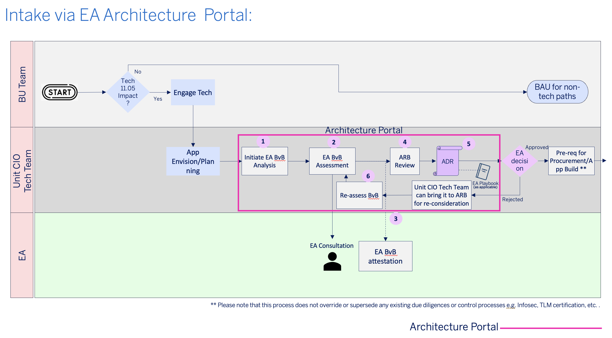
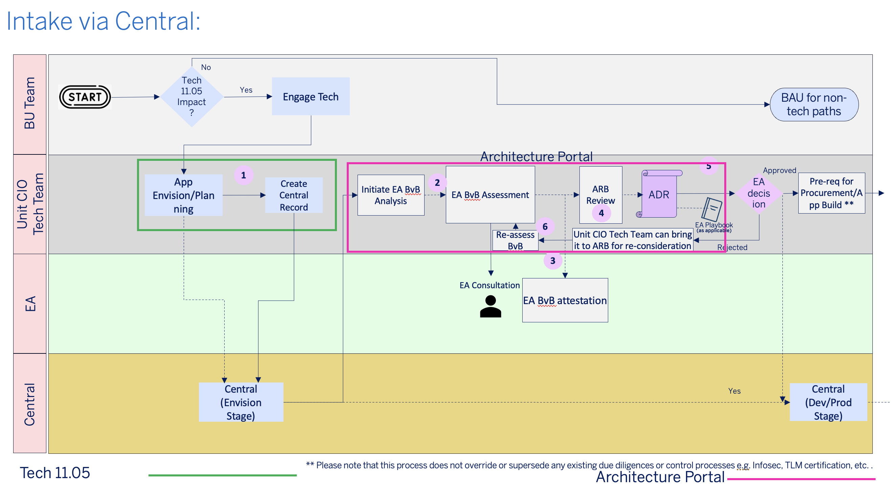
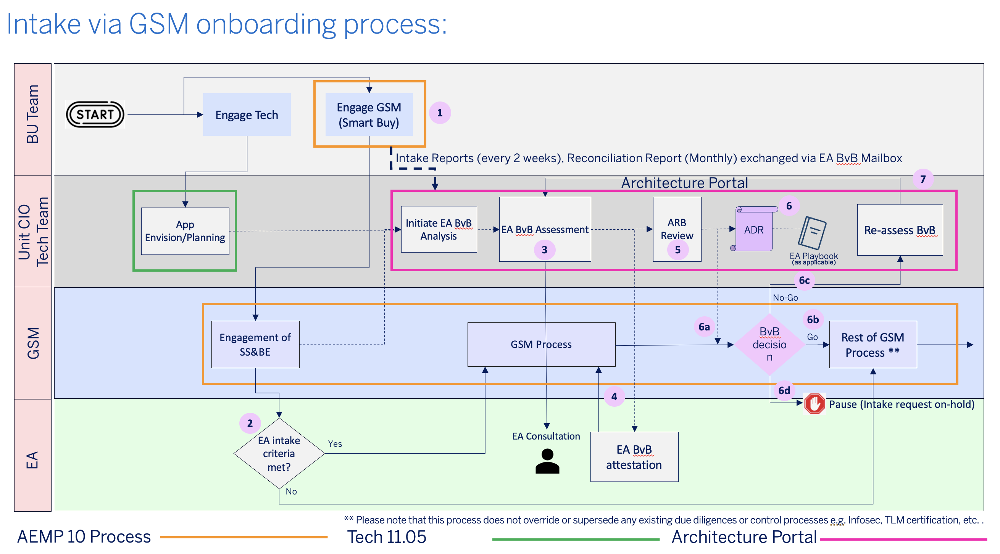

# Enterprise Architecture Build-vs-Buy Framework Guide

**Version History**

| **Version** | **Description**          | **Authors**                        | **Date**    |
|-------------|--------------------------|------------------------------------|-------------|
| 0.1         | Initial Draft            | Srinidhi K V Prasad                | 14-Jan-2025 |
| 0.2         | Internal Review feedback | Srinidhi K V Prasad, Frank Donnell | 17-Jan-2025 |
| 0.3         | Minor verbiage changes   | Srinidhi K V Prasad                | 21-Jan-2025 |
| 0.4         | Updated BURR metrics     | Srinidhi K V Prasad                | 05-Mar-2025 |
| 0.5         | Minor verbiage updates to criteria and flow diagrams; Replaced AEMP 30 references with Tech 11.05     | Srinidhi K V Prasad                | 28-Apr-2025 |

## What is the EA Build-vs-Buy Framework?

_**Scope**_

The Build-vs-Buy-vs-Partner-vs-Reuse (BvB) is a framework to ensure thorough analysis at the beginning of Solution
Delivery Life Cycle (SDLC) and mandate that required due diligence is performed for major decisions regarding software
procurement/development.

BvB is a reusable but configurable framework which standardizes the way we make major choices to either build or buy
software solutions.

_**Audience**_

The BvB framework enables Business Unit and Unit CIO Tech teams to be
able to make clear and informed decisions regarding software
procurement/development.

## Why do we need the Build-vs-Buy Framework?

- Ensures Software Procurement/Development decisions are Enterprise
  focused

- Provides Standardized and Unified approach to BvB decisions

    - BvB assessment is based on a defined BvB scorecard template that
      considers multitude of dimensions such as Security, Observability,
      Cloud Readiness, etc.

- Ensures high-grade results (i.e. meets strict Business, Technical, and
  Security mandates)

- Ensures there is a consolidated/managed inventory of all BvB decisions
  as ADRs

- Provides templates (starting point) for building Architecture
  artifacts

- Avoid incremental tech debts

- Avoid tools needs excessive customization

- Avoid inefficient/duplicative resource spend

## When to use the Build-vs-Buy Framework?

EA Build-vs-Buy framework for analyzing software procurement/development
and performing necessary due diligence using the
Build-vs-Buy-vs-Partner-vs-Reuse (BvB) process.

Per Tech standard 05.10, the BvB framework must be used for major
software procurement/development decisions according to the following
criteria:

- New software procurement request/initiative/application or a significant technology change to an existing application

  **AND**

- Estimated contract spend value \> \$500K OR Enterprise Top
  Priority (ETP) / Enterprise Critical Multi-year Initiative (ECMI)
  impacting OR Application Inherent Risk (Critical/High)

Note: 
  1. The above criteria apply to all GSM procurement requests for software where a risk assessment and a contract are needed. 
  2. Software for all application types as defined in Tech 11.05 are in scope. 
  

Examples:

1. New Application for Expense Management

> Estimated Annual cost ~ \$2 million
>
> Application Inherent Risk = High
>
> This would qualify as an **eligible** BvB assessment candidate and must follow the BvB framework

2. Existing Application looking at a new Database technology

> Estimated Annual cost ~ \$5 million
>
> Application Inherent Risk = Medium
>
> This would qualify as an **eligible** BvB assessment candidate and must follow the BvB framework

3. New Software for GRPC service testing

> Estimated Annual cost ~ \$20k
>
> Application Inherent Risk = Low
>
> This would **not qualify** as an eligible BvB assessment and is not
> required to follow the BvB framework. The framework may still be used
> as a recommended best practice for software decisioning.

## Build-vs-Buy Assessment, ADR and Scorecard

### BvB Assessment Page

The BvB Assessment template can be found in the Architecture Portal [BvB Overview Section](https://architecture1.aexp.com/docs/8781eadc-bf25-47d6-938d-df9338a57036).

The assessment page aims to provide a high-level overview of a BvB.

### BvB Architecture Decision Record (ADR)

The BvB ADR template can be found in the Architecture Portal [BvB Overview Section](https://architecture1.aexp.com/docs/d2bacd17-6b0f-4c2c-83a5-2a24d7bbcaac).

Once the BU/Unit CIO tech team completes the BvB assessment, it must be
reviewed with EA after which EA will attest it. It must then be reviewed
with Domain ARB or Enterprise ARB as applicable and then published as an
ADR.

### BvB Scorecard Template

One of the important aspects of the BvB ADR is the BvB Scorecard. The EA
Build-vs-Buy scorecard is used for scoring build vs buy decisions and
also choosing between multiple options (for buy) on various dimensions
like Security, Observability, Cloud Readiness, etc..

The BvB assessment scorecard template is available in Sharepoint.

<https://spaces.aexp.com/teams/GR%20Architecture/_layouts/15/Doc.aspx?sourcedoc={282eb8cb-0e22-4ec7-8609-d028f5270374}&action=view>

#### Usage of the BvB Scorecard

The BvB scorecard contains a list of recommended questions to start with
across several categories. It is recommended to add additional questions
custom to the individual decision, for example, a decision about a new
database technology might add additional questions around reliability,
performance, SQL support, etc. While a decision about marketing software
might add feature requirement questions, for e.g., email support, user
targeting.

The dimensions and questions for the BvB assessment should be reviewed with the assigned EA Architect to ensure all relevant aspects are covered including mandatory/optional sections.

_Scoring_

For simplicity and standardization, scores are on a 0 to 5 scale, with 0 being non-existent score and 5 being the best score. Scores will be summed
and grouped by categories. The categories can be weighted, for example a
decision around a tool holding sensitive financial information might
double weight security category.

**IMPORTANT: Please ensure that no competitively sensitive cost information is included in the BvB Scorecard or any BvB
artifacts (including ADR).**

## EA Build-vs-Buy Process

### Build-vs-Buy Paths

There are 3 types of engagement paths:

1. [Architecture Portal BvB Submission](https://architecture1.aexp.com/onboarding-form?type=8d5c9f86-90dc-4ff6-8e36-edcff0b4af21) (
   **Recommended**) -
   Submit a request to initiate BvB assessment from EA Architecture Portal

2. [Central Application Registration](https://central.aexp.com/applications/create) – Register your
   Application(s) in Central during App Envisioning

3. [GSM Procurement Request](https://thesquare.americanexpress.com/sites/enterprise/colleague-resources/global-supply-management) –
   Submit a
   software procurement request to GSM (Global Supply Management) team

#### 1. Architecture Portal BvB Submission:

The below steps outline the process when BU/Unit CIO Tech teams submit the
request to initiate BvB assessment from the EA Architecture Portal.

##### 1. Engagement

BU/Unit CIO Tech teams must submit a request to initiate EA BvB assessment, using
the [Onboarding Form](https://architecture1.aexp.com/onboarding-form?type=8d5c9f86-90dc-4ff6-8e36-edcff0b4af21) on the
Architecture Portal.

##### 2. Assessment

BvB assessment will be performed by BU/Unit CIO teams using the defined [BvB
Scorecard template](https://spaces.aexp.com/:x:/t/GR%20Architecture/ER4bd08-KPBDgkoz8YRAdYEBEDax8DHGo5vQ8WYOts39CQ?e=Tehwff)
with close consultation
with EA. The BvB scorecard considers multitude of dimensions such as
Security, Observability, Cloud Readiness, etc..

BU/Unit CIO teams can closely work with EA for any guidance on BvB
assessment.

##### 3. EA Attestation

After Unit CIO completed and submits the assessment, EA will review and
attest it.

##### 4. ARB Review

Unit CIO team will present the BvB ADR along with EA on the ARB panel.

##### 5. Publishing of ADR

Once reviewed, it will be published as an ADR on the Architecture
Portal.

##### 6. Re-Assessment

If the ADR is rejected due to conflicts, Unit CIO team can bring it back to Enterprise ARB for re-consideration and
approval.

#### 2. Central Application Registration:

This process describes the steps that happen when BU/Unit CIO teams start the registration of their application in
Central.

##### 1. Engagement

BU/Unit CIO teams register their Application in Central during Application Envisioning stage, the initial status would
be ‘Envision’. Central would periodically send all requests in ‘Envision’ state to EA.

##### 2. Assessment

BvB assessment will be performed by BU/Unit CIO teams using defined [BvB
Scorecard template](https://spaces.aexp.com/:x:/t/GR%20Architecture/ER4bd08-KPBDgkoz8YRAdYEBEDax8DHGo5vQ8WYOts39CQ?e=Tehwff)
with close consultation
with EA. The BvB scorecard considers multitude of dimensions such as
Security, Observability, Cloud Readiness, etc..

BU/Unit CIO teams can closely work with EA for any guidance on BvB
assessment.

##### 3. EA Attestation

After Unit CIO completed and submits the assessment, EA will review and
attest it.

##### 4. ARB Review

Unit CIO team will present the BvB ADR along with EA on the ARB panel.

##### 5. Publishing of ADR

Once reviewed, it will be published as an ADR on the Architecture
Portal.

##### 6. Re-Assessment

If the ADR is rejected due to conflicts, Unit CIO team can bring it back to Enterprise ARB for re-consideration and
approval.

#### 3. GSM Procurement Request:

This below process details the steps when teams reach out to Global Supply
Procurement with an intent to procure software services externally.

##### 1. Engagement

BU/Unit CIO Tech teams will submit procurement request in SmartBuy.

EA will apply filter criteria to identify eligible requests.

##### 2. Assessment

BvB assessment will be performed by BU/Unit CIO teams using defined [BvB
Scorecard template](https://spaces.aexp.com/:x:/t/GR%20Architecture/ER4bd08-KPBDgkoz8YRAdYEBEDax8DHGo5vQ8WYOts39CQ?e=Tehwff)
with close consultation
with EA. The BvB scorecard considers multitude of dimensions such as
Security, Observability, Cloud Readiness, etc..

BU/Unit CIO teams can closely work with EA for any guidance on BvB
assessment.

##### 3. EA Attestation

After Unit CIO completed and submits the assessment, EA will review and
attest it.

##### 4. ARB Review

Unit CIO team will present the BvB ADR along with EA on the ARB panel.

##### 5. Publishing of ADR

Once the ADR has been reviewed by ARB, it will be published as an ADR on the Architecture Portal.

- If EA response is **Go** (for Buy from new 3rd party), GSM proceeds with onboarding process
- If EA response is **No Go** (for Buy from new 3rd party), GSM cancels/reject the intake request
- If EA response is **Pause**, GSM onboarding process remains on hold

##### 6. Re-Assessment

If the ADR is rejected due to conflicts, Unit CIO team can bring it back to Enterprise ARB for re-consideration and
approval.

## SLAs

<table>
<colgroup>
<col style="width: 25%" />
<col style="width: 28%" />
</colgroup>
<thead>
<tr>
<th><strong>Task</strong></th>
<th><strong>SLA</strong></th>
</tr>
</thead>
<tbody>
<tr>
<th>EA and Engg team communicate on eligible/qualified requests (i.e., requests that meet EA’s filter criteria)</th>
<td>14 days</td>
</tr>
<tr>
<th rowSpan="2">BvB Assessment and Decision</th>
<td>1 month **</td>
</tr>
<tr>
<td>90 days ***</td>
</tr>
</tbody>
</table>

** The 1-month timeline indicated is assuming that all inputs to perform the BvB assessment are available.

*** In certain cases, if more time is needed for diligence, 90 days is the worst case SLA EA would need, to communicate back a BvB decision. (For example, BvB assessment could be dependent on inputs from external vendors, which would be out of control of the BvB process)

## Escalation/Exception Process

The ADR will be rejected if there is no consensus on the assessment
made. In this case, the Unit CIO Tech team should **bring it to
Enterprise ARB for re-consideration and approval.**

## Appendix

### EA BvB Scorecard Template

[BvB
Scorecard template](https://spaces.aexp.com/:x:/r/teams/GR%20Architecture/_layouts/15/Doc.aspx?sourcedoc=%7B282eb8cb-0e22-4ec7-8609-d028f5270374%7D&action=view)
with close consultation

### EA BvB Planned Metrics Reporting

As part of on-going EA BvB Governance, the following metrics relating to
BvB ADRs will be captured and reported on monthly BURR

 

<table>
<colgroup>
<col style="width: 25%" />
<col style="width: 28%" />
<col style="width: 9%" />
<col style="width: 17%" />
<col style="width: 18%" />
</colgroup>
<thead>
<tr>
<th><strong>Metric Name</strong></th>
<th><strong>Description</strong></th>
<th style="text-align: center;"><strong>Target</strong></th>
<th style="text-align: center;"><strong>RAG Determination</strong></th>
<th style="text-align: center;"><strong>Date for launch of
BURR</strong></th>
</tr>
</thead>
<tbody>
<tr>
<th>% of Eligible GSM Requests without BvB ADRs</th>
<td>Shared by UCIO – Numerator is YTD # of Eligible GSM Requests without
BvB ADRs; Denominator is the YTD # of Eligible GSM Requests</td>
<td style="text-align: center;">0%</td>
<td rowspan="2" style="text-align: center;">
Green <= 20%

Amber > 20%, <= 50%

Red > 50%
</td>
<td style="text-align: center;">April 2025</td>
</tr>
<tr>
<th>% of Eligible New Application Requests without BvB ADRs</th>
<td>Shared by UCIO – Numerator is YTD # of Eligible New Applications in
Central without BvB ADRs; Denominator is the YTD # of Eligible New
Applications in Central</td>
<td style="text-align: center;">0%</td>
<td style="text-align: center;">April 2025</td>
</tr>
</tbody>
</table>

 

### References

- [AEMP
  10](https://spaces.aexp.com/:b:/r/teams/policyapproval/Policies/AEMP10-%20Third-Party%20Management%20Policy.pdf?csf=1&web=1&e=048FDk)
  (Third-party Management Policy)

    - [Getting Started with
      GSM](https://thesquare.americanexpress.com/sites/enterprise/tools-and-programs/global-supply-management/document/135964/New-to-GSM-Start-here-)

    - [AEMP 10 Service Category
      Listing](https://thesquare.americanexpress.com/redir/145668)

- [Tech 11.05](https://spaces.aexp.com/sites/global%20standards%20library/Shared%20Documents/TECH11.05%20Application%20Lifecycle%20Management%20Standard.pdf)
  (Application Management Policy)

- [Application Inherent Risk
  Rating](https://enterprise-confluence.aexp.com/confluence/display/BISO/Application+Inherent+Risk+Rating)
