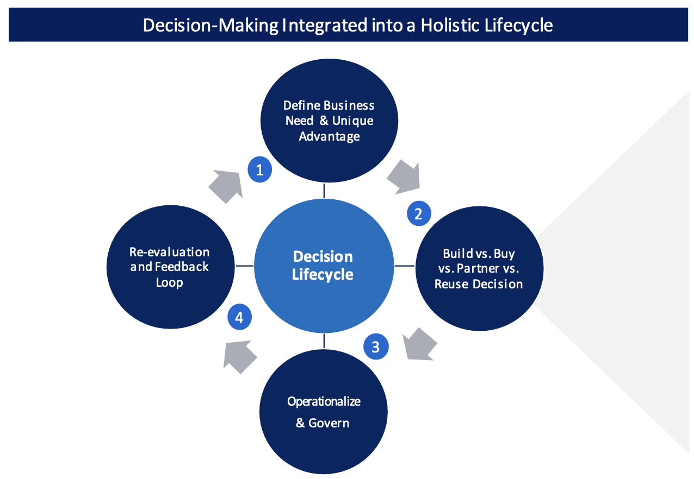
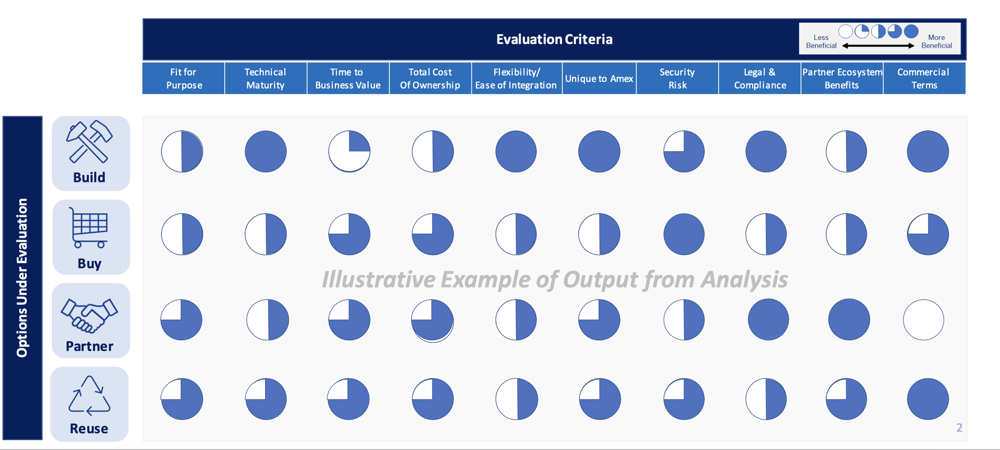
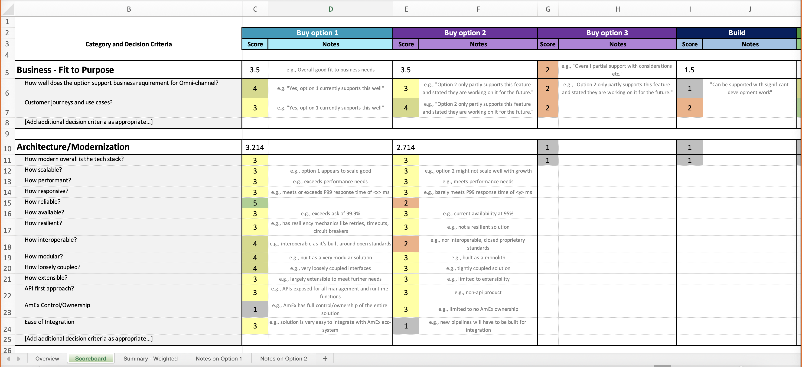

# Tech Organization Approach to Build vs. Buy vs. Partner vs. Reuse (BBPR)

export const IframeComp = () => {
    return (
        

            <iframe
                width="100%"
                height="1000"
                frameborder="0"
                scrolling="no"
                src="https://spaces.aexp.com/teams/GR%20Architecture/_layouts/15/Doc.aspx?sourcedoc={282EB8CB-0E22-4EC7-8609-D028F5270374}&action=embedview&wdAllowInteractivity=False&wdHideGridlines=True&wdHideHeaders=True&wdDownloadButton=True&wdInConfigurator=True&wdInConfigurator=True"
            ></iframe>
        

    );
};

## Amex Technology Assets
Amex Technology Assets are an intentional mix of
<ol>
    <li>Custom-built assets (BUILD)</li>
    <li>Commercial-Off-the-shelf products (BUY)</li>
    <li>Solutions built jointly with strategic partners (PARTNER)</li>
    <li>Open-sourced or Internal software assets (REUSE)</li>
</ol>
 

## Guiding Principles for BBPR Decisions

<ul>
    <li>
        <b>BUILD</b>
        

            New assets that are unique, differentiating and/or create a competitive
            advantage for AXP
        

    </li>
    <li>
        <b>BUY</b>
        

            New assets through comprehensive due diligence across vendor options,
            evaluating vendor relationship, maturity and risk of engagement
        

    </li>
    <li>
        <b>PARTNER</b>
        

            On new assets considering strategic fit and measuring value, cost, and
            technical risks of partner ecosystemy.
        

    </li>
    <li>
        <b>REUSE</b>
        

            Publicly available software or existing assets based on maturity
            assessment and fit for purpose both functionally and technically
        

    </li>
</ul>

 

## Purpose of Comprehensive BBPR Analysis

 

    We conduct a robust analysis across Build, Buy, Partner, or Reuse options
    available to fulfill business capability needs. Evaluation criteria may be
    weighted based on the strategy and augmented with additional dimensions.

## BBPR Assessment and Scoring

Use the latest BvB Template in order to start the assessment. 
Instantiate the latest BvB scorecard included in the Template in order to objectively analyse the different Build. Buy. Partner, Resue options. 

 

## ADR Creation
<ul>
    <li>Review the Assessment and Document the proposed ADR.</li>
    <li>Review the ADR with the Rnterprise Architecture Review Board (E-ARB).</li>
    <li>Status changes to Approved or Rejected based on the outcome of E-ARB Review.</li>
</ul>

