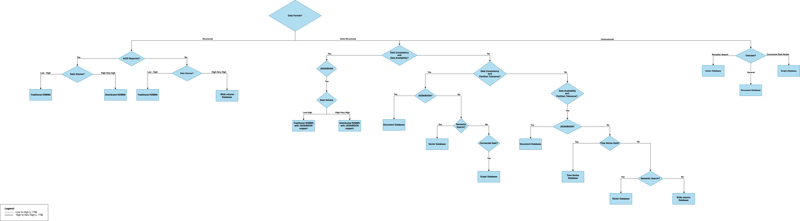

# Database Type Selection Prescriptive ADR

| Choose One [X] | ADR Type | Description |
|----------------| ----- | ----- |
|                | **architecture** | Describes a solution that a team proposes about the architecture of an Initiative/Platform, or to be applied across the Enterprise. This can also set a precedent in that future problems having the same patterns might be able to leverage the same solutions. |
|                | **buildvsbuy** | Describes a choice that a team proposes on the implementation of a building block (i.e. Build, Buy, Reuse) |
| X              | **prescriptive** | Describes various prescriptions that a team proposes based on certain patterns. In most cases, prescriptions are expressed in the form of a decision tree. |
|                | **process** | Describes the Process that is being proposed to be put in place based on certain Entry Criteria conditions or use cases |

## ADR Status History

| Authors | Status (Proposed/Accepted/Declined/Deprecated) | Date | Deciders |
| ----- | ----- | ----- | ----- |
| [Staff Engineers/Architects, Solutions Architects, etc] | Proposed | ... | N/A |
| Ravi Mishra, Ashwin Pande, Senthil Vallinayagam, Akshay Kumar, Senthil Sivaprakasam, Shradha Agrawal | Accepted | 10/16/2025 | Lakshmi Sagari Isukapally, Srividya Gopalan, Bryn Worgan, Ashok Nair |
| ... | ... | ... | ... |

## Context & Problem Statement

Choosing a suitable database type for a use case based on the functional and non-functional requirements is a foundational step in enterprise architecture. This makes it essential to finalize the database type prior to the selection of a database platform.

A strategic decision ensures the selection of a database type that supports scalability, consistency, and availability requirements, while also enabling seamless integration across applications, future-proofing the architecture, and supporting evolving business needs.
## Decision Drivers

List of key factors/criteria in which the options were evaluated that influenced the decision.

e.g.

* **Data Structure**: Type of data – structured, semi-structured, or unstructured.

* **Database Size**: Total volume of data to be handled.

* **Scalability Needs**: Vertical or horizontal growth capability.

* **Consistency (C)**: Accuracy and reliability of data.

* **Availability (A)**: System uptime and fault tolerance.

* **Partition Tolerance (P)**: Resilience during network failures.

* **Read Paths**: Efficiency, indexing, and complexity of read operations (pros and cons).

* **Write Paths**: Performance and structure of data ingestion and updates (pros and cons).

* **Frequency of Reads/Writes**: Expected read/write intensity.

* **Cost**: Licensing and operational expenses.

* **Security & Compliance**: Data protection and regulatory alignment.

* **Nature of Data**: Hierarchical, multi-dimensional, temporal, relationship-intensive, graph-oriented, or polymorphic.

## Options Considered

| Type of Database        | Key Features                                                                                                                                                                                                                                     | Use Case                                                                                                                                                                                                                                                                                                                                                                                                                                                                                                                                                                                                                                                                                                                                                                                                                                                                                                                                                                                                                                                                                                         | Pros & Cons                                                                                                                                                                                                                                                                                                                                                                                                                                                                                                                                                                                                                                                                                                                                                                                                                                                                                                                                               | **Sample Offerings**                                                                   |
|-------------------------|--------------------------------------------------------------------------------------------------------------------------------------------------------------------------------------------------------------------------------------------------|------------------------------------------------------------------------------------------------------------------------------------------------------------------------------------------------------------------------------------------------------------------------------------------------------------------------------------------------------------------------------------------------------------------------------------------------------------------------------------------------------------------------------------------------------------------------------------------------------------------------------------------------------------------------------------------------------------------------------------------------------------------------------------------------------------------------------------------------------------------------------------------------------------------------------------------------------------------------------------------------------------------------------------------------------------------------------------------------------------------|-----------------------------------------------------------------------------------------------------------------------------------------------------------------------------------------------------------------------------------------------------------------------------------------------------------------------------------------------------------------------------------------------------------------------------------------------------------------------------------------------------------------------------------------------------------------------------------------------------------------------------------------------------------------------------------------------------------------------------------------------------------------------------------------------------------------------------------------------------------------------------------------------------------------------------------------------------------|----------------------------------------------------------------------------------------|
| **Relational**          | • Structured Data  • ACID compliant  • Supports referential integrity  • Distributed relational databases  offers ACID compliance with horizontal scalability                           | • Transactional systems (banking, ERP, customer management systems).  • Applications requiring ACID compliance  • Distributed RDBMS: Applications requiring high throughput, global distribution, linear horizontal scaling, and strong consistency for transactions. (ex: Yugabyte)  • Traditional RDBMS: Transactional systems such as banking, ERP, or customer management platforms requiring strict consistency, relational integrity, and ANSI SQL compliance.                                                                                                                                                                                                                                                                                                                                                                                                                                                                                                                                                                                                             | • **Traditional RDBMS:**  **Pros**: • Mature technology with a long-standing ecosystem • High data integrity and native support for complex queries • ANSI SQL compliance ensures broad developer adoption  **Cons**: • Limited scalability; vertical scaling can be costly • Less suited for handling large-scale distributed workloads or dynamic scaling  • **Distributed RDBMS:**  **Pros**: • Combines ACID compliance with horizontal scalability • Suited for modern cloud-native and geo-distributed applications • High fault tolerance and built-in data replication  **Cons**: • Operational complexity may be higher due to distributed architecture • Relatively newer ecosystem compared to traditional RDBMS • Generally higher per-operation latency compared to traditional RDBMS, because commits require consistency across multiple nodes/shards. | • PostgreSQL, Oracle (Traditional)  • Yugabyte, Spanner, Aurora PostgreSQL (Distributed) |
| **Document**            | • Schema-less, flexible document storage.  • Stores data in JSON, BSON, or XML format.  • Efficient for hierarchical and semi-structured data.  • Supports indexing and querying of nested fields.                       | • Content management systems (CMS).  • E-commerce product catalogs.  • Event logging: Schema flexible event logging at scale  • Applications requiring flexible and evolving schemas.                                                                                                                                                                                                                                                                                                                                                                                                                                                                                                                                                                                                                                                                                                                                                                                                                                                                                                    | **Pros**:  • Flexible schema, easy scalability, supports hierarchical data. • Supports Availability: Guarantees a response even if some nodes fail. • Supports Partition Tolerance: Operates reliably during network partitions.   **Cons**: • Provides eventual consistency by default • Does not support referential integrity and joins • Not suitable for applications requiring adhoc queries                                                                                                                                                                                                                                                                                                                                                                                                                                                                                                                        | MongoDB, DynamoDB, Google Firestore                                                    |
| **Wide Column**         | • Stores data in column families for optimized reads and writes.  • Suitable for handling large-scale data with high availability.  • Supports fast lookup operations.  • Scales horizontally for distributed workloads. | • Real-time big data applications.  • Recommendation engines.  • Fraud detection and financial analytics.  • High-volume transactional data processing.                                                                                                                                                                                                                                                                                                                                                                                                                                                                                                                                                                                                                                                                                                                                                                                                                                                                                                                                  | **Pros**:  • Highly scalable, optimized for heavy workloads, handles large datasets efficiently. • Supports Availability: Prioritizes system uptime and responsiveness. • Supports Partition Tolerance: Designed to function across distributed networks.  **Cons**: • Less flexible for ad hoc queries, requires understanding of data modeling. • Provides eventual consistency by default. • Not suitable for applications requiring adhoc queries.                                                                                                                                                                                                                                                                                                                                                                                                                                                                    | Cassandra, Bigtable, DynamoDB, Keyspaces                                               |
| **Time Series Database** | • Optimized for time-stamped, sequential data with high ingestion rates  • Efficient time-based querying, aggregation, and compression.  • Supports anomaly detection, forecasting, and trend analysis.                          | • IoT & Monitoring – Sensor data, server logs, and system metrics.  • Finance & Trading – Stock price tracking and risk analysis.  •  Healthcare – Patient monitoring and medical device tracking.  • Event Analytics – Clickstreams, user interactions, and anomaly detection.                                                                                                                                                                                                                                                                                                                                                                                                                                                                                                                                                                                                                                                                                                                                                                                                          | **Pros**: • Fast writes, efficient storage, and built-in analytics. • Supports Availability: Ensures continuous data ingestion and query access under load. • Supports Partition Tolerance: Built to operate across distributed environments without failure.  **Cons**: • Not suitable for OLTP applications. • Provides eventual consistency by default. • Not suitable for applications requiring adhoc queries.                                                                                                                                                                                                                                                                                                                                                                                                                                                                                                       | Cassandra, Bigtable, DynamoDB, Keyspaces                                               |
| **Vector Database**     | • Embedding Model  • Optimized for Low Latency Retrieval – Designed for fast, real-time similarity searches across large vector datasets.  • Scalability for Similarity Searches                                                 | • Semantic Search – Contextual and intent-based search in enterprise knowledge systems or document repositories.  • Finding information based on its meaning or context, generating personalized recommendations, finding similar text passages, performing sentiment analysis, or generating chatbots and identifying anomalous patterns in data.  • Recommendation Systems – Personalized product or content suggestions based on user preferences and behavior patterns (e.g., e-commerce, streaming platforms)  • Image and Video Search – Searching across multimedia content based on visual similarity (e.g., surveillance, digital asset management).  • Anomaly Detection – Identifying fraud patterns, security threats, or operational anomalies using similarity scoring across multidimensional vectors.  • Conversational AI – Powering intelligent virtual assistants and chatbots with fast retrieval from vector-encoded knowledge bases.  • Vector databases are a critical component of RAG applications as they store the vector embeddings. | **Pros**:  • Efficient similarity search, handle large datasets and high query volumes, efficiently store and query vectors with hundreds or even thousands of dimensions,  integrate with machine learning workflows and semantic understanding.  **Cons**:  • A relatively new technology, so the ecosystem is still evolving, requires knowledge of vector embeddings and similarity search algorithms, consume significant storage space, building the indexes needed for fast vector searches can take time, requiring specialized hardware.  • Vector databases currently lack native support for encrypting sensitive data attributes. However encrypting vectors before ingestion can break the mathematical relationships required for similarity search, reducing retrieval accuracy.                                                                                                                                   | PostgreSQL Vector, DataStax JVector, GCP CloudSQL with Postgre engine, Amazon Aurora with Postgre engine |
| **Graph Database**      | • Uses nodes, edges, and properties instead of tables and rows.  • It allows storing the properties of the relationships between different nodes  • Ideal for connected data and relationship-heavy queries.                     | • Social Networks – User connections and interactions.  • Fraud Detection – Transaction pattern analysis.  • Recommendation Engines – Personalized suggestions based on relationships.  • Knowledge Graphs – Semantic data representation.                                                                                                                                                                                                                                                                                                                                                                                                                                                                                                                                                                                                                                                                                                                                                                                                                                               | **Pros**: • High performance for relationship-based queries, flexible schema. • Supports Consistency: Maintains strong consistency for relationship traversal and updates. • Supports Partition Tolerance: Capable of operating in distributed environments with replication.  **Cons**: • Not optimized for bulk unconnected data, requires specialized indexing. • Does not provide availability: May sacrifice uptime or responsiveness under network failures. • Limited availability under partitioned conditions; requires careful planning for scale-out deployments.                                                                                                                                                                                                                                                                                                                                              | PostgreSQL AGE, DataStax Graph, Spanner Graph                                          |

## Prescription

Here is the prescriptive decision tree for determining database category.

  

## Importance of Choosing the Right Database for an Application
Choosing the appropriate database type is foundational to application architecture. It determines how well the application can scale, perform under pressure, maintain data consistency, optimize costs, and remain agile to future changes in business needs or technology.

- **Optimal Performance:** A well-chosen database aligns with the application’s read/write patterns and access frequency. This ensures low-latency queries, rapid transaction processing, and seamless user experiences across dashboards, analytics modules, and core services.
- **Efficient Resource Utilization:** Maximizes the use of hardware resources (CPU, memory, disk I/O), reducing operational costs and improving throughput.
- **Scalability:** The database can easily accommodate increasing data volumes and user loads without significant performance degradation or costly re-architecting.

- **Data Integrity and Consistency:** When applications handle critical data—financial records, user profiles, transactions—a database with strong consistency or ACID compliance ensures trustworthy data and operational reliability across the stack.
- **Reduced Errors:** Minimizes data anomalies and ensures that business rules are enforced.
- **Cost Optimization:** An efficient database reduces costs by requiring fewer servers or tuning efforts. It accelerates development by minimizing workarounds and avoids expensive migrations or technical debt that arise from misalignment with application requirements.

## Consequences of Choosing the Wrong Database for an Application
Selecting an incompatible or poorly suited database can severely compromise the stability, performance, and reliability of the application. As the application grows in scope and traffic, these consequences often amplify, leading to rework, outages, or lost business value.

- **Poor Performance:** An unsuitable database struggles to handle queries and data operations, leading to frustrating user experiences and potential loss of users.
- **Performance Bottlenecks:** Even if application code is well-optimized, a mismatched database can become the limiting factor-creating hidden constraints that impact system throughput and responsiveness across workflows.
- **High Latency:** Delays in data processing, especially critical for real-time applications.

- **Scalability Limitations:** Some databases don’t scale easily with increasing user load or data growth. This may result in frequent crashes, downtime, or the need for workarounds like over-provisioning hardware or premature re-architecting.
- **Data Inconsistency Risks:** Using a database without proper consistency or ACID guarantees can lead to duplicate, missing, or conflicting data-ultimately affecting decision-making, compliance, and customer confidence.
- **Higher Infrastructure Costs:** To compensate for performance gaps, teams may end up deploying more powerful hardware or scaling inefficiently, increasing the total cost of ownership without proportional value.
- **Increased Development and Maintenance Effort:** Developers spend excessive time on performance tuning, bug fixes related to data issues, and workarounds for database limitations.

## Exemption Process

- No implicit or informal exemptions are permitted. Any deviation from this architectural mandate must undergo a formal exception review by EARB.
- A request must include:
    - Documented technical gaps in the recommended database platform for the proposed use case.
    - A detailed alternative database platform, including security and governance controls Cost-benefit analysis that materially justifies divergence.
    - A defined migration roadmap to converge to the enterprise platform.
    - A thorough Buy vs. Build analysis must be completed and documented before an alternative database platform is finalized.
- All exception requests must be reviewed, approved, and logged with a convergence plan or alternate guardrails. No exemption is assumed by default. For ambiguous use cases or edge scenarios, teams are required to engage with the Database Engineering and EA Data Architecture team for architectural consultation prior to implementation.
