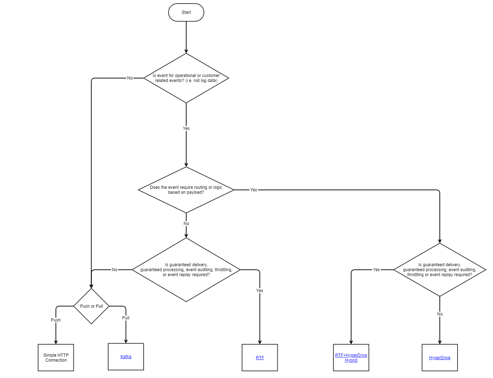

# Prescriptive ADR for Event Brokers and Messaging

RTF and Hyperdrive are amex enterprise IT assets that can be used to develop event driven solutions. While there is some
amount of overlap of capabilities between the two, there are fundamental differences both in the feature set and
development models that must be considered when using these assets in an event driven design.

| **Overview Statement** | **RTF**   RTF is a payload agnostic event broker that focuses on guaranteed delivery of events from an event publisher to one or more subscribers.  The RTF client inserts itself between what would be an ordinary HTTP or GRPC connection.  Event publishers can go through the RTF client for all events or use RTF only as a fallback if a direct call fails.                                                                                           |Hyperdrive   Hyperdrive provides an exchange for processing real-time events.  Producers make them available.  Consumers shop for and process them by wiring together processing modules to validate, filter, transform, enrich, and route events without needing to write code. |
|:-----------------------|:--------------------------------------------------------------------------------------------------------------------------------------------------------------------------------------------------------------------------------------------------------------------------------------------------------------------------------------------------------------------------------------------------------------------------------------------------------------------|-----------------------------------------------------------------------------------------------------------------------------------------------------------------------------------------------------------------------------------------------------------------------------------------|
| Core Features          | • Payload agnostic, supporting complex event chaining.  • Guaranteed processing of events by subscribers.    • Low or zero added latency compared to normal point to point communications.  • High availability (99.999%) with zero data loss.  • 30 day event history with replay capability.                                                                                                                                                      |         •	Multiplexing of events. •	Custom low, latency processing workflows assembled from composable processing modules. •	Highly scalable pull and push ingress of events. •	Push delivery of processed events over various channels and to Lumi. •	Curated schemas provided by producers to enable enterprise-wide usage of real-time events. •	Integration with Schema Factory for schema lifecycle management. •	Zero downtime, active-active GDHA.                                                                                              |                                                                                                                                                                                 |
| Constraints                   | •	At least once delivery (consumers must be idempotent). •	Does not perform any transformation, validation, routing or other logic based on event payload. •	RTF is limited to a push model–It receives events via an HTTP or GRPC invocation and propagates those events out to consumers by calling an HTTP or GRPC endpoint of the subscribers (i.e PubSub at Lumi) . •	Maximum throughput of 10k TPS. •	Message body size limited to 64KB.  |•	At least once delivery (consumers must be idempotent). •	Curated schema with lifecycle management. •	Limited number of delivery retries with selectable backoffs. •	No throttling or back pressure handling of delivery attempts. •	Circuit breakers for delivery to prevent problematic destinations from causing issues. •	Enrichment requires access to highly available, low latency databases. •	Extended region outage could cause the loss of in-flight events. •	Recommended payload size 20 KB or less. |
| Development Model                   | •	Drop in framework available to solution developers. •	Back end infrastructure tied to history and retry capabilities that is transparent to users/developers.                                                                                                                                                                                                                                                                                             |•	Self-service onboarding for producers. •	Self-service shopping for events by consumers. •	Self-service configuration of processing workflows. |

 

# Event Producer Decision Flow

