# Resy OS — Complete Partner Journey Map

Structured map of **every** restaurant-partner journey on Resy OS: which steps belong to which
journey, in what order, on which interface, and which help-desk article documents each step.

**Grounded, not synthesized.** Every journey, step and navigation path below traces back to the
real scrape of <https://helpdesk.resy.com/> held in
[`prototype/walkthrough-assistant/assets/resy-help-desk-kb/`](../prototype/walkthrough-assistant/assets/resy-help-desk-kb/index.md)
— **199 articles, 605 screenshots, 30 categories**, captured 2026-09-17. Each YAML step carries a
`kb_article` field pointing at the source markdown, and every screenshot for a step is already on
disk under `images/<category>/<slug>/` with ids matching the `[[IMAGE: …]]` placeholders in the
article body, so a how-to guide can be assembled in order without re-scraping.

Appendix A maps all 199 articles to their journey — nothing in the KB is unassigned.

---

## 1. Journey Landscape

Twelve journeys. Four run once, in order, to get a venue live. Four run continuously once live.
Four are cross-cutting — entered at any time, repeatedly.

```
════════ SETUP TRACK — sequential, once per venue ════════

[J1: Onboarding & Go-Live]
       ↓
[J2: Venue, Floor Plan & Table Setup]
       ↓
[J3: Service, Shifts & Availability]
       ↓
[J4: Payments, Policies & Transactions]
       ↓
[J8: Marketing & Channel Distribution]  ──────┐
                                              │
                                        ═══ GO LIVE ═══
                                              │
════════ OPERATE TRACK — continuous, every service ════════
                                              │
       ┌──────────────┬──────────────┬────────┴─────┐
       ↓              ↓              ↓              ↓
 [J5: Daily      [J6: Guest    [J7: Events &   [J9: Reporting
  Service Ops]    Profiles &    Ticketed        & Analytics]
                  Comms]        Experiences]
       └──────────────┴──────────────┴──────────────┘
                              ↑
                   feeds back into J3 / J4 tuning

════════ CROSS-CUTTING — any time, repeatedly ════════

[J10: Integrations]   [J11: Users, Access & Billing]
[J12: Amex Programs & Global Dining Access]   [R: Reference, Training & FAQ]
```

---

## 2. Master Journey Map (Mermaid)

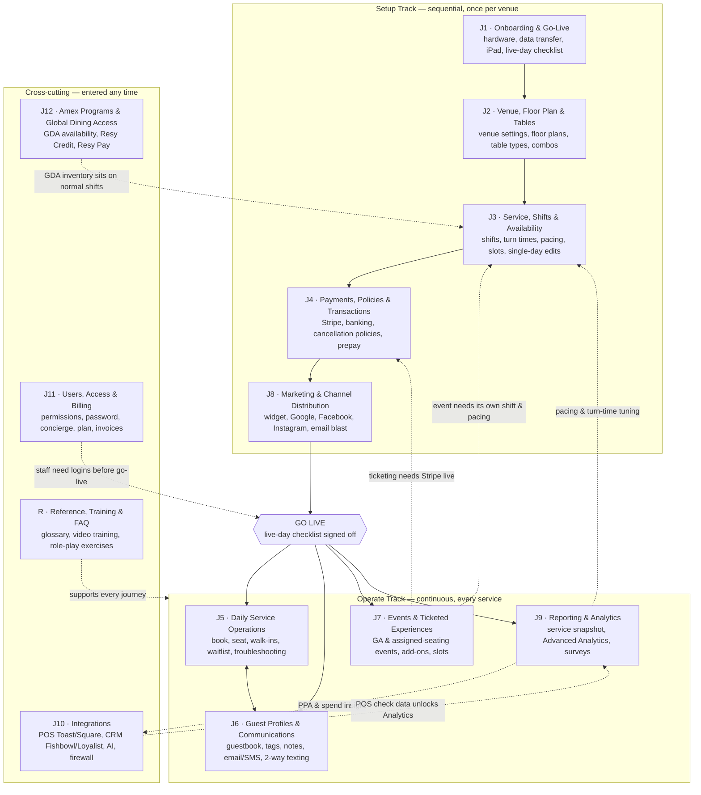

---

## 3. Journey Catalogue

| ID | Journey | Articles | Screenshots | Primary interface | Owning role | When |
|---|---|---|---|---|---|---|
| **J1** | Onboarding & Go-Live | 5 | 6 | Dashboard + iPad + email | Owner / GM | Once, pre-launch |
| **J2** | Venue, Floor Plan & Table Setup | 7 | 26 | Dashboard (`os.resy.com`) | GM | Once, then on remodel |
| **J3** | Service, Shifts & Availability | 25 | 80 | Dashboard + ResyOS app | GM / Head Host | Once, then weekly tuning |
| **J4** | Payments, Policies & Transactions | 27 | 79 | Dashboard + Stripe | Owner / Finance | Once, then per dispute |
| **J5** | Daily Service Operations | 28 | 88 | ResyOS iPad app | Host team | Every service |
| **J6** | Guest Profiles & Communications | 24 | 67 | ResyOS app + Dashboard | Host / Marketing | Continuous |
| **J7** | Events & Ticketed Experiences | 15 | 51 | Dashboard | GM / Events lead | Per event |
| **J8** | Marketing & Channel Distribution | 7 | 26 | Dashboard + external platforms | Marketing | Pre-launch, then campaigns |
| **J9** | Reporting & Analytics | 26 | 115 | Dashboard Analytics | GM / Owner | Daily + monthly |
| **J10** | Integrations | 9 | 14 | Dashboard + vendor portals | GM / IT | On adoption |
| **J11** | Users, Access & Billing | 8 | 29 | Dashboard + Billing Portal | Owner / Admin | On staffing change |
| **J12** | Amex Programs & Global Dining Access | 9 | 20 | Dashboard | GM / Owner | Program partners only |
| **R** | Reference, Training & FAQ | 9 | 4 | — | All | Any time |
| | **Total** | **199** | **605** | | | |

Two interfaces recur throughout, and steps are never interchangeable between them:

- **Resy OS Dashboard** — `os.resy.com`, web. Configuration: venue, shifts, policies, analytics, users.
- **Resy OS App** — iPad, in-venue. Execution: booking, seating, waitlist, guest notes, single-day edits.

---

## 4. Journey Schemas

Every step carries `kb_article` — a path under
`prototype/walkthrough-assistant/assets/resy-help-desk-kb/articles/`. Screenshots for that step live
at `images/<same-path>/<slug>/` in article order.

### J1 · Onboarding & Go-Live

Pre-launch track. Hardware in place, historic reservations migrated, iPads provisioned, checklist
signed off. 5 articles, 6 screenshots. Blocks everything else.

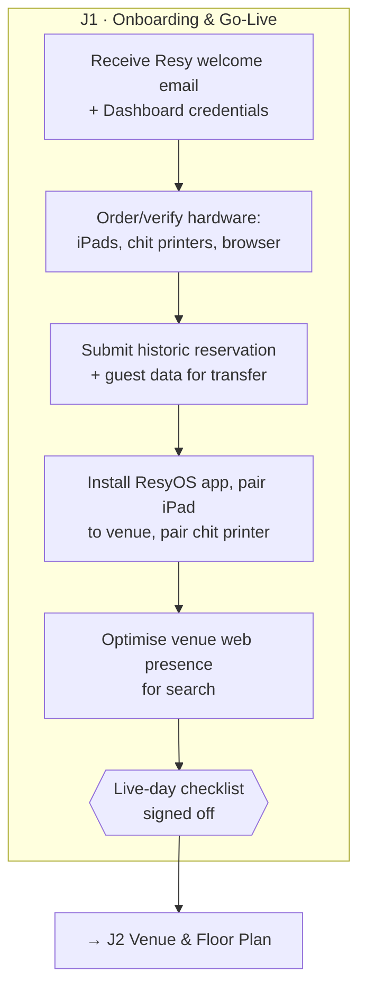

```yaml
journey: "J1 — Onboarding & Go-Live"
interface: "Email + Resy OS Dashboard (os.resy.com) + ResyOS iPad app"
target_role: "Owner / General Manager"
cadence: "Once, pre-launch"
steps:
  - step_id: "J1_01"
    title: "Confirm hardware and browser compatibility"
    navigation_path: "Pre-work — no Resy UI"
    prerequisites: []
    inputs_required:
      - field_name: "iPad model / iPadOS version"
        type: "string"
        required: true
      - field_name: "Chit printer model (Bluetooth)"
        type: "string"
        required: false
      - field_name: "Desktop browser (Chrome current version)"
        type: "string"
        required: true
    actions:
      - "Check each iPad and printer against the supported-hardware list."
      - "Replace unsupported devices before go-live — the app will not be supported on them."
    outputs: ["Approved device inventory"]
    kb_article: "onboarding-materials/resyos-recommended-hardware-and-accessories.md"

  - step_id: "J1_02"
    title: "Submit reservation and guest data for transfer"
    navigation_path: "Email to Resy onboarding contact"
    prerequisites: ["J1_01"]
    inputs_required:
      - field_name: "Export of future reservations from prior platform"
        type: "file (CSV)"
        required: true
      - field_name: "Guest / guestbook export"
        type: "file (CSV)"
        required: false
      - field_name: "Requested transfer date"
        type: "date"
        required: true
    actions:
      - "Export future reservations and guest history from the outgoing platform in the requested format."
      - "Send to the Resy onboarding contact ahead of the transfer window."
      - "Verify transferred reservations appear on the Dashboard calendar after import."
    outputs: ["Migrated future reservations", "Migrated guestbook"]
    kb_article: "onboarding-materials/data-transfer-instructions.md"

  - step_id: "J1_03"
    title: "Set up Resy OS on each iPad"
    navigation_path: "iPad > App Store > ResyOS > Log in"
    prerequisites: ["J1_01"]
    inputs_required:
      - field_name: "Resy OS user email"
        type: "string"
        required: true
      - field_name: "Password"
        type: "string"
        required: true
      - field_name: "Venue selection"
        type: "enum"
        required: true
    actions:
      - "Install the ResyOS app from the App Store on each host iPad."
      - "Log in and select the venue."
      - "Pair the Bluetooth chit printer from iPad Settings, then confirm from the app."
      - "Disable auto-lock / sleep so the host stand stays live during service."
    outputs: ["Provisioned host iPads", "Paired chit printer"]
    kb_article: "onboarding-materials/resyos-ipad-set-up.md"

  - step_id: "J1_04"
    title: "Optimise venue discoverability before launch"
    navigation_path: "Venue website + Google Business Profile"
    prerequisites: []
    inputs_required:
      - field_name: "Venue website URL"
        type: "string"
        required: true
      - field_name: "Google Business Profile access"
        type: "boolean"
        required: true
    actions:
      - "Add the Resy booking link to the venue website and Google Business Profile."
      - "Align venue name, address and hours across listings so search results resolve to one venue."
    outputs: ["Consistent public listings pointing at Resy"]
    kb_article: "onboarding-materials/google-search-optimization-tips.md"

  - step_id: "J1_05"
    title: "Work the live-day checklist"
    navigation_path: "Resy OS Dashboard — full review"
    prerequisites: ["J1_02", "J1_03", "J2_*", "J3_*", "J4_*", "J8_*"]
    inputs_required:
      - field_name: "Go-live date"
        type: "date"
        required: true
    actions:
      - "Confirm venue profile, floor plan, shifts, turn times, pacing and policies are all published."
      - "Confirm staff logins exist with the right permission level (see J11)."
      - "Confirm the booking widget and channel integrations are pointing at the live venue (see J8)."
      - "Open online bookings for the first live shift."
    outputs: ["Venue live on Resy", "Bookable inventory on resy.com and the widget"]
    kb_article: "onboarding-materials/live-day-checklist.md"
```

---

### J2 · Venue, Floor Plan & Table Setup

The venue's physical and public identity. Everything in J3 sits on top of the floor plan built here.
7 articles, 26 screenshots.

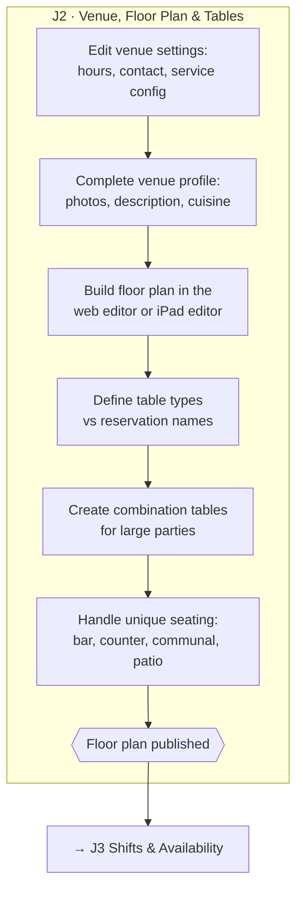

```yaml
journey: "J2 — Venue, Floor Plan & Table Setup"
interface: "Resy OS Dashboard (os.resy.com) + ResyOS iPad app"
target_role: "General Manager"
cadence: "Once at setup, revisited on remodel or seasonal patio changes"
steps:
  - step_id: "J2_01"
    title: "Configure venue settings"
    navigation_path: "Dashboard > Settings > Venue Settings"
    prerequisites: ["J1_03"]
    inputs_required:
      - field_name: "Venue name"
        type: "string"
        required: true
      - field_name: "Time zone"
        type: "enum"
        required: true
      - field_name: "Phone / contact email"
        type: "string"
        required: true
      - field_name: "Operating hours"
        type: "schedule"
        required: true
    actions:
      - "Open Venue Settings and set the operational fields that every other module reads."
      - "Save — changes propagate to the booking widget and resy.com listing."
    outputs: ["Operational venue record"]
    kb_article: "getting-started-settings/venue-settings/how-to-edit-your-venue-settings.md"

  - step_id: "J2_02"
    title: "Complete the public venue profile"
    navigation_path: "Dashboard > Settings > Venue Profile"
    prerequisites: ["J2_01"]
    inputs_required:
      - field_name: "Hero + gallery images"
        type: "file[]"
        required: true
      - field_name: "Venue description"
        type: "text"
        required: true
      - field_name: "Cuisine type / price range / neighbourhood"
        type: "enum"
        required: true
      - field_name: "Dress code, parking, accessibility notes"
        type: "text"
        required: false
    actions:
      - "Upload imagery and write the description shown to diners on resy.com and in the app."
      - "Set cuisine, price band and neighbourhood — these drive diner-side search and filtering."
    outputs: ["Published diner-facing venue listing"]
    kb_article: "reopening-on-resy/how-to-update-your-venue-listing-info.md"

  - step_id: "J2_03"
    title: "Build the floor plan"
    navigation_path: "Dashboard > Floor Plan (web editor) — or ResyOS app > Settings > Floor Plan"
    prerequisites: ["J2_01"]
    inputs_required:
      - field_name: "Floor plan name (e.g. Dining Room, Patio)"
        type: "string"
        required: true
      - field_name: "Table number / label"
        type: "string"
        required: true
      - field_name: "Min / max party size per table"
        type: "integer"
        required: true
      - field_name: "Table shape and position"
        type: "object"
        required: true
    actions:
      - "Create a floor plan and drag table objects onto the canvas to match the real room."
      - "Set each table's seating range — this is what the availability engine matches parties against."
      - "Create a separate floor plan per distinct configuration (indoor, patio, private room)."
      - "Save and publish. The web editor and the iPad editor write to the same floor plan."
    outputs: ["Published floor plan(s)", "Table inventory with seating ranges"]
    kb_article: "general/floor-plan-on-web.md"

  - step_id: "J2_04"
    title: "Separate table type from reservation name"
    navigation_path: "Dashboard > Floor Plan > Table > Properties"
    prerequisites: ["J2_03"]
    inputs_required:
      - field_name: "Table type (Standard, Bar, Counter, Communal, High-top, Patio)"
        type: "enum"
        required: true
      - field_name: "Reservation name shown to diners"
        type: "string"
        required: false
    actions:
      - "Set the internal table type used for grouping and availability rules."
      - "Set the diner-facing reservation name separately — diners book the name, hosts seat the type."
    outputs: ["Table types mapped to diner-facing reservation names"]
    kb_article: "general/reservation-names.md"

  - step_id: "J2_05"
    title: "Create combination tables"
    navigation_path: "Dashboard > Floor Plan > Combinations"
    prerequisites: ["J2_03"]
    inputs_required:
      - field_name: "Member tables in the combination"
        type: "string[]"
        required: true
      - field_name: "Combined min / max party size"
        type: "integer"
        required: true
    actions:
      - "Select two or more adjacent tables and save them as a combination."
      - "Set the combined seating range so large parties surface availability automatically."
      - "Verify the combination appears in the iPad timeline view (see J5)."
    outputs: ["Large-party inventory without manual blocking"]
    kb_article: "general/create-and-add-combination-tables.md"

  - step_id: "J2_06"
    title: "Model unique seating setups"
    navigation_path: "Dashboard > Floor Plan"
    prerequisites: ["J2_04"]
    inputs_required:
      - field_name: "Seating style (chef's counter, communal, standing bar, seasonal patio)"
        type: "enum"
        required: true
    actions:
      - "Represent counters and communal tables as individual seats or seat blocks, per the setup guide."
      - "Keep seasonal areas on their own floor plan so they can be activated per shift or per day (see J3)."
    outputs: ["Accurate inventory for non-standard rooms"]
    kb_article: "general/unique-table-setups-in-resy-os.md"
```

---

### J3 · Service, Shifts & Availability

The largest configuration journey — shifts, turn times, pacing, slots, and every single-day override.
25 articles, 80 screenshots. Split into three sub-tracks: base configuration, availability tuning,
and single-day / emergency edits.

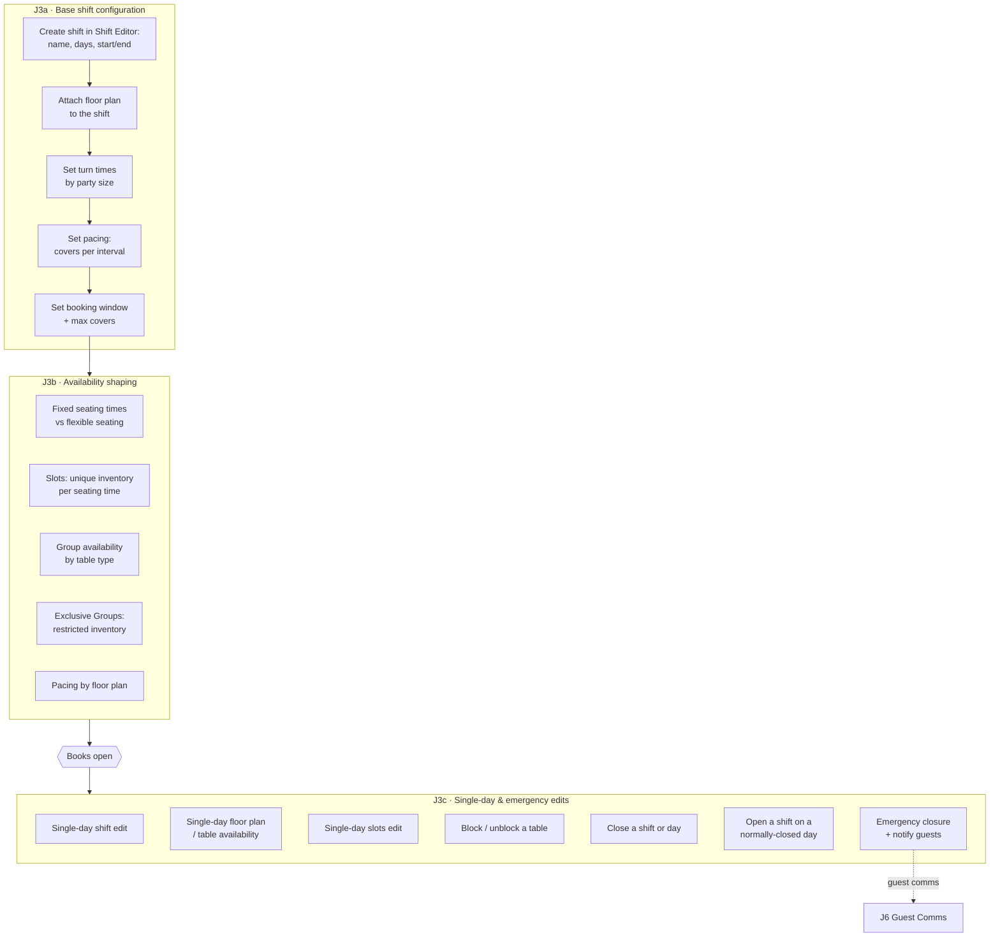

```yaml
journey: "J3 — Service, Shifts & Availability"
interface: "Resy OS Dashboard > Service Settings; ResyOS iPad app for in-service edits"
target_role: "General Manager / Head Host"
cadence: "Once at setup; weekly tuning; single-day edits daily"
steps:
  - step_id: "J3_01"
    title: "Create the base shift"
    navigation_path: "Dashboard > Service > Shift Settings > New Shift"
    prerequisites: ["J2_03"]
    inputs_required:
      - field_name: "Shift name (e.g. Dinner Default)"
        type: "string"
        required: true
      - field_name: "Days of week"
        type: "enum[]"
        required: true
      - field_name: "Start / end time"
        type: "time"
        required: true
      - field_name: "Start date / end date"
        type: "date"
        required: true
      - field_name: "Floor plan"
        type: "enum"
        required: true
    actions:
      - "Create the shift and attach the floor plan built in J2_03."
      - "Set the day pattern and service window."
      - "Save — the shift generates inventory for every future date in range."
    outputs: ["Base shift generating availability"]
    kb_article: "getting-started-settings/reservation-settings/how-to-create-and-edit-a-shift-in-dashboard-service-settings.md"

  - step_id: "J3_02"
    title: "Set turn times by party size"
    navigation_path: "Dashboard > Service > Shift Settings > [Shift] > Turn Times"
    prerequisites: ["J3_01"]
    inputs_required:
      - field_name: "Party size band (1-2, 3-4, 5-6, 7+)"
        type: "enum"
        required: true
      - field_name: "Duration in minutes"
        type: "integer"
        required: true
    actions:
      - "Enter the real observed dining duration per party-size band, not an aspiration."
      - "Revisit after the first month using J9 POS spend & turn-time data."
    outputs: ["Turn times driving table-hold duration"]
    kb_article: "getting-started-settings/reservation-settings/turn-times.md"

  - step_id: "J3_03"
    title: "Enable flexible seating to maximise covers"
    navigation_path: "Dashboard > Service > Shift Settings > [Shift] > Seating"
    prerequisites: ["J3_02"]
    inputs_required:
      - field_name: "Flexible seating on/off"
        type: "boolean"
        required: true
      - field_name: "Seating interval (15/30 min)"
        type: "enum"
        required: true
    actions:
      - "Turn on flexible seating so the engine fits parties into gaps rather than fixed blocks."
      - "Choose the interval granularity — tighter intervals yield more covers but more host churn."
    outputs: ["Higher table utilisation"]
    kb_article: "getting-started-settings/reservation-settings/how-to-setup-flexible-seating-to-maximize-covers.md"

  - step_id: "J3_04"
    title: "Or set fixed seating times"
    navigation_path: "Dashboard > Service > Shift Settings > [Shift] > Fixed Seating Times"
    prerequisites: ["J3_01"]
    inputs_required:
      - field_name: "Seating time(s)"
        type: "time[]"
        required: true
    actions:
      - "Define discrete seating times (e.g. 18:00 / 20:30) when the kitchen runs coursed service."
      - "Mutually exclusive with flexible seating for the same shift — pick one model per shift."
    outputs: ["Fixed-seating inventory"]
    kb_article: "getting-started-settings/reservation-settings/how-to-setup-fixed-seating-times-for-your-shifts.md"

  - step_id: "J3_05"
    title: "Set pacing and availability limits"
    navigation_path: "Dashboard > Service > Shift Settings > [Shift] > Pacing"
    prerequisites: ["J3_01"]
    inputs_required:
      - field_name: "Covers per interval"
        type: "integer"
        required: true
      - field_name: "Max covers for the shift"
        type: "integer"
        required: false
    actions:
      - "Cap covers per interval so the kitchen is not flooded at peak."
      - "Set a shift-level max-covers ceiling if the kitchen has a hard nightly limit."
      - "Where rooms have different kitchen loads, set pacing per floor plan instead of per shift."
    outputs: ["Paced inventory"]
    kb_article: "getting-started-settings/reservation-settings/availability-and-pacing-updates.md"
    related:
      - "general/maximum-covers.md"
      - "general/customizable-pacing-by-floorplan.md"

  - step_id: "J3_06"
    title: "Set the booking window"
    navigation_path: "Dashboard > Service > Shift Settings > [Shift] > Booking Window"
    prerequisites: ["J3_01"]
    inputs_required:
      - field_name: "Days in advance bookable"
        type: "integer"
        required: true
      - field_name: "Release time of day"
        type: "time"
        required: false
      - field_name: "Cut-off before service"
        type: "integer (minutes)"
        required: false
    actions:
      - "Set how far ahead diners can book and when new days drop."
      - "Set the last-minute cut-off so the host stand is not surprised mid-service."
    outputs: ["Controlled booking horizon"]
    kb_article: "reopening-on-resy/update-your-books/how-to-adjust-your-booking-window.md"

  - step_id: "J3_07"
    title: "Configure slots for differentiated inventory"
    navigation_path: "Dashboard > Service > Shift Settings > [Shift] > Slots"
    prerequisites: ["J3_05"]
    inputs_required:
      - field_name: "Slot name"
        type: "string"
        required: true
      - field_name: "Seating time(s) covered"
        type: "time[]"
        required: true
      - field_name: "Table types included"
        type: "enum[]"
        required: true
      - field_name: "Price / prepay attached"
        type: "currency"
        required: false
    actions:
      - "Create a slot per distinct experience or price point within one shift."
      - "Assign which tables and times the slot draws from."
      - "Slots are the same mechanism events use — see J7 for ticketed use."
    outputs: ["Named, separately-priced inventory inside one shift"]
    kb_article: "getting-started-settings/reservation-settings/how-to-setup-slots-in-the-resy-dashboard.md"

  - step_id: "J3_08"
    title: "Group availability by table type"
    navigation_path: "Dashboard > Service > Shift Settings > [Shift] > Availability"
    prerequisites: ["J2_04", "J3_05"]
    inputs_required:
      - field_name: "Table type group"
        type: "enum"
        required: true
      - field_name: "Inventory allocated to the group"
        type: "integer"
        required: true
    actions:
      - "Ring-fence inventory per table type so the bar or counter does not absorb all dining-room demand."
    outputs: ["Per-table-type inventory ceilings"]
    kb_article: "general/group-availability-by-table-type.md"

  - step_id: "J3_09"
    title: "Restrict inventory with Exclusive Groups"
    navigation_path: "Dashboard > Service > Shift Settings > [Shift] > Exclusive Groups"
    prerequisites: ["J3_07"]
    inputs_required:
      - field_name: "Group name"
        type: "string"
        required: true
      - field_name: "Eligible audience"
        type: "enum"
        required: true
      - field_name: "Inventory reserved"
        type: "integer"
        required: true
    actions:
      - "Reserve part of the book for a defined audience (members, program partners, concierge)."
      - "Unreserved inventory stays on the public book."
    outputs: ["Audience-restricted inventory"]
    kb_article: "getting-started-settings/reservation-settings/exclusive-groups-feature.md"

  - step_id: "J3_10"
    title: "Make a single-day shift edit"
    navigation_path: "Dashboard > Service > Shift Settings > [Date] > Edit This Day Only"
    prerequisites: ["J3_01"]
    inputs_required:
      - field_name: "Target date"
        type: "date"
        required: true
      - field_name: "Field to override (times, pacing, max covers)"
        type: "enum"
        required: true
    actions:
      - "Open the specific date and override only that day — the base shift is untouched."
      - "Confirm the override badge appears on the calendar for that date."
    outputs: ["One-day override"]
    kb_article: "getting-started-settings/single-day-edits/how-to-make-a-single-day-edit-in-the-dashboard-service-settings.md"

  - step_id: "J3_11"
    title: "Swap or activate a floor plan for one day or shift"
    navigation_path: "Dashboard > Service > [Date/Shift] > Floor Plan"
    prerequisites: ["J2_03", "J3_01"]
    inputs_required:
      - field_name: "Target date or shift"
        type: "date"
        required: true
      - field_name: "Floor plan to activate"
        type: "enum"
        required: true
    actions:
      - "Activate the alternate floor plan (patio closed for rain, private-event layout) for that date only."
      - "Edit table availability on the activated plan without republishing the base plan."
    outputs: ["Date-scoped floor plan"]
    kb_article: "getting-started-settings/single-day-edits/how-to-activate-floor-plan-and-edit-table-availability-for-a-single-day.md"
    related:
      - "getting-started-settings/single-day-edits/how-to-activate-floor-plan-and-edit-table-availability-in-dashboard-for-a-shift.md"
      - "getting-started-settings/single-day-edits/how-to-update-a-floor-plan-for-a-single-day.md"

  - step_id: "J3_12"
    title: "Block or unblock a table mid-service"
    navigation_path: "ResyOS app > Floor Plan > [Table] > Block"
    prerequisites: ["J3_01"]
    inputs_required:
      - field_name: "Table"
        type: "enum"
        required: true
      - field_name: "Block duration / shift"
        type: "enum"
        required: true
    actions:
      - "Block the table to pull it out of online availability without deleting it."
      - "Unblock when the table returns to service."
    outputs: ["Table removed from bookable inventory"]
    kb_article: "in-service-troubleshooting/availability/how-to-block-a-table-for-a-shift-in-resyos.md"
    related:
      - "in-service-troubleshooting/availability/how-to-make-single-day-edits-to-table-availability-in-resyos-app.md"
      - "in-service-troubleshooting/availability/how-to-make-single-day-edits-to-slots-in-resyos.md"

  - step_id: "J3_13"
    title: "Close a shift or day"
    navigation_path: "ResyOS app > Calendar > [Date] > Close — or Dashboard > Service > Calendar"
    prerequisites: ["J3_01"]
    inputs_required:
      - field_name: "Date / shift to close"
        type: "date"
        required: true
      - field_name: "Reason note"
        type: "text"
        required: false
    actions:
      - "Close the shift from the calendar — existing reservations are not auto-cancelled."
      - "For an emergency closure, also cancel and message affected guests (J6)."
    outputs: ["Closed date, no new bookings"]
    kb_article: "in-service-troubleshooting/availability/how-to-close-a-shift-from-the-calendar-in-resyos.md"
    related:
      - "general/how-to-close-days-in-dashboard.md"
      - "reopening-on-resy/how-to-handle-closures.md"

  - step_id: "J3_14"
    title: "Open a shift on a normally-closed day"
    navigation_path: "Dashboard > Service > Shift Settings > New Shift (single date)"
    prerequisites: ["J3_01"]
    inputs_required:
      - field_name: "Date"
        type: "date"
        required: true
      - field_name: "Shift template to copy"
        type: "enum"
        required: false
    actions:
      - "Create a shift scoped to that one date rather than editing the recurring pattern."
      - "Add shift notes so the host team knows why the day is open."
    outputs: ["One-off open day"]
    kb_article: "general/opening-a-shift-on-a-day-you-are-normally-closed.md"
    related:
      - "reopening-on-resy/update-your-books/how-to-start-a-shift-on-a-specific-date.md"
      - "in-service-troubleshooting/availability/how-to-add-shift-notes-in-your-calendar-in-resyos-app.md"
```

---

### J4 · Payments, Policies & Transactions

Stripe onboarding, cancellation and prepay policies, and every downstream charge, refund and dispute.
27 articles, 79 screenshots. Must be live before J7 ticketing.

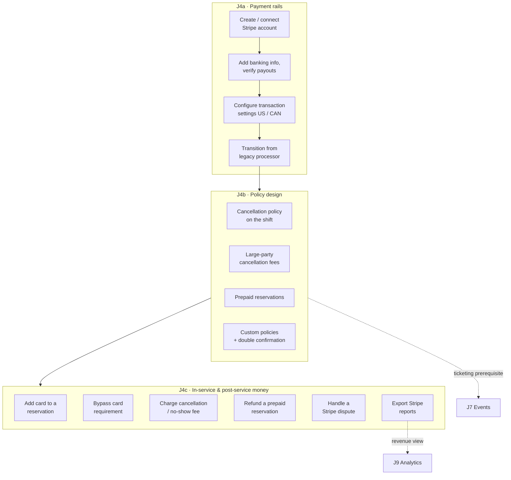

```yaml
journey: "J4 — Payments, Policies & Transactions"
interface: "Resy OS Dashboard > Transactions/Settings + Stripe Dashboard"
target_role: "Owner / Finance"
cadence: "Once at setup; policy tuning seasonally; charges and disputes ongoing"
steps:
  - step_id: "J4_01"
    title: "Get started on Stripe"
    navigation_path: "Dashboard > Settings > Payments > Connect Stripe"
    prerequisites: ["J2_01"]
    inputs_required:
      - field_name: "Legal business entity name"
        type: "string"
        required: true
      - field_name: "Tax ID / EIN"
        type: "string"
        required: true
      - field_name: "Business representative identity details"
        type: "object"
        required: true
    actions:
      - "Create or connect the Stripe account from the Resy Dashboard."
      - "Complete Stripe identity verification — payouts are held until it clears."
    outputs: ["Connected Stripe account"]
    kb_article: "general/getting-started-on-stripe.md"
    related: ["general/transitioning-to-stripe.md", "general/stripe-faq.md"]

  - step_id: "J4_02"
    title: "Add banking information for payouts"
    navigation_path: "Stripe Dashboard > Settings > Bank accounts and scheduling"
    prerequisites: ["J4_01"]
    inputs_required:
      - field_name: "Bank routing number"
        type: "string"
        required: true
      - field_name: "Account number"
        type: "string"
        required: true
      - field_name: "Payout schedule"
        type: "enum"
        required: true
    actions:
      - "Add the payout bank account; use the manual ACH process where instant verification fails."
      - "Confirm the first test payout lands before relying on prepay."
    outputs: ["Verified payout account"]
    kb_article: "general/manual-ach-stripe-process.md"

  - step_id: "J4_03"
    title: "Configure transaction settings for your region"
    navigation_path: "Dashboard > Settings > Transactions"
    prerequisites: ["J4_01"]
    inputs_required:
      - field_name: "Region (US / CAN)"
        type: "enum"
        required: true
      - field_name: "Tax rate"
        type: "percent"
        required: true
      - field_name: "Gratuity handling"
        type: "enum"
        required: false
      - field_name: "Service charge"
        type: "percent"
        required: false
    actions:
      - "Open the region-appropriate transaction settings page and set tax, gratuity and service charge."
      - "These values apply to every prepay, ticket and fee charged through Resy."
    outputs: ["Correct tax and gratuity on all charges"]
    kb_article: "transactions/managing-transactions-settings-for-us-partners.md"
    related: ["transactions/transaction-settings-can.md", "transactions/transactions-faq.md"]

  - step_id: "J4_04"
    title: "Attach a cancellation policy to inventory"
    navigation_path: "Dashboard > Service > Shift Settings > [Shift] > Cancellation Policy"
    prerequisites: ["J4_01", "J3_01"]
    inputs_required:
      - field_name: "Fee amount (per person or per reservation)"
        type: "currency"
        required: true
      - field_name: "Cancellation cut-off window"
        type: "integer (hours)"
        required: true
      - field_name: "Party-size threshold"
        type: "integer"
        required: false
      - field_name: "Policy text shown to the diner"
        type: "text"
        required: true
    actions:
      - "Set the fee, the window inside which it applies, and the diner-facing wording."
      - "Apply a higher-threshold policy to large parties where the exposure is bigger."
      - "Diners must store a card to book policy-protected inventory."
    outputs: ["Card-required, fee-protected inventory"]
    kb_article: "getting-started-settings/reservation-settings/how-to-add-cancellation-policy-to-a-reservation.md"
    related:
      - "general/adding-a-cancellation-policy-to-large-parties.md"
      - "general/using-large-party-cancellation-fees-with-custom-policies.md"
      - "general/custom-policies.md"
      - "general/double-confirmation-message.md"

  - step_id: "J4_05"
    title: "Enable prepaid reservations"
    navigation_path: "Dashboard > Service > Shift Settings > [Shift/Slot] > Prepay"
    prerequisites: ["J4_02", "J3_07"]
    inputs_required:
      - field_name: "Price per person"
        type: "currency"
        required: true
      - field_name: "Refundable until"
        type: "integer (hours)"
        required: false
      - field_name: "Slot the prepay attaches to"
        type: "enum"
        required: true
    actions:
      - "Attach a prepay price to the slot — the diner is charged at booking, not at the table."
      - "Follow the prepay best-practice guidance on pricing and refund windows before publishing."
    outputs: ["Prepaid, revenue-collected inventory"]
    kb_article: "general/adding-a-prepaid-policy.md"
    related:
      - "in-service-troubleshooting/cancellation-policy-and-payments/resy-pre-pay-best-practices.md"
      - "in-service-troubleshooting/cancellation-policy-and-payments/how-to-use-resy-prepay-feature-in-resyos.md"

  - step_id: "J4_06"
    title: "Add or bypass a card on a reservation"
    navigation_path: "ResyOS app > [Reservation] > Payment"
    prerequisites: ["J4_04"]
    inputs_required:
      - field_name: "Card details or guest's stored card"
        type: "object"
        required: true
      - field_name: "Bypass reason"
        type: "text"
        required: false
    actions:
      - "Add the guest's card to a phone or walk-in booking so the policy attaches."
      - "Use the bypass only for comps and VIPs — it removes fee protection for that reservation."
    outputs: ["Policy-covered reservation, or a documented exception"]
    kb_article: "in-service-troubleshooting/cancellation-policy-and-payments/how-do-i-add-payment-to-a-reservation.md"
    related:
      - "in-service-troubleshooting/cancellation-policy-and-payments/how-to-bypass-a-credit-card-requirement.md"
      - "general/for-diners-add-credit-card-information-to-your-profile.md"

  - step_id: "J4_07"
    title: "Charge a cancellation or no-show fee"
    navigation_path: "ResyOS app > [Reservation] > Charge Fee"
    prerequisites: ["J4_04", "J4_06"]
    inputs_required:
      - field_name: "Reservation"
        type: "enum"
        required: true
      - field_name: "Amount (defaults to policy)"
        type: "currency"
        required: true
      - field_name: "Reason"
        type: "text"
        required: false
    actions:
      - "Mark the reservation no-show or late-cancel, then charge the policy fee against the stored card."
      - "Charge promptly — the window for capturing on a stored card is not indefinite."
    outputs: ["Captured fee", "Stripe transaction record"]
    kb_article: "in-service-troubleshooting/cancellation-policy-and-payments/how-do-i-charge-a-cancellation-or-no-show-fee.md"

  - step_id: "J4_08"
    title: "Cancel and refund a prepaid reservation"
    navigation_path: "ResyOS app > [Reservation] > Cancel > Refund"
    prerequisites: ["J4_05"]
    inputs_required:
      - field_name: "Refund amount (full or partial)"
        type: "currency"
        required: true
    actions:
      - "Cancel the reservation and issue the refund in the same flow so inventory is released."
      - "Partial refunds are supported; the balance stays captured."
    outputs: ["Refunded guest", "Released inventory"]
    kb_article: "in-service-troubleshooting/cancellation-policy-and-payments/how-to-cancel-and-refund-a-prepaid-reservation.md"
    related: ["general/stripe-refunds.md"]

  - step_id: "J4_09"
    title: "Respond to a Stripe dispute"
    navigation_path: "Stripe Dashboard > Payments > Disputes"
    prerequisites: ["J4_07"]
    inputs_required:
      - field_name: "Dispute evidence (policy text, booking record, comms log)"
        type: "file[]"
        required: true
      - field_name: "Response deadline"
        type: "date"
        required: true
    actions:
      - "Gather the diner-facing policy text, the booking confirmation and any texts/emails as evidence."
      - "Submit before the Stripe deadline — an unanswered dispute is lost by default."
    outputs: ["Submitted dispute response"]
    kb_article: "general/guide-to-stripe-disputes.md"
    related: ["general/stripe-disputes.md"]

  - step_id: "J4_10"
    title: "Export transaction reports"
    navigation_path: "Dashboard > Transactions > Reports — or Stripe Dashboard > Reports"
    prerequisites: ["J4_03"]
    inputs_required:
      - field_name: "Date range"
        type: "daterange"
        required: true
      - field_name: "Report type (payouts, charges, fees)"
        type: "enum"
        required: true
    actions:
      - "Export the period's transactions for reconciliation against POS and bank deposits."
    outputs: ["Reconciliation export (CSV)"]
    kb_article: "general/stripe-transaction-reports.md"
    related: ["general/stripe-reporting.md"]

  - step_id: "J4_11"
    title: "Enable contactless payment / Resy Pay"
    navigation_path: "Dashboard > Settings > Payments > Resy Pay"
    prerequisites: ["J4_01"]
    inputs_required:
      - field_name: "Resy Pay enabled"
        type: "boolean"
        required: true
      - field_name: "POS integration (for check sync)"
        type: "enum"
        required: false
    actions:
      - "Enable pay-at-table so diners settle the check from their phone."
      - "Where a supported POS is connected (J10), checks sync automatically."
    outputs: ["Contactless check settlement"]
    kb_article: "general/resy-pay.md"
    related: ["reopening-on-resy/update-your-books/how-to-use-resy-for-contactless-payment.md"]
```

---
### J5 · Daily Service Operations

The busiest journey and the only one that runs every single night. Almost entirely on the iPad.
28 articles, 88 screenshots.

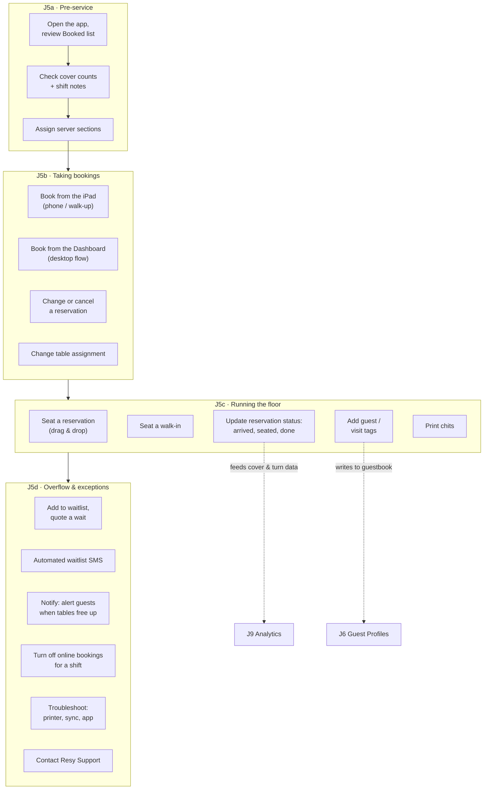

```yaml
journey: "J5 — Daily Service Operations"
interface: "ResyOS iPad app (primary); Dashboard for desktop booking"
target_role: "Host team / Maître d'"
cadence: "Every service"
steps:
  - step_id: "J5_01"
    title: "Open service and review the book"
    navigation_path: "ResyOS app > Booked list / Timeline"
    prerequisites: ["J1_03", "J3_01"]
    inputs_required:
      - field_name: "Service date"
        type: "date"
        required: true
    actions:
      - "Review the Booked list, cover counts and any shift notes left for the team."
      - "Read the icon legend on the booked list — tags, notes, payment state and VIP status are all encoded there."
      - "Switch to Timeline view to see table combinations and overlap at a glance."
    outputs: ["Shift situational awareness"]
    kb_article: "general/view-cover-counts-in-the-resyos-app.md"
    related:
      - "in-service-troubleshooting/guest-profile/what-are-the-icons-on-my-booked-list.md"
      - "getting-started-settings/ipad-settings/how-to-show-table-combinations-on-the-timeline-view-in-resyos.md"

  - step_id: "J5_02"
    title: "Assign server sections"
    navigation_path: "ResyOS app > Settings > Server Sections"
    prerequisites: ["J2_03"]
    inputs_required:
      - field_name: "Section name"
        type: "string"
        required: true
      - field_name: "Tables in section"
        type: "string[]"
        required: true
      - field_name: "Server assigned"
        type: "string"
        required: false
    actions:
      - "Group tables into sections and assign servers so seating spreads load evenly."
    outputs: ["Section map for the shift"]
    kb_article: "getting-started-settings/ipad-settings/how-to-manage-server-sections-in-resyos.md"

  - step_id: "J5_03"
    title: "Book a reservation on the iPad"
    navigation_path: "ResyOS app > + (New Reservation)"
    prerequisites: ["J3_01"]
    inputs_required:
      - field_name: "Party size"
        type: "integer"
        required: true
      - field_name: "Date / time"
        type: "datetime"
        required: true
      - field_name: "Guest name"
        type: "string"
        required: true
      - field_name: "Phone number"
        type: "string"
        required: false
      - field_name: "Email"
        type: "string"
        required: false
      - field_name: "Reservation notes"
        type: "text"
        required: false
    actions:
      - "Search the guestbook by name or phone first — booking an existing profile preserves history."
      - "Pick an available time; the app auto-assigns a table unless one is chosen manually."
      - "Where the guest has no phone number, use the no-phone booking path so confirmation still works."
      - "If the shift has a policy attached, capture the card (see J4_06)."
    outputs: ["Confirmed reservation", "Guest profile created or matched"]
    kb_article: "in-service-troubleshooting/reservations-walk-ins/how-to-book-a-reservation-in-resyos-app.md"
    related:
      - "in-service-troubleshooting/guest-profile/how-to-book-without-a-guest's-phone-number-in-resyos-app.md"
      - "getting-started-settings/ipad-settings/how-to-know-if-a-reservation-was-automatically-or-manually-assigned.md"

  - step_id: "J5_04"
    title: "Book from the Dashboard"
    navigation_path: "Dashboard > Reservations > New"
    prerequisites: ["J3_01"]
    inputs_required:
      - field_name: "Party size / date / time"
        type: "object"
        required: true
      - field_name: "Guest"
        type: "string"
        required: true
    actions:
      - "Use the desktop flow for phone bookings taken away from the host stand and for bulk entry."
      - "Same inventory and same policy rules as the iPad — only the interface differs."
    outputs: ["Confirmed reservation"]
    kb_article: "general/desktop-reservation-flow.md"

  - step_id: "J5_05"
    title: "Change, move or cancel a reservation"
    navigation_path: "ResyOS app > [Reservation] > Edit / Cancel"
    prerequisites: ["J5_03"]
    inputs_required:
      - field_name: "New date / time / party size"
        type: "object"
        required: false
      - field_name: "New table"
        type: "enum"
        required: false
      - field_name: "Cancellation reason"
        type: "text"
        required: false
    actions:
      - "Edit in place for time or party-size changes — the guest is re-notified automatically."
      - "Drag the reservation on the timeline to reassign a table."
      - "Cancelling releases inventory; if prepaid or policy-covered, handle money via J4_07/J4_08."
    outputs: ["Updated reservation", "Guest notification sent"]
    kb_article: "in-service-troubleshooting/reservations-walk-ins/how-to-cancel-or-change-a-reservation.md"
    related:
      - "in-service-troubleshooting/reservations-walk-ins/how-to-change-table-assignment-in-resyos.md"
      - "in-service-troubleshooting/how-to-make-changes-to-a-prepaid-reservation.md"
      - "general/for-diners-change-or-cancel-a-reservation.md"

  - step_id: "J5_06"
    title: "Seat a guest"
    navigation_path: "ResyOS app > Floor Plan > drag reservation onto table"
    prerequisites: ["J5_03"]
    inputs_required:
      - field_name: "Reservation"
        type: "enum"
        required: true
      - field_name: "Table"
        type: "enum"
        required: true
    actions:
      - "Drag and drop the reservation onto the table to seat it — this starts the turn-time clock."
      - "Overlap alerts warn when the seating would collide with a later booking; enable them in app settings."
    outputs: ["Seated party", "Turn clock started"]
    kb_article: "in-service-troubleshooting/reservations-walk-ins/how-to-seat-a-guest-in-resyos.md"
    related:
      - "getting-started-settings/how-to-drag-and-drop-to-seat-in-resyos.md"
      - "getting-started-settings/ipad-settings/how-to-enabledisable-reservation-overlap-alerts-in-your-resyos-settings.md"

  - step_id: "J5_07"
    title: "Seat a walk-in"
    navigation_path: "ResyOS app > Walk-in"
    prerequisites: []
    inputs_required:
      - field_name: "Party size"
        type: "integer"
        required: true
      - field_name: "Table"
        type: "enum"
        required: true
      - field_name: "Guest name / phone"
        type: "string"
        required: false
    actions:
      - "Seat the walk-in directly from the floor plan so the table shows occupied."
      - "Attach a guest profile after seating to capture the visit in the guestbook."
    outputs: ["Seated walk-in", "Cover counted"]
    kb_article: "in-service-troubleshooting/reservations-walk-ins/how-to-seat-a-walk-in-in-resyos.md"
    related: ["in-service-troubleshooting/guest-profile/how-to-add-a-guest-profile-to-a-seated-walk-in.md"]

  - step_id: "J5_08"
    title: "Keep reservation statuses current"
    navigation_path: "ResyOS app > [Reservation] > Status"
    prerequisites: ["J5_06"]
    inputs_required:
      - field_name: "Status (Confirmed, Arrived, Seated, Entrée, Done, No-show)"
        type: "enum"
        required: true
    actions:
      - "Move each party through the status chain as it happens — analytics and turn-time data come from this."
      - "Mark no-shows accurately; J4_07 fee charging depends on the status being set."
    outputs: ["Accurate service record", "Clean turn-time and no-show data"]
    kb_article: "in-service-troubleshooting/reservations-walk-ins/how-to-update-a-reservation-status.md"

  - step_id: "J5_09"
    title: "Tag the reservation"
    navigation_path: "ResyOS app > [Reservation] > Tags"
    prerequisites: ["J5_03"]
    inputs_required:
      - field_name: "Visit tag (birthday, anniversary, allergy, regular)"
        type: "enum[]"
        required: false
      - field_name: "Guest tag (persists across visits)"
        type: "enum[]"
        required: false
    actions:
      - "Visit tags describe tonight; guest tags describe the person and follow them forever."
      - "Tags drive the icons on the booked list and are searchable in the guestbook (J6)."
    outputs: ["Tagged reservation and/or guest profile"]
    kb_article: "getting-started-settings/ipad-settings/how-to-add-guest-and-visit-tags-to-a-reservation-in-resy-os.md"
    related: ["general/resy-os-tag-functionality-2-0.md"]

  - step_id: "J5_10"
    title: "Run the waitlist"
    navigation_path: "ResyOS app > Waitlist"
    prerequisites: []
    inputs_required:
      - field_name: "Party size"
        type: "integer"
        required: true
      - field_name: "Guest name + mobile"
        type: "string"
        required: true
      - field_name: "Quoted wait (minutes)"
        type: "integer"
        required: true
    actions:
      - "Add the party, quote a realistic wait, and let automated SMS handle the ready-now message."
      - "Seat from the waitlist directly onto a table when one frees."
      - "Mobile waitlist lets diners join remotely inside the configured city radius."
    outputs: ["Managed overflow", "Waitlist performance data for J9"]
    kb_article: "in-service-troubleshooting/waitlist/how-to-manage-your-waitlist:-adding-messaging-and-seating-guests.md"
    related:
      - "in-service-troubleshooting/waitlist/how-to-use-automated-waitlist-sms-in-resyos.md"
      - "in-service-troubleshooting/waitlist/how-to-use-mobile-waitlist.md"
      - "in-service-troubleshooting/waitlist/mobile-waitlist-city-radius-list.md"

  - step_id: "J5_11"
    title: "Use Notify to fill cancellations"
    navigation_path: "Automatic — Dashboard > Settings > Notify"
    prerequisites: ["J3_01"]
    inputs_required:
      - field_name: "Notify enabled"
        type: "boolean"
        required: true
    actions:
      - "Leave Notify on: diners subscribe to a full date and are alerted the moment inventory frees."
      - "No host action needed when a cancellation lands — the seat is offered out automatically."
    outputs: ["Recovered covers from cancellations"]
    kb_article: "in-service-troubleshooting/what-is-notify-and-how-does-it-work.md"

  - step_id: "J5_12"
    title: "Close the book mid-shift"
    navigation_path: "ResyOS app > Settings > Online Reservations > Off"
    prerequisites: []
    inputs_required:
      - field_name: "Duration / shift"
        type: "enum"
        required: true
    actions:
      - "Turn off online bookings when the kitchen is underwater — existing reservations are unaffected."
      - "Re-enable when the room recovers; for a whole-day stop use J3_13 instead."
    outputs: ["Online inventory paused"]
    kb_article: "in-service-troubleshooting/how-to-turn-off-online-reservations-for-a-shift-or-period-of-time-in-resyos.md"

  - step_id: "J5_13"
    title: "Troubleshoot and escalate"
    navigation_path: "ResyOS app > Support Chat (top-left) — or Dashboard > Chat"
    prerequisites: []
    inputs_required:
      - field_name: "Symptom (printer offline, sync lag, app crash)"
        type: "string"
        required: true
    actions:
      - "Work the standard troubleshooting steps first: force-quit, re-pair Bluetooth, check network."
      - "Bluetooth chit printers have their own fault tree — run it before escalating."
      - "Escalate via Live Chat (8am–2am ET, 7 days) or resysupport@resy.com."
    outputs: ["Restored service", "Support ticket if unresolved"]
    kb_article: "in-service-troubleshooting/resyos-troubleshooting-steps.md"
    related:
      - "in-service-troubleshooting/troubleshooting-common-issues.md"
      - "in-service-troubleshooting/troubleshooting-for-bluetooth-chit-printers.md"
      - "in-service-troubleshooting/how-to-contact-resy-support.md"
      - "general/resyos-app-settings.md"
      - "getting-started-settings/ipad-settings/events-faq.md"
```

---

### J6 · Guest Profiles & Communications

Everything the guest receives and everything the venue remembers about them. 24 articles,
67 screenshots. Runs alongside J5 every service.

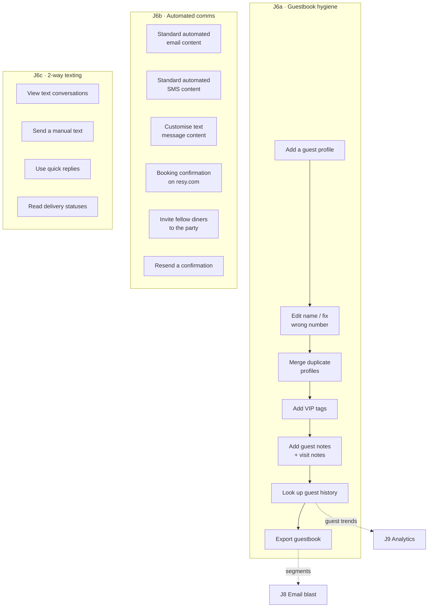

```yaml
journey: "J6 — Guest Profiles & Communications"
interface: "ResyOS iPad app (guestbook, texting) + Dashboard (comms templates)"
target_role: "Host team / Marketing"
cadence: "Continuous"
steps:
  - step_id: "J6_01"
    title: "Create or attach a guest profile"
    navigation_path: "ResyOS app > Guests > Add Guest"
    prerequisites: []
    inputs_required:
      - field_name: "First / last name"
        type: "string"
        required: true
      - field_name: "Phone"
        type: "string"
        required: false
      - field_name: "Email"
        type: "string"
        required: false
    actions:
      - "Search before creating — duplicate profiles fragment visit history."
      - "Attach the profile to seated walk-ins so the visit counts toward their history."
    outputs: ["Guest profile"]
    kb_article: "general/how-to-add-a-guest.md"

  - step_id: "J6_02"
    title: "Correct profile data"
    navigation_path: "ResyOS app > Guests > [Guest] > Edit"
    prerequisites: ["J6_01"]
    inputs_required:
      - field_name: "Corrected name / phone / email"
        type: "string"
        required: true
    actions:
      - "Fix misspelled names so the guest is findable next visit."
      - "When a number reaches the wrong person, clear it — leaving it sends this venue's texts to a stranger."
      - "Merge duplicates rather than deleting; merging preserves the combined visit history."
    outputs: ["Clean, deduplicated guestbook"]
    kb_article: "in-service-troubleshooting/guest-profile/how-to-edit-a-guest's-name.md"
    related:
      - "getting-started-settings/guest-communications/how-to-merge-guest-profiles.md"
      - "in-service-troubleshooting/guest-profile/right-number-wrong-guest.md"
      - "in-service-troubleshooting/guest-profile/guest-wrong-number.md"

  - step_id: "J6_03"
    title: "Tag VIPs"
    navigation_path: "ResyOS app > Guests > [Guest] > Tags > VIP"
    prerequisites: ["J6_01"]
    inputs_required:
      - field_name: "VIP tag name"
        type: "string"
        required: true
    actions:
      - "Create the venue's own VIP taxonomy (Owner Friend, Press, Industry, Regular)."
      - "VIP tags surface as icons on the booked list so the whole team sees them at seating."
    outputs: ["VIP-flagged profiles"]
    kb_article: "in-service-troubleshooting/guest-profile/create-and-add-vip-tags.md"

  - step_id: "J6_04"
    title: "Record guest notes and visit notes"
    navigation_path: "ResyOS app > [Reservation or Guest] > Notes"
    prerequisites: ["J6_01"]
    inputs_required:
      - field_name: "Guest note (permanent)"
        type: "text"
        required: false
      - field_name: "Visit note (this reservation only)"
        type: "text"
        required: false
    actions:
      - "Guest notes persist across every future visit — allergies, seating preference, wine of choice."
      - "Visit notes apply to one booking — occasion, special request from tonight's call."
    outputs: ["Institutional memory of the guest"]
    kb_article: "in-service-troubleshooting/guest-profile/how-to-add-visit-notes-and-guest-notes-in-resyos.md"

  - step_id: "J6_05"
    title: "Look up guest history"
    navigation_path: "ResyOS app > Guests > [Guest] > History"
    prerequisites: ["J6_01"]
    inputs_required:
      - field_name: "Guest name or phone"
        type: "string"
        required: true
    actions:
      - "Check visit count, spend, no-shows and past notes before the party arrives."
    outputs: ["Pre-shift VIP brief"]
    kb_article: "in-service-troubleshooting/guest-profile/how-to-find-guest-history.md"

  - step_id: "J6_06"
    title: "Export the guestbook"
    navigation_path: "Dashboard > Guests > Export"
    prerequisites: ["J11_01"]
    inputs_required:
      - field_name: "Date range / segment"
        type: "object"
        required: true
    actions:
      - "Export for email marketing or CRM sync; check the FAQ for which fields are included."
      - "Handle the export under the venue's own privacy obligations."
    outputs: ["Guest CSV for marketing / CRM"]
    kb_article: "general/guestbook-download-faq.md"

  - step_id: "J6_07"
    title: "Review the automated comms the guest already receives"
    navigation_path: "Dashboard > Settings > Guest Communications"
    prerequisites: ["J2_01"]
    inputs_required: []
    actions:
      - "Read the standard automated email and SMS content so staff know what the guest was already told."
      - "Confirm the on-site booking confirmation copy matches the venue's tone."
    outputs: ["Known baseline guest messaging"]
    kb_article: "getting-started-settings/guest-communications/standard-resy-automated-email-content.md"
    related:
      - "getting-started-settings/guest-communications/standard-resy-automated-sms-content.md"
      - "general/guest-communications-emails.md"
      - "general/guest-booking-confirmation-on-resy-com.md"

  - step_id: "J6_08"
    title: "Customise message content"
    navigation_path: "Dashboard > Settings > Guest Communications > Customize"
    prerequisites: ["J6_07"]
    inputs_required:
      - field_name: "Message type (confirmation, reminder, thank-you)"
        type: "enum"
        required: true
      - field_name: "Custom body copy"
        type: "text"
        required: true
    actions:
      - "Override the default copy per message type — parking instructions, dress code, arrival notes."
      - "Keep SMS short; long bodies split into multiple messages."
    outputs: ["Venue-specific guest messaging"]
    kb_article: "getting-started-settings/guest-communications/customizing-text-message-content.md"

  - step_id: "J6_09"
    title: "Let guests invite their party"
    navigation_path: "Dashboard > Settings > Guest Communications > Invite Fellow Diners"
    prerequisites: ["J6_07"]
    inputs_required:
      - field_name: "Feature enabled"
        type: "boolean"
        required: true
    actions:
      - "Enable invites so the booker can add their guests — each invitee becomes a known profile."
    outputs: ["Additional guest profiles per reservation"]
    kb_article: "getting-started-settings/guest-communications/guests-can-invite-fellow-diners-to-their-reservation-party.md"

  - step_id: "J6_10"
    title: "Resend a booking confirmation"
    navigation_path: "ResyOS app > [Reservation] > Resend Confirmation"
    prerequisites: ["J5_03"]
    inputs_required:
      - field_name: "Reservation"
        type: "enum"
        required: true
    actions:
      - "Resend when the guest says they never received it — first verify the email on the profile is right."
    outputs: ["Delivered confirmation"]
    kb_article: "in-service-troubleshooting/guest-profile/how-to-resend-a-booking-confirmation-email-to-a-guest.md"

  - step_id: "J6_11"
    title: "Run 2-way texting"
    navigation_path: "ResyOS app > Messages"
    prerequisites: ["J6_01"]
    inputs_required:
      - field_name: "Guest thread"
        type: "enum"
        required: true
      - field_name: "Message body or quick reply"
        type: "text"
        required: true
    actions:
      - "Open the guest's thread to see the full conversation, inbound and outbound."
      - "Send a manual text for running-late, table-ready and special-request exchanges."
      - "Save the venue's repeated answers as quick replies so hosts respond in one tap."
      - "Watch delivery statuses — a failed status means the number is bad, not that the guest ignored you."
    outputs: ["Live guest conversation", "Delivery confirmation"]
    kb_article: "in-service-troubleshooting/resy-2-way-texting/how-to-view-text-message-conversations-in-resyos.md"
    related:
      - "in-service-troubleshooting/resy-2-way-texting/how-to-manually-send-a-text-message-to-your-guests..md"
      - "in-service-troubleshooting/resy-2-way-texting/text-message-quick-replies.md"
      - "in-service-troubleshooting/resy-2-way-texting/text-message-statuses-in-resyos.md"
```

---

### J7 · Events & Ticketed Experiences

Ticketed and special-service inventory. Depends on J3 (slots) and J4 (Stripe). 15 articles,
51 screenshots.

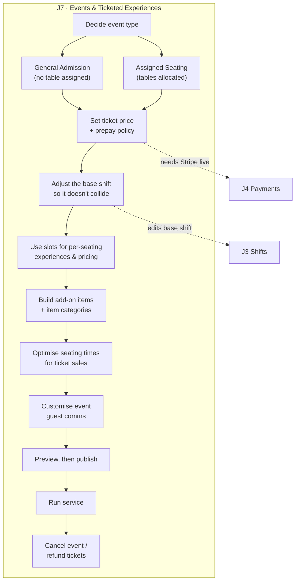

```yaml
journey: "J7 — Events & Ticketed Experiences"
interface: "Resy OS Dashboard > Events"
target_role: "GM / Events lead"
cadence: "Per event"
steps:
  - step_id: "J7_01"
    title: "Create the event"
    navigation_path: "Dashboard > Events > Create Event"
    prerequisites: ["J3_01", "J4_05"]
    inputs_required:
      - field_name: "Event name"
        type: "string"
        required: true
      - field_name: "Date(s)"
        type: "date[]"
        required: true
      - field_name: "Seating type (General Admission / Assigned)"
        type: "enum"
        required: true
      - field_name: "Ticket price per person"
        type: "currency"
        required: true
      - field_name: "Capacity"
        type: "integer"
        required: true
      - field_name: "Event description"
        type: "text"
        required: true
    actions:
      - "Pick the seating model up front: GA sells tickets without tables, assigned seating allocates real tables."
      - "Set price and capacity; the ticket charge runs through the Stripe account from J4_01."
    outputs: ["Draft event"]
    kb_article: "events-virtual-experiences/how-to-create-an-event.md"
    related:
      - "events-virtual-experiences/general-admission-event.md"
      - "events-virtual-experiences/how-to-create-an-assigned-seating-event.md"

  - step_id: "J7_02"
    title: "Adjust the base shift around the event"
    navigation_path: "Dashboard > Service > Shift Settings > [Event date]"
    prerequisites: ["J7_01"]
    inputs_required:
      - field_name: "Event date"
        type: "date"
        required: true
      - field_name: "Base-shift change (close, reduce covers, restrict floor plan)"
        type: "enum"
        required: true
    actions:
      - "Stop the normal shift from double-selling the tables the event needs (single-day edit, J3_10)."
      - "To run an event and normal service side by side, split by floor plan or table type instead of closing."
    outputs: ["Non-colliding inventory"]
    kb_article: "events-virtual-experiences/how-to-adjust-your-base-shift-when-hosting-an-event.md"
    related: ["events-virtual-experiences/how-to-run-a-special-service-while-running-normal-service.md"]

  - step_id: "J7_03"
    title: "Use slots for per-seating experiences"
    navigation_path: "Dashboard > Events > [Event] > Slots"
    prerequisites: ["J7_01"]
    inputs_required:
      - field_name: "Slot per seating time"
        type: "object[]"
        required: true
      - field_name: "Price per slot"
        type: "currency"
        required: false
    actions:
      - "Give each seating time its own slot when the experience or price differs (early vs prime)."
    outputs: ["Differentiated event inventory"]
    kb_article: "events-virtual-experiences/use-slots-to-create-unique-experiences-for-each-seating-time-of-your-event.md"

  - step_id: "J7_04"
    title: "Build add-on items"
    navigation_path: "Dashboard > Items > Add-On Items"
    prerequisites: ["J4_05"]
    inputs_required:
      - field_name: "Item name"
        type: "string"
        required: true
      - field_name: "Price"
        type: "currency"
        required: true
      - field_name: "Category"
        type: "string"
        required: false
      - field_name: "Max quantity per booking"
        type: "integer"
        required: false
    actions:
      - "Create items for wine pairings, upgrades and merchandise; group them into categories for the booking flow."
      - "Apply items to prepaid reservations so the charge is collected at booking."
      - "Add-ons at different prices are the mechanism for tiered event tickets."
    outputs: ["Purchasable add-ons attached to inventory"]
    kb_article: "resy-40/add-on-items/how-can-i-manage-add-on-items.md"
    related:
      - "resy-40/add-on-items/how-to-organize-items-in-categories.md"
      - "resy-40/add-on-items/how-to-apply-items-to-prepaid-reservations.md"
      - "events-virtual-experiences/how-can-i-add-prepaid-items-to-an-event-ticket.md"
      - "general/using-add-ons-to-offer-different-priced-event-tickets.md"

  - step_id: "J7_05"
    title: "Optimise seating times for sell-through"
    navigation_path: "Dashboard > Events > [Event] > Seating Times"
    prerequisites: ["J7_03"]
    inputs_required:
      - field_name: "Seating times offered"
        type: "time[]"
        required: true
    actions:
      - "Spread seating times to match real demand rather than offering one prime slot that sells out instantly."
    outputs: ["Higher ticket sell-through"]
    kb_article: "events-virtual-experiences/how-to-optimize-seating-times-for-maximum-event-ticket-sales.md"

  - step_id: "J7_06"
    title: "Customise event guest communications"
    navigation_path: "Dashboard > Events > [Event] > Communications"
    prerequisites: ["J7_01"]
    inputs_required:
      - field_name: "Confirmation / reminder copy"
        type: "text"
        required: true
    actions:
      - "Override the standard templates with event-specific arrival, menu and refund details."
    outputs: ["Event-specific guest messaging"]
    kb_article: "events-virtual-experiences/how-to-customize-guest-communications-for-events.md"

  - step_id: "J7_07"
    title: "Preview and publish"
    navigation_path: "Dashboard > Events > [Event] > Preview"
    prerequisites: ["J7_01", "J7_06"]
    inputs_required: []
    actions:
      - "Preview exactly what the diner sees — price, description, add-ons, policy — before it goes live."
      - "Publish; the event appears on the venue's resy.com page and the booking widget."
    outputs: ["Live, bookable event"]
    kb_article: "general/event-preview.md"

  - step_id: "J7_08"
    title: "Cancel an event and refund"
    navigation_path: "Dashboard > Events > [Event] > Cancel"
    prerequisites: ["J7_07"]
    inputs_required:
      - field_name: "Cancellation reason / guest message"
        type: "text"
        required: true
      - field_name: "Refund scope (all tickets, partial)"
        type: "enum"
        required: true
    actions:
      - "Cancel the event, message every ticket holder, and issue refunds through the Stripe flow (J4_08)."
    outputs: ["Cancelled event", "Refunded ticket holders"]
    kb_article: "events-virtual-experiences/event-cancellation.md"
```

---

### J8 · Marketing & Channel Distribution

Getting the venue's inventory in front of diners, on and off Resy. 7 articles, 26 screenshots.
Last setup step before go-live.

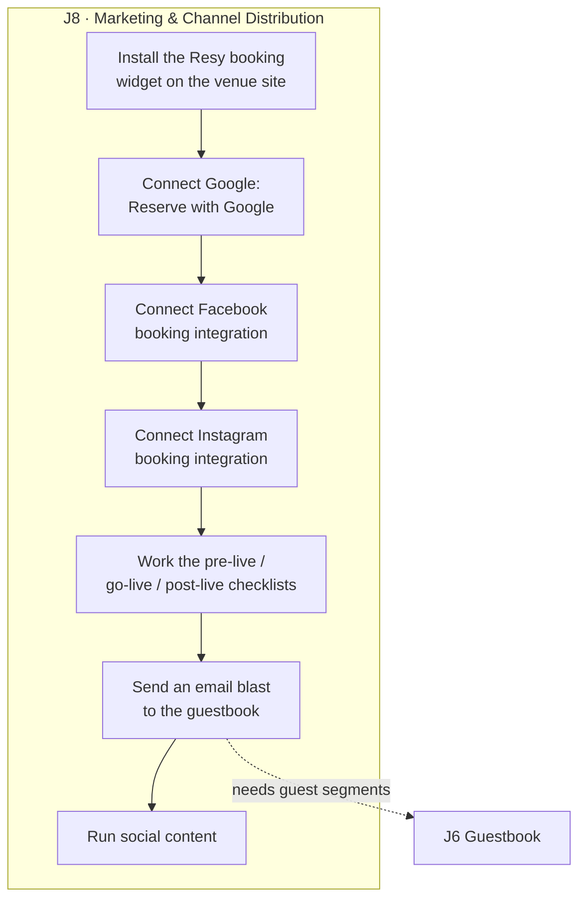

```yaml
journey: "J8 — Marketing & Channel Distribution"
interface: "Resy OS Dashboard + venue website + Google/Meta business tools"
target_role: "Marketing / GM"
cadence: "Pre-launch, then per campaign"
steps:
  - step_id: "J8_01"
    title: "Install the booking widget"
    navigation_path: "Dashboard > Settings > Widget > Copy embed code"
    prerequisites: ["J2_01"]
    inputs_required:
      - field_name: "Venue id (in the embed snippet)"
        type: "string"
        required: true
      - field_name: "Website CMS access"
        type: "boolean"
        required: true
    actions:
      - "Copy the embed snippet and paste it into the venue website's reservations page."
      - "Verify the widget loads live inventory before go-live — a stale venue id books nothing."
    outputs: ["Direct bookings from the venue's own site"]
    kb_article: "general/booking-button-installation.md"

  - step_id: "J8_02"
    title: "Connect Google"
    navigation_path: "Dashboard > Settings > Integrations > Google"
    prerequisites: ["J8_01"]
    inputs_required:
      - field_name: "Google Business Profile ownership"
        type: "boolean"
        required: true
    actions:
      - "Enable the Google integration so a Reserve button appears on Search and Maps."
      - "Confirm the listing points at the right venue — duplicate listings split traffic."
    outputs: ["Bookable from Google Search / Maps"]
    kb_article: "marketing-and-promotion/google-integration.md"

  - step_id: "J8_03"
    title: "Connect Facebook and Instagram"
    navigation_path: "Dashboard > Settings > Integrations > Facebook / Instagram"
    prerequisites: ["J8_01"]
    inputs_required:
      - field_name: "Meta Business page admin access"
        type: "boolean"
        required: true
    actions:
      - "Link the Meta business page and add the Resy action button to Facebook and Instagram profiles."
    outputs: ["Bookable from social profiles"]
    kb_article: "marketing-and-promotion/resy-x-facebook-integration:.md"
    related: ["marketing-and-promotion/resy-x-instagram-integration.md"]

  - step_id: "J8_04"
    title: "Run the transition marketing checklists"
    navigation_path: "Marketing plan — no Resy UI"
    prerequisites: ["J8_01"]
    inputs_required:
      - field_name: "Go-live date"
        type: "date"
        required: true
    actions:
      - "Work the pre-live, go-live and post-live checklists so diners are not sent to a dead old booking link."
      - "Update every off-platform link — website, newsletter footer, third-party listings."
    outputs: ["Clean platform transition"]
    kb_article: "marketing-and-promotion/marketing-the-transition-to-resy:-pre-live-go-live-post-live-checklists.md"

  - step_id: "J8_05"
    title: "Send an email blast"
    navigation_path: "Dashboard > Marketing > Email Blast"
    prerequisites: ["J6_06"]
    inputs_required:
      - field_name: "Recipient segment"
        type: "enum"
        required: true
      - field_name: "Subject line"
        type: "string"
        required: true
      - field_name: "Body content"
        type: "text"
        required: true
      - field_name: "Send time"
        type: "datetime"
        required: true
    actions:
      - "Select the guestbook segment, write the campaign, and preview before sending."
      - "Include a direct booking link so the email converts into inventory."
    outputs: ["Campaign sent", "Bookings attributable to the blast"]
    kb_article: "marketing-and-promotion/how-to-send-an-email-blast.md"

  - step_id: "J8_06"
    title: "Keep social content running"
    navigation_path: "External social platforms"
    prerequisites: ["J8_03"]
    inputs_required: []
    actions:
      - "Follow the social playbook for cadence, content types and booking-link placement."
    outputs: ["Sustained demand between campaigns"]
    kb_article: "marketing-and-promotion/restaurant-social-media-tips-+-tricks.md"
```

---

### J9 · Reporting & Analytics

Largest screenshot set in the KB — 26 articles, 115 screenshots. Three tiers: daily snapshot,
Advanced Analytics dashboards, and POS-joined revenue analysis.

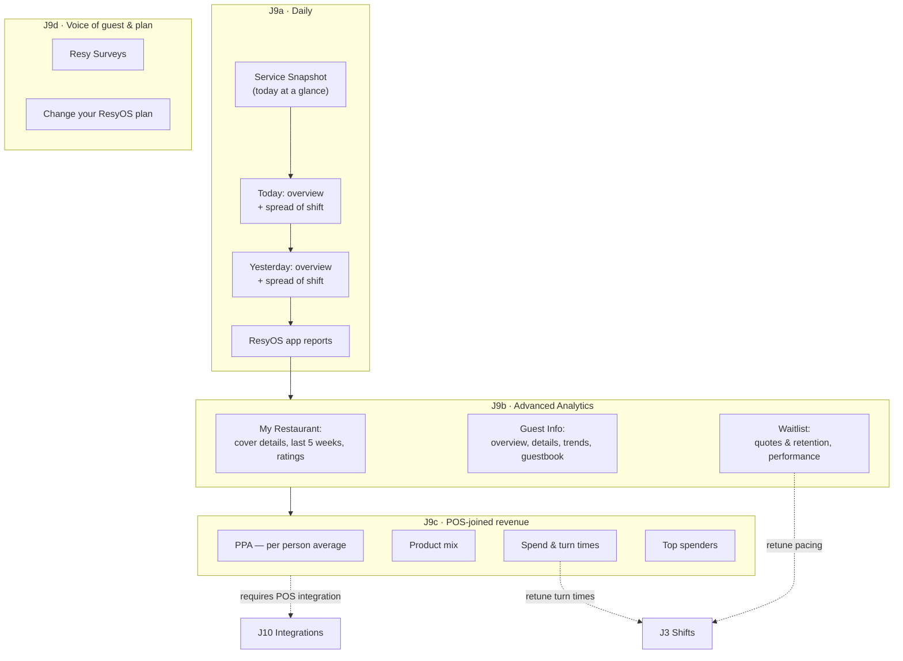

```yaml
journey: "J9 — Reporting & Analytics"
interface: "Resy OS Dashboard > Analytics (Advanced Analytics on eligible plans)"
target_role: "GM / Owner"
cadence: "Daily snapshot; weekly and monthly deep dives"
steps:
  - step_id: "J9_01"
    title: "Read the Service Snapshot"
    navigation_path: "Dashboard > Analytics > Service Snapshot"
    prerequisites: ["J5_08"]
    inputs_required:
      - field_name: "Date"
        type: "date"
        required: true
    actions:
      - "Check covers, seated vs booked, no-shows and walk-ins for the service just finished."
      - "Accuracy depends entirely on statuses being maintained during service (J5_08)."
    outputs: ["Daily performance read"]
    kb_article: "reporting-analytics/service-snapshot.md"
    related: ["general/resyos-apps-reports.md"]

  - step_id: "J9_02"
    title: "Work the Today and Yesterday dashboards"
    navigation_path: "Dashboard > Analytics > Advanced Analytics > Today / Yesterday"
    prerequisites: ["J9_01"]
    inputs_required:
      - field_name: "Shift filter"
        type: "enum"
        required: false
    actions:
      - "Use Overview for the headline numbers and Spread of Shift to see where covers clustered."
      - "A spiky spread means pacing needs work (J3_05); a flat tail means the booking window is too tight (J3_06)."
    outputs: ["Pacing and demand-shape insight"]
    kb_article: "reporting-analytics/advanced-analytics/today-overview.md"
    related:
      - "reporting-analytics/advanced-analytics/today-spread-of-shift.md"
      - "reporting-analytics/advanced-analytics/yesterday-overview.md"
      - "reporting-analytics/advanced-analytics/yesterday-spread-of-shift.md"

  - step_id: "J9_03"
    title: "Review My Restaurant trends"
    navigation_path: "Dashboard > Analytics > Advanced Analytics > My Restaurant"
    prerequisites: ["J9_02"]
    inputs_required:
      - field_name: "Date range"
        type: "daterange"
        required: true
    actions:
      - "Compare Last 5 Weeks for week-over-week trend; use Cover Details to break covers down by shift and party size."
      - "Read Ratings for the diner-side score and where it is moving."
    outputs: ["Trend line on covers and reputation"]
    kb_article: "reporting-analytics/advanced-analytics/my-restaurant-last-5-weeks.md"
    related:
      - "reporting-analytics/advanced-analytics/my-restaurant-cover-details.md"
      - "reporting-analytics/advanced-analytics/my-restaurant-ratings.md"

  - step_id: "J9_04"
    title: "Analyse the guest base"
    navigation_path: "Dashboard > Analytics > Advanced Analytics > Guest Info"
    prerequisites: ["J6_01"]
    inputs_required:
      - field_name: "Segment (new vs returning, visit count)"
        type: "enum"
        required: false
    actions:
      - "Use Overview and Trends for the new-vs-returning mix; Details and Guestbook for individual behaviour."
      - "Guestbook quality here is only as good as the profile hygiene in J6_02."
    outputs: ["Retention and acquisition read", "Segments for J8_05 campaigns"]
    kb_article: "reporting-analytics/advanced-analytics/guest-info-overview.md"
    related:
      - "reporting-analytics/advanced-analytics/guest-info-trends.md"
      - "reporting-analytics/advanced-analytics/guest-info-details.md"
      - "reporting-analytics/advanced-analytics/guest-info-guestbook.md"

  - step_id: "J9_05"
    title: "Measure waitlist performance"
    navigation_path: "Dashboard > Analytics > Advanced Analytics > Waitlist"
    prerequisites: ["J5_10"]
    inputs_required:
      - field_name: "Date range"
        type: "daterange"
        required: true
    actions:
      - "Compare quoted vs actual waits — a quote that is habitually short is what loses walk-ins."
      - "Use retention numbers to size how much overflow demand the room is actually capturing."
    outputs: ["Calibrated wait quotes", "Overflow demand estimate"]
    kb_article: "reporting-analytics/advanced-analytics/waitlist-waitlist-performance.md"
    related: ["reporting-analytics/advanced-analytics/waitlist-quotes-retention.md"]

  - step_id: "J9_06"
    title: "Connect POS data to reservations"
    navigation_path: "Dashboard > Settings > Integrations > POS"
    prerequisites: ["J10_01"]
    inputs_required:
      - field_name: "POS vendor"
        type: "enum"
        required: true
      - field_name: "POS credentials / location id"
        type: "string"
        required: true
    actions:
      - "Connect the POS so checks join to reservations — without this the whole POS tier of Analytics is empty."
      - "Verify check-to-reservation matching before trusting the numbers."
    outputs: ["Revenue joined to reservations"]
    kb_article: "reporting-analytics/pos-integrations-HkUQN3s5u.md"
    related:
      - "reporting-analytics/pos-integrations-BJ4QMDQLd.md"
      - "reporting-analytics/resyos-and-pos-reporting.md"

  - step_id: "J9_07"
    title: "Run POS revenue analysis"
    navigation_path: "Dashboard > Analytics > Advanced Analytics > POS"
    prerequisites: ["J9_06"]
    inputs_required:
      - field_name: "Date range"
        type: "daterange"
        required: true
      - field_name: "Shift / party-size filter"
        type: "enum"
        required: false
    actions:
      - "Read PPA to see which shifts and party sizes actually earn."
      - "Use Product Mix for menu performance and Top Spenders to identify guests worth VIP-tagging (J6_03)."
      - "Spend & Turn Times is the evidence for whether turn times in J3_02 are set correctly."
    outputs: ["Revenue-grounded decisions on pacing, turn times and menu"]
    kb_article: "reporting-analytics/advanced-analytics/pos-per-person-average-ppa.md"
    related:
      - "reporting-analytics/advanced-analytics/pos-product-mix.md"
      - "reporting-analytics/advanced-analytics/pos-spend-turn-times.md"
      - "reporting-analytics/advanced-analytics/pos-top-spenders.md"
      - "reporting-analytics/advanced-analytics/advanced-analytics-faq.md"
      - "reporting-analytics/resy-analytics.md"

  - step_id: "J9_08"
    title: "Read guest survey feedback"
    navigation_path: "Dashboard > Analytics > Surveys"
    prerequisites: ["J6_07"]
    inputs_required:
      - field_name: "Date range"
        type: "daterange"
        required: true
    actions:
      - "Review post-visit survey responses for service issues the numbers do not show."
    outputs: ["Qualitative service feedback"]
    kb_article: "reporting-analytics/resy-surveys.md"

  - step_id: "J9_09"
    title: "Change plan to unlock reporting tiers"
    navigation_path: "Dashboard > Settings > Plan"
    prerequisites: ["J11_02"]
    inputs_required:
      - field_name: "Target plan"
        type: "enum"
        required: true
    actions:
      - "Advanced Analytics is plan-gated; upgrade if the POS and Guest Info tiers are not visible."
    outputs: ["Plan change request"]
    kb_article: "reporting-analytics/change-your-resy-os-plan.md"
    related: ["general/platform-360-plan-features.md"]
```

---
### J10 · Integrations

Third-party systems bolted onto Resy OS. 9 articles, 14 screenshots. Entered any time, but POS
must be connected before the POS tier of J9 has any data.

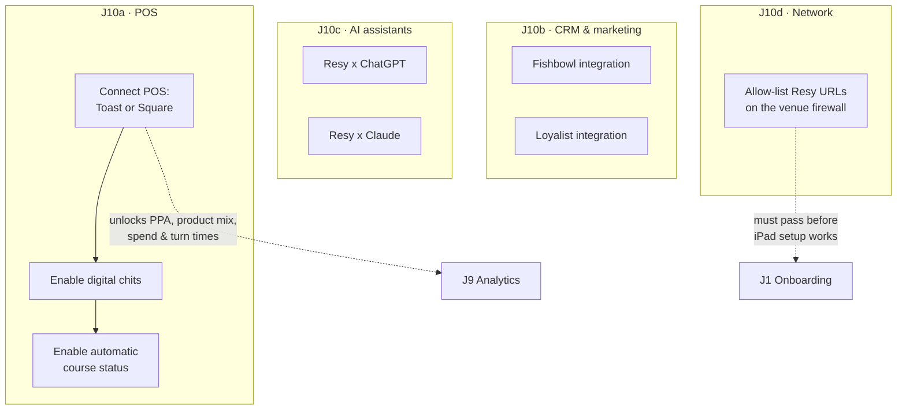

```yaml
journey: "J10 — Integrations"
interface: "Resy OS Dashboard > Integrations + vendor portals"
target_role: "GM / IT"
cadence: "On adoption; firewall step is pre-launch"
steps:
  - step_id: "J10_01"
    title: "Connect the POS"
    navigation_path: "Dashboard > Settings > Integrations > Toast / Square"
    prerequisites: ["J11_01"]
    inputs_required:
      - field_name: "POS vendor (Toast, Square)"
        type: "enum"
        required: true
      - field_name: "POS account credentials / location id"
        type: "string"
        required: true
      - field_name: "Table mapping POS ↔ Resy"
        type: "object"
        required: true
    actions:
      - "Authorise Resy in the POS vendor portal, then map POS table names to Resy tables."
      - "Bad table mapping is the usual cause of checks that never join to a reservation."
    outputs: ["Checks joined to reservations", "POS analytics tier unlocked (J9_07)"]
    kb_article: "general/pos-integrations-toast.md"
    related: ["general/pos-integrations-square.md"]

  - step_id: "J10_02"
    title: "Turn on digital chits"
    navigation_path: "Dashboard > Settings > Integrations > POS > Digital Chits"
    prerequisites: ["J10_01"]
    inputs_required:
      - field_name: "Feature enabled"
        type: "boolean"
        required: true
    actions:
      - "Push reservation notes and tags to the kitchen as digital chits instead of paper."
    outputs: ["Kitchen sees guest context without printing"]
    kb_article: "general/pos-integration-digital-chits-feature.md"

  - step_id: "J10_03"
    title: "Turn on automatic course status"
    navigation_path: "Dashboard > Settings > Integrations > POS > Course Status"
    prerequisites: ["J10_01"]
    inputs_required:
      - field_name: "Feature enabled"
        type: "boolean"
        required: true
    actions:
      - "Let POS course firing drive the reservation status automatically — hosts stop updating it by hand."
      - "This makes the turn-time data in J9_07 materially more accurate."
    outputs: ["Auto-advancing reservation status", "Cleaner turn-time data"]
    kb_article: "general/pos-integration-automatic-course-status.md"

  - step_id: "J10_04"
    title: "Connect CRM / marketing platforms"
    navigation_path: "Dashboard > Settings > Integrations > Fishbowl / Loyalist"
    prerequisites: ["J6_06"]
    inputs_required:
      - field_name: "Vendor account credentials"
        type: "string"
        required: true
    actions:
      - "Sync the guestbook out to Fishbowl or Loyalist so marketing runs on live guest data."
    outputs: ["Guest data flowing to the CRM"]
    kb_article: "general/fishbowl-integration.md"
    related: ["general/loyalist-integration.md"]

  - step_id: "J10_05"
    title: "Enable AI assistant booking"
    navigation_path: "No venue action — platform-level availability"
    prerequisites: []
    inputs_required: []
    actions:
      - "Understand that diners can discover and book the venue through ChatGPT and Claude integrations."
      - "Inventory and policies are the same ones configured in J3 and J4 — nothing separate to maintain."
    outputs: ["Bookings sourced from AI assistants"]
    kb_article: "general/resy-chatgpt-integration.md"
    related: ["general/resy-claude-integration.md"]

  - step_id: "J10_06"
    title: "Allow-list Resy on the venue network"
    navigation_path: "Venue firewall / router admin — no Resy UI"
    prerequisites: []
    inputs_required:
      - field_name: "Resy URL allow-list"
        type: "string[]"
        required: true
    actions:
      - "Give the allow-list to whoever runs the venue network before install day."
      - "A blocked URL looks exactly like a broken iPad — check this before escalating in J5_13."
    outputs: ["iPad and Dashboard reachable on venue Wi-Fi"]
    kb_article: "general/allowed-urls-to-run-resy.md"
```

---

### J11 · Users, Access & Billing

Who can log in, what they can do, and what the venue pays. 8 articles, 29 screenshots.
Must be partly done before go-live — staff need logins.

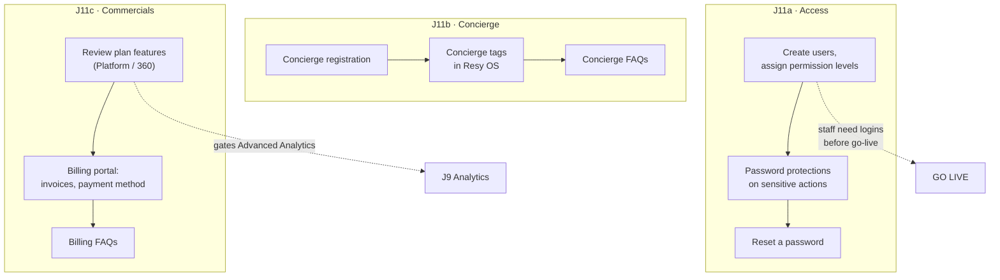

```yaml
journey: "J11 — Users, Access & Billing"
interface: "Resy OS Dashboard + Resy Billing Portal"
target_role: "Owner / Admin"
cadence: "On staffing change; billing monthly"
steps:
  - step_id: "J11_01"
    title: "Set up users and permissions"
    navigation_path: "Dashboard > Settings > Users"
    prerequisites: ["J2_01"]
    inputs_required:
      - field_name: "User name"
        type: "string"
        required: true
      - field_name: "Email"
        type: "string"
        required: true
      - field_name: "Permission level (Owner, Manager, Host, Read-only)"
        type: "enum"
        required: true
      - field_name: "Password-protected actions"
        type: "enum[]"
        required: false
    actions:
      - "Give each staff member their own login — shared logins destroy the audit trail on cancellations and comps."
      - "Set permission level to the minimum the role needs; only Owner/Manager should reach payments and analytics."
      - "Turn on password protection for destructive actions (cancel, refund, comp) on the iPad."
    outputs: ["Per-user access", "Audited actions"]
    kb_article: "getting-started-settings/user-settings/user-permissions.md"

  - step_id: "J11_02"
    title: "Reset a password"
    navigation_path: "Dashboard login > Forgot Password — or Dashboard > [initials, top right] > Reset Password"
    prerequisites: ["J11_01"]
    inputs_required:
      - field_name: "Account email"
        type: "string"
        required: true
    actions:
      - "Use Forgot Password from the login page when locked out."
      - "When already logged in, reset from the initials menu in the upper-right corner."
    outputs: ["Restored access"]
    kb_article: "getting-started-settings/how-to-reset-your-password.md"

  - step_id: "J11_03"
    title: "Register and configure concierge access"
    navigation_path: "Dashboard > Settings > Concierge"
    prerequisites: ["J11_01"]
    inputs_required:
      - field_name: "Concierge / hotel partner details"
        type: "object"
        required: true
      - field_name: "Concierge tag"
        type: "string"
        required: false
    actions:
      - "Register concierge partners so hotel and travel bookings are attributable."
      - "Apply concierge tags to those reservations to track which partner drives covers."
    outputs: ["Attributed concierge bookings"]
    kb_article: "general/concierge-registration.md"
    related:
      - "getting-started-settings/concierge-/how-to-use-concierge-tags-in-resy-os.md"
      - "getting-started-settings/concierge-/concierge-faqs.md"

  - step_id: "J11_04"
    title: "Review the plan and its features"
    navigation_path: "Dashboard > Settings > Plan"
    prerequisites: []
    inputs_required:
      - field_name: "Current plan"
        type: "enum"
        required: true
    actions:
      - "Check which features the current plan includes before hunting for a missing screen."
      - "Advanced Analytics, some event features and some integrations are plan-gated."
    outputs: ["Clear picture of entitlements"]
    kb_article: "general/platform-360-plan-features.md"

  - step_id: "J11_05"
    title: "Manage billing"
    navigation_path: "Resy Billing Portal"
    prerequisites: ["J11_01"]
    inputs_required:
      - field_name: "Payment method"
        type: "object"
        required: true
      - field_name: "Billing contact"
        type: "string"
        required: true
    actions:
      - "Download invoices, update the payment method and set the billing contact in the portal."
      - "Billing is separate from Stripe payouts (J4_02) — one is what the venue pays, the other is what it receives."
    outputs: ["Current invoices", "Valid payment method on file"]
    kb_article: "billing/resy-billing-portal.md"
    related: ["general/billing-faqs.md"]
```

---

### J12 · Amex Programs & Global Dining Access

Amex-linked programs: Global Dining Access inventory, Resy Credit and the Resy reward card.
9 articles, 20 screenshots. Only applies to participating venues.

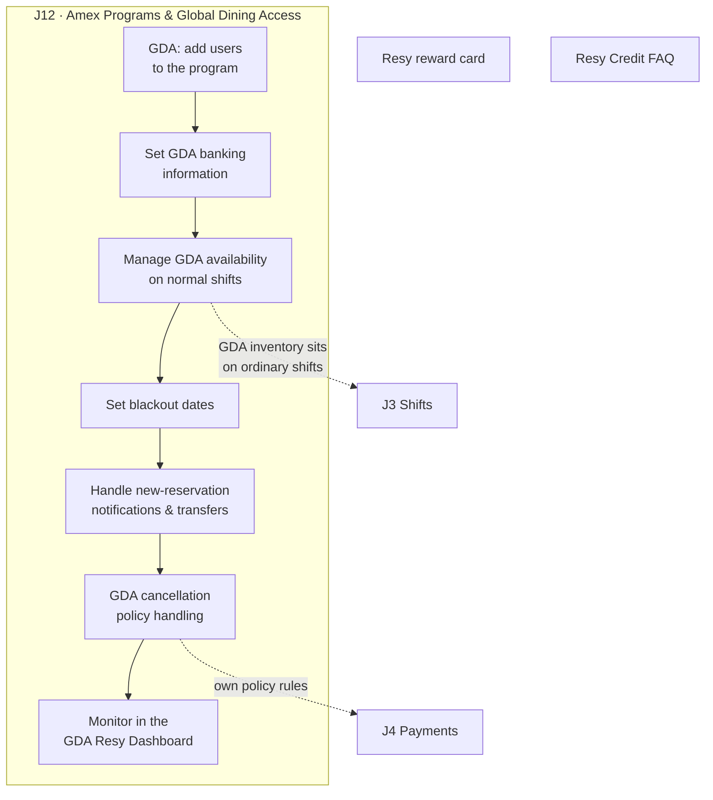

```yaml
journey: "J12 — Amex Programs & Global Dining Access"
interface: "Resy OS Dashboard > Global Dining Access"
target_role: "GM / Owner at participating venues"
cadence: "Setup once, then availability upkeep"
steps:
  - step_id: "J12_01"
    title: "Add users to the GDA program"
    navigation_path: "Dashboard > Global Dining Access > Users"
    prerequisites: ["J11_01"]
    inputs_required:
      - field_name: "User"
        type: "enum"
        required: true
      - field_name: "GDA role"
        type: "enum"
        required: true
    actions:
      - "Grant GDA access only to staff who manage the program — it carries its own notifications and policies."
    outputs: ["GDA-enabled users"]
    kb_article: "global-dining-access/global-dining-access:-adding-new-users.md"

  - step_id: "J12_02"
    title: "Provide GDA banking information"
    navigation_path: "Dashboard > Global Dining Access > Banking"
    prerequisites: ["J4_02"]
    inputs_required:
      - field_name: "Bank account / routing details"
        type: "object"
        required: true
    actions:
      - "Supply the banking details GDA pays out to; this is distinct from the Stripe payout account in J4_02."
    outputs: ["GDA payouts configured"]
    kb_article: "global-dining-access/global-dining-access:-banking-information.md"

  - step_id: "J12_03"
    title: "Manage GDA availability"
    navigation_path: "Dashboard > Global Dining Access > Availability"
    prerequisites: ["J3_01"]
    inputs_required:
      - field_name: "Shifts / times released to GDA"
        type: "object"
        required: true
      - field_name: "Number of GDA seats"
        type: "integer"
        required: true
    actions:
      - "Release GDA inventory on top of the ordinary shifts built in J3 — it is not a separate shift type."
      - "Watch total capacity: GDA seats consume the same pacing budget as public inventory."
    outputs: ["GDA-bookable inventory"]
    kb_article: "general/managing-global-dining-access-availability.md"

  - step_id: "J12_04"
    title: "Set blackout dates"
    navigation_path: "Dashboard > Global Dining Access > Blackout Dates"
    prerequisites: ["J12_03"]
    inputs_required:
      - field_name: "Blackout date(s)"
        type: "date[]"
        required: true
    actions:
      - "Block GDA on dates the venue needs entirely for itself — holidays, buyouts, private events."
    outputs: ["GDA excluded on protected dates"]
    kb_article: "global-dining-access/global-dining-access:-blackout-dates.md"

  - step_id: "J12_05"
    title: "Handle GDA notifications and transfers"
    navigation_path: "Dashboard > Global Dining Access > Reservations"
    prerequisites: ["J12_03"]
    inputs_required:
      - field_name: "Reservation"
        type: "enum"
        required: true
    actions:
      - "Watch for new-reservation notifications and action transfer requests promptly."
      - "GDA cancellations follow the program's own policy, not the venue's standard one from J4_04."
    outputs: ["Correctly handled GDA bookings"]
    kb_article: "global-dining-access/global-dining-access:-new-reservation-notification-and-transfers.md"
    related: ["global-dining-access/global-dining-access:-cancellation-policy-faq.md"]

  - step_id: "J12_06"
    title: "Monitor the GDA dashboard"
    navigation_path: "Dashboard > Global Dining Access > Overview"
    prerequisites: ["J12_03"]
    inputs_required: []
    actions:
      - "Review GDA bookings, fill rate and payouts in the dedicated GDA view."
    outputs: ["GDA program performance read"]
    kb_article: "global-dining-access/global-dining-access:-resy-dashboard.md"

  - step_id: "J12_07"
    title: "Understand Resy Credit and the reward card"
    navigation_path: "Reference — no venue configuration"
    prerequisites: []
    inputs_required: []
    actions:
      - "Know how Resy Credit and the Resy reward card affect what a diner pays, so hosts can answer at the door."
    outputs: ["Staff able to answer diner questions"]
    kb_article: "general/resy-credit-faq.md"
    related: ["general/resy-reward-card.md"]
```

---

### R · Reference, Training & FAQ

Not a journey — the material that supports every journey. 9 articles, 4 screenshots.

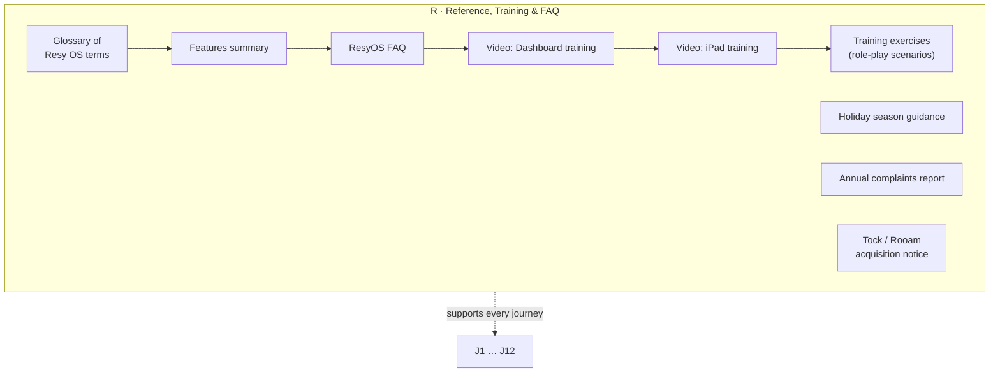

```yaml
journey: "R — Reference, Training & FAQ"
interface: "Help desk (no product configuration)"
target_role: "All"
cadence: "Any time; training before go-live"
steps:
  - step_id: "R_01"
    title: "Learn the vocabulary"
    navigation_path: "Help desk > Glossary"
    prerequisites: []
    inputs_required: []
    actions:
      - "Read the glossary before anything else — shift, slot, turn time, pacing and cover all have exact meanings here."
      - "Follow with the features summary and the ResyOS FAQ for the shape of the product."
    outputs: ["Shared vocabulary across the team"]
    kb_article: "general/glossary.md"
    related:
      - "getting-started-settings/resyos-features-summary.md"
      - "getting-started-settings/resyos-faq.md"

  - step_id: "R_02"
    title: "Run video training"
    navigation_path: "Help desk > Video Tutorials"
    prerequisites: []
    inputs_required: []
    actions:
      - "Dashboard video for managers (configuration), iPad video for the host team (execution)."
    outputs: ["Trained staff"]
    kb_article: "video-tutorials/resyos-dashboard.md"
    related: ["video-tutorials/resyos-ipad-training.md"]

  - step_id: "R_03"
    title: "Run the training exercises"
    navigation_path: "Help desk > Training Resources"
    prerequisites: ["R_02"]
    inputs_required: []
    actions:
      - "Work the role-play scenarios on the live iPad before go-live so mistakes happen off-service."
    outputs: ["Hands-on competence before the first real service"]
    kb_article: "training-resources/training-exercises.md"

  - step_id: "R_04"
    title: "Prepare for peak periods"
    navigation_path: "Help desk > Holiday Season"
    prerequisites: ["J3_01"]
    inputs_required: []
    actions:
      - "Apply the holiday-season guidance to pacing, policies and staffing ahead of peak weeks."
    outputs: ["Peak-period plan"]
    kb_article: "holiday-season/holiday-season.md"

  - step_id: "R_05"
    title: "Platform notices"
    navigation_path: "Help desk > announcements"
    prerequisites: []
    inputs_required: []
    actions:
      - "Reference only: the annual complaints report and the Amex/Tock/Rooam acquisition notice."
    outputs: ["Awareness of platform-level changes"]
    kb_article: "general/p2br-complaints-annual-report.md"
    related: ["general/to-enhance-dining-platform-american-express-enters-agreement-to-acquire-tock-from-squarespace-also-agrees-to-acquire-rooam.md"]
```

---

## Appendix A — Article-to-Journey Coverage

All 199 scraped articles, every one assigned to exactly one journey. `md` links the local scraped
file; `src` links the live help-desk page.

| Journey | Article | Category | Images | KB file |
|---|---|---|---|---|
| J1 | Compatible Browser, iPads, Chit Printers and Accessories for ResyOS | `onboarding-materials` | 0 | [md](../prototype/walkthrough-assistant/assets/resy-help-desk-kb/articles/onboarding-materials/resyos-recommended-hardware-and-accessories.md) · [src](https://helpdesk.resy.com/en_us/resyos-recommended-hardware-and-accessories-SyvVbP78_) |
| J1 | Data Transfer Instructions | `onboarding-materials` | 0 | [md](../prototype/walkthrough-assistant/assets/resy-help-desk-kb/articles/onboarding-materials/data-transfer-instructions.md) · [src](https://helpdesk.resy.com/en_us/data-transfer-instructions-BkD17zouu) |
| J1 | Going Live on Resy | `onboarding-materials` | 0 | [md](../prototype/walkthrough-assistant/assets/resy-help-desk-kb/articles/onboarding-materials/live-day-checklist.md) · [src](https://helpdesk.resy.com/en_us/live-day-checklist-r1BVbvXUu) |
| J1 | Improve My Website's SEO | `onboarding-materials` | 1 | [md](../prototype/walkthrough-assistant/assets/resy-help-desk-kb/articles/onboarding-materials/google-search-optimization-tips.md) · [src](https://helpdesk.resy.com/en_us/google-search-optimization-tips-BkqED78O) |
| J1 | Setting Up Resy OS on an iPad | `onboarding-materials` | 5 | [md](../prototype/walkthrough-assistant/assets/resy-help-desk-kb/articles/onboarding-materials/resyos-ipad-set-up.md) · [src](https://helpdesk.resy.com/en_us/resyos-ipad-set-up-rkrbv7L_) |
| J2 | Create and Add Combination Tables | `general` | 4 | [md](../prototype/walkthrough-assistant/assets/resy-help-desk-kb/articles/general/create-and-add-combination-tables.md) · [src](https://helpdesk.resy.com/en_us/create-and-add-combination-tables-B11ofhdZh) |
| J2 | Floor Plan Web Editor | `general` | 7 | [md](../prototype/walkthrough-assistant/assets/resy-help-desk-kb/articles/general/floor-plan-on-web.md) · [src](https://helpdesk.resy.com/en_us/floor-plan-on-web-SyTdJuBp9) |
| J2 | Reservation Names vs Table Type | `general` | 5 | [md](../prototype/walkthrough-assistant/assets/resy-help-desk-kb/articles/general/reservation-names.md) · [src](https://helpdesk.resy.com/en_us/reservation-names-r1fd_spaY) |
| J2 | ResyOS Floor Plan Editor | `general` | 2 | [md](../prototype/walkthrough-assistant/assets/resy-help-desk-kb/articles/general/floor-plan-editor.md) · [src](https://helpdesk.resy.com/en_us/floor-plan-editor-SJ5M493VY) |
| J2 | Unique Seating Setups in Resy OS | `general` | 1 | [md](../prototype/walkthrough-assistant/assets/resy-help-desk-kb/articles/general/unique-table-setups-in-resy-os.md) · [src](https://helpdesk.resy.com/en_us/unique-table-setups-in-resy-os-HyHECGSap) |
| J2 | Venue Profile | `reopening-on-resy` | 7 | [md](../prototype/walkthrough-assistant/assets/resy-help-desk-kb/articles/reopening-on-resy/how-to-update-your-venue-listing-info.md) · [src](https://helpdesk.resy.com/en_us/how-to-update-your-venue-listing-info-Hk1_ZvX8_) |
| J2 | Venue Settings | `getting-started-settings/venue-settings` | 0 | [md](../prototype/walkthrough-assistant/assets/resy-help-desk-kb/articles/getting-started-settings/venue-settings/how-to-edit-your-venue-settings.md) · [src](https://helpdesk.resy.com/en_us/how-to-edit-your-venue-settings-rkTjbwm8O) |
| J3 | Activating a New Floor Plan | `getting-started-settings/single-day-edits` | 3 | [md](../prototype/walkthrough-assistant/assets/resy-help-desk-kb/articles/getting-started-settings/single-day-edits/how-to-activate-floor-plan-and-edit-table-availability-in-dashboard-for-a-shift.md) · [src](https://helpdesk.resy.com/en_us/how-to-activate-floor-plan-and-edit-table-availability-in-dashboard-for-a-shift-BJEnbPXUd) |
| J3 | Availability and Pacing Updates | `getting-started-settings/reservation-settings` | 5 | [md](../prototype/walkthrough-assistant/assets/resy-help-desk-kb/articles/getting-started-settings/reservation-settings/availability-and-pacing-updates.md) · [src](https://helpdesk.resy.com/en_us/availability-and-pacing-updates-S1T3bPXLd) |
| J3 | Block and Unblock a Table in Resy OS | `in-service-troubleshooting/availability` | 6 | [md](../prototype/walkthrough-assistant/assets/resy-help-desk-kb/articles/in-service-troubleshooting/availability/how-to-block-a-table-for-a-shift-in-resyos.md) · [src](https://helpdesk.resy.com/en_us/how-to-block-a-table-for-a-shift-in-resyos-HJQxMw78u) |
| J3 | Booking Window | `reopening-on-resy/update-your-books` | 1 | [md](../prototype/walkthrough-assistant/assets/resy-help-desk-kb/articles/reopening-on-resy/update-your-books/how-to-adjust-your-booking-window.md) · [src](https://helpdesk.resy.com/en_us/how-to-adjust-your-booking-window-HJpDP7U_) |
| J3 | Close a Shift or Day in Resy OS | `in-service-troubleshooting/availability` | 2 | [md](../prototype/walkthrough-assistant/assets/resy-help-desk-kb/articles/in-service-troubleshooting/availability/how-to-close-a-shift-from-the-calendar-in-resyos.md) · [src](https://helpdesk.resy.com/en_us/how-to-close-a-shift-from-the-calendar-in-resyos-BkWlfPmIu) |
| J3 | Customize Turn Times | `getting-started-settings/reservation-settings` | 1 | [md](../prototype/walkthrough-assistant/assets/resy-help-desk-kb/articles/getting-started-settings/reservation-settings/turn-times.md) · [src](https://helpdesk.resy.com/en_us/turn-times-B1K2bIGXc) |
| J3 | Emergency Closures: How to Update Settings and inform Guests | `reopening-on-resy` | 2 | [md](../prototype/walkthrough-assistant/assets/resy-help-desk-kb/articles/reopening-on-resy/how-to-handle-closures.md) · [src](https://helpdesk.resy.com/en_us/how-to-handle-closures-H1fdbwXU_) |
| J3 | Exclusive Groups Feature | `getting-started-settings/reservation-settings` | 7 | [md](../prototype/walkthrough-assistant/assets/resy-help-desk-kb/articles/getting-started-settings/reservation-settings/exclusive-groups-feature.md) · [src](https://helpdesk.resy.com/en_us/exclusive-groups-feature-BkihvQIO) |
| J3 | Fixed Seating Times | `getting-started-settings/reservation-settings` | 3 | [md](../prototype/walkthrough-assistant/assets/resy-help-desk-kb/articles/getting-started-settings/reservation-settings/how-to-setup-fixed-seating-times-for-your-shifts.md) · [src](https://helpdesk.resy.com/en_us/how-to-setup-fixed-seating-times-for-your-shifts-H1v2ZPm8O) |
| J3 | Floor Plan Edits in ResyOS and on Web | `getting-started-settings/reservation-settings` | 11 | [md](../prototype/walkthrough-assistant/assets/resy-help-desk-kb/articles/getting-started-settings/reservation-settings/how-to-create-and-edit-floor-plans-in-the-resyos-app.md) · [src](https://helpdesk.resy.com/en_us/how-to-create-and-edit-floor-plans-in-the-resyos-app-Hk16bwXUO) |
| J3 | Group Availability by Table Type | `general` | 7 | [md](../prototype/walkthrough-assistant/assets/resy-help-desk-kb/articles/general/group-availability-by-table-type.md) · [src](https://helpdesk.resy.com/en_us/group-availability-by-table-type-B1YXrdgkl) |
| J3 | How do I add Shift Notes to my Calendar? | `in-service-troubleshooting/availability` | 0 | [md](../prototype/walkthrough-assistant/assets/resy-help-desk-kb/articles/in-service-troubleshooting/availability/how-to-add-shift-notes-in-your-calendar-in-resyos-app.md) · [src](https://helpdesk.resy.com/en_us/how-to-add-shift-notes-in-your-calendar-in-resyos-app-ByklzPXId) |
| J3 | How to Close Days in Dashboard | `general` | 1 | [md](../prototype/walkthrough-assistant/assets/resy-help-desk-kb/articles/general/how-to-close-days-in-dashboard.md) · [src](https://helpdesk.resy.com/en_us/how-to-close-days-in-dashboard-ry4VzPQ8O) |
| J3 | Maximum Covers | `general` | 0 | [md](../prototype/walkthrough-assistant/assets/resy-help-desk-kb/articles/general/maximum-covers.md) · [src](https://helpdesk.resy.com/en_us/maximum-covers-SJQb1ImnC) |
| J3 | Open a Shift on a Day you are Normally Closed | `general` | 3 | [md](../prototype/walkthrough-assistant/assets/resy-help-desk-kb/articles/general/opening-a-shift-on-a-day-you-are-normally-closed.md) · [src](https://helpdesk.resy.com/en_us/opening-a-shift-on-a-day-you-are-normally-closed-rJp51n6h9) |
| J3 | Pacing by Floor Plan FAQ | `general` | 1 | [md](../prototype/walkthrough-assistant/assets/resy-help-desk-kb/articles/general/customizable-pacing-by-floorplan.md) · [src](https://helpdesk.resy.com/en_us/customizable-pacing-by-floorplan-SJGwJVqA) |
| J3 | Setting up Slots | `getting-started-settings/reservation-settings` | 8 | [md](../prototype/walkthrough-assistant/assets/resy-help-desk-kb/articles/getting-started-settings/reservation-settings/how-to-setup-slots-in-the-resy-dashboard.md) · [src](https://helpdesk.resy.com/en_us/how-to-setup-slots-in-the-resy-dashboard-H1c3bvQ8d) |
| J3 | Shift Editor | `getting-started-settings/reservation-settings` | 0 | [md](../prototype/walkthrough-assistant/assets/resy-help-desk-kb/articles/getting-started-settings/reservation-settings/how-to-create-and-edit-a-shift-in-dashboard-service-settings.md) · [src](https://helpdesk.resy.com/en_us/how-to-create-and-edit-a-shift-in-dashboard-service-settings-ByNaZwmIu) |
| J3 | Single Day Edits to Floor Plan and Availability | `getting-started-settings/single-day-edits` | 3 | [md](../prototype/walkthrough-assistant/assets/resy-help-desk-kb/articles/getting-started-settings/single-day-edits/how-to-activate-floor-plan-and-edit-table-availability-for-a-single-day.md) · [src](https://helpdesk.resy.com/en_us/how-to-activate-floor-plan-and-edit-table-availability-for-a-single-day-H1Q3Wv7IO) |
| J3 | Single Day Floor Plan Updates | `getting-started-settings/single-day-edits` | 0 | [md](../prototype/walkthrough-assistant/assets/resy-help-desk-kb/articles/getting-started-settings/single-day-edits/how-to-update-a-floor-plan-for-a-single-day.md) · [src](https://helpdesk.resy.com/en_us/how-to-update-a-floor-plan-for-a-single-day-H1z3v7Ud) |
| J3 | Single Day Shift Updates in the Resy OS Portal | `getting-started-settings/single-day-edits` | 3 | [md](../prototype/walkthrough-assistant/assets/resy-help-desk-kb/articles/getting-started-settings/single-day-edits/how-to-make-a-single-day-edit-in-the-dashboard-service-settings.md) · [src](https://helpdesk.resy.com/en_us/how-to-make-a-single-day-edit-in-the-dashboard-service-settings-rJf6bD7IO) |
| J3 | Single Day Slots Updates in Resy OS | `in-service-troubleshooting/availability` | 3 | [md](../prototype/walkthrough-assistant/assets/resy-help-desk-kb/articles/in-service-troubleshooting/availability/how-to-make-single-day-edits-to-slots-in-resyos.md) · [src](https://helpdesk.resy.com/en_us/how-to-make-single-day-edits-to-slots-in-resyos-H161zDmL_) |
| J3 | Single Day Table Availability Updates in Resy OS | `in-service-troubleshooting/availability` | 5 | [md](../prototype/walkthrough-assistant/assets/resy-help-desk-kb/articles/in-service-troubleshooting/availability/how-to-make-single-day-edits-to-table-availability-in-resyos-app.md) · [src](https://helpdesk.resy.com/en_us/how-to-make-single-day-edits-to-table-availability-in-resyos-app-r1nkGP7Ud) |
| J3 | Start a New Shift on a Specific Date | `reopening-on-resy/update-your-books` | 1 | [md](../prototype/walkthrough-assistant/assets/resy-help-desk-kb/articles/reopening-on-resy/update-your-books/how-to-start-a-shift-on-a-specific-date.md) · [src](https://helpdesk.resy.com/en_us/how-to-start-a-shift-on-a-specific-date-HycIbwmI_) |
| J3 | Turn Times | `getting-started-settings/reservation-settings` | 4 | [md](../prototype/walkthrough-assistant/assets/resy-help-desk-kb/articles/getting-started-settings/reservation-settings/how-to-setup-flexible-seating-to-maximize-covers.md) · [src](https://helpdesk.resy.com/en_us/how-to-setup-flexible-seating-to-maximize-covers-BkL3bvQLO) |
| J4 | Adding a Guest's Credit Card Information to a Reservation | `in-service-troubleshooting/cancellation-policy-and-payments` | 3 | [md](../prototype/walkthrough-assistant/assets/resy-help-desk-kb/articles/in-service-troubleshooting/cancellation-policy-and-payments/how-do-i-add-payment-to-a-reservation.md) · [src](https://helpdesk.resy.com/en_us/how-do-i-add-payment-to-a-reservation-H1GXfv78u) |
| J4 | Booking Without Payment | `in-service-troubleshooting/cancellation-policy-and-payments` | 2 | [md](../prototype/walkthrough-assistant/assets/resy-help-desk-kb/articles/in-service-troubleshooting/cancellation-policy-and-payments/how-to-bypass-a-credit-card-requirement.md) · [src](https://helpdesk.resy.com/en_us/how-to-bypass-a-credit-card-requirement-BkeQMvmId) |
| J4 | Cancel and Refund a Prepaid Reservation | `in-service-troubleshooting/cancellation-policy-and-payments` | 3 | [md](../prototype/walkthrough-assistant/assets/resy-help-desk-kb/articles/in-service-troubleshooting/cancellation-policy-and-payments/how-to-cancel-and-refund-a-prepaid-reservation.md) · [src](https://helpdesk.resy.com/en_us/how-to-cancel-and-refund-a-prepaid-reservation-SJRfzDXIu) |
| J4 | Cancellation Fee Charges | `in-service-troubleshooting/cancellation-policy-and-payments` | 3 | [md](../prototype/walkthrough-assistant/assets/resy-help-desk-kb/articles/in-service-troubleshooting/cancellation-policy-and-payments/how-do-i-charge-a-cancellation-or-no-show-fee.md) · [src](https://helpdesk.resy.com/en_us/how-do-i-charge-a-cancellation-or-no-show-fee-HJQXfP7Lu) |
| J4 | Cancellation Policy | `getting-started-settings/reservation-settings` | 4 | [md](../prototype/walkthrough-assistant/assets/resy-help-desk-kb/articles/getting-started-settings/reservation-settings/how-to-add-cancellation-policy-to-a-reservation.md) · [src](https://helpdesk.resy.com/en_us/how-to-add-cancellation-policy-to-a-reservation-BkF2ZDQIu) |
| J4 | Contactless Payment Options | `reopening-on-resy/update-your-books` | 2 | [md](../prototype/walkthrough-assistant/assets/resy-help-desk-kb/articles/reopening-on-resy/update-your-books/how-to-use-resy-for-contactless-payment.md) · [src](https://helpdesk.resy.com/en_us/how-to-use-resy-for-contactless-payment-SJKdwmLO) |
| J4 | Custom Policies | `general` | 0 | [md](../prototype/walkthrough-assistant/assets/resy-help-desk-kb/articles/general/custom-policies.md) · [src](https://helpdesk.resy.com/en_us/custom-policies-Hk3MMQ9Zh) |
| J4 | Double Confirmation Message | `general` | 3 | [md](../prototype/walkthrough-assistant/assets/resy-help-desk-kb/articles/general/double-confirmation-message.md) · [src](https://helpdesk.resy.com/en_us/double-confirmation-message-B1Km8K46F) |
| J4 | Export Stripe Reports | `general` | 1 | [md](../prototype/walkthrough-assistant/assets/resy-help-desk-kb/articles/general/stripe-transaction-reports.md) · [src](https://helpdesk.resy.com/en_us/stripe-transaction-reports-HJYL7AJ7T) |
| J4 | For Diners: Manage Credit Card Information on Your Profile | `general` | 7 | [md](../prototype/walkthrough-assistant/assets/resy-help-desk-kb/articles/general/for-diners-add-credit-card-information-to-your-profile.md) · [src](https://helpdesk.resy.com/en_us/for-diners-add-credit-card-information-to-your-profile-ry7KdoZA5) |
| J4 | Getting Started on Stripe | `general` | 4 | [md](../prototype/walkthrough-assistant/assets/resy-help-desk-kb/articles/general/getting-started-on-stripe.md) · [src](https://helpdesk.resy.com/en_us/getting-started-on-stripe-BkHLWVX9o) |
| J4 | How do I add Prepaid Reservations? | `general` | 0 | [md](../prototype/walkthrough-assistant/assets/resy-help-desk-kb/articles/general/adding-a-prepaid-policy.md) · [src](https://helpdesk.resy.com/en_us/adding-a-prepaid-policy-H139rKJLF) |
| J4 | Large Party Cancellation Policy | `general` | 1 | [md](../prototype/walkthrough-assistant/assets/resy-help-desk-kb/articles/general/adding-a-cancellation-policy-to-large-parties.md) · [src](https://helpdesk.resy.com/en_us/adding-a-cancellation-policy-to-large-parties-Hy9nK01P9) |
| J4 | Manual ACH Stripe Process | `general` | 6 | [md](../prototype/walkthrough-assistant/assets/resy-help-desk-kb/articles/general/manual-ach-stripe-process.md) · [src](https://helpdesk.resy.com/en_us/manual-ach-stripe-process-HkZ6wz7Jg) |
| J4 | Resy Guide to Stripe Disputes | `general` | 5 | [md](../prototype/walkthrough-assistant/assets/resy-help-desk-kb/articles/general/guide-to-stripe-disputes.md) · [src](https://helpdesk.resy.com/en_us/guide-to-stripe-disputes-HyK_UHHza) |
| J4 | Resy Pay | `general` | 1 | [md](../prototype/walkthrough-assistant/assets/resy-help-desk-kb/articles/general/resy-pay.md) · [src](https://helpdesk.resy.com/en_us/resy-pay-BJUK2y65) |
| J4 | Stripe Disputes | `general` | 1 | [md](../prototype/walkthrough-assistant/assets/resy-help-desk-kb/articles/general/stripe-disputes.md) · [src](https://helpdesk.resy.com/en_us/stripe-disputes-Bk_1FaFco) |
| J4 | Stripe FAQs | `general` | 8 | [md](../prototype/walkthrough-assistant/assets/resy-help-desk-kb/articles/general/stripe-faq.md) · [src](https://helpdesk.resy.com/en_us/stripe-faq-H1nSP4X5j) |
| J4 | Stripe Refunds | `general` | 1 | [md](../prototype/walkthrough-assistant/assets/resy-help-desk-kb/articles/general/stripe-refunds.md) · [src](https://helpdesk.resy.com/en_us/stripe-refunds-SkOy9nSMh) |
| J4 | Stripe Reporting | `general` | 2 | [md](../prototype/walkthrough-assistant/assets/resy-help-desk-kb/articles/general/stripe-reporting.md) · [src](https://helpdesk.resy.com/en_us/stripe-reporting-ryXldKN9o) |
| J4 | Transaction Settings (CAN) | `transactions` | 4 | [md](../prototype/walkthrough-assistant/assets/resy-help-desk-kb/articles/transactions/transaction-settings-can.md) · [src](https://helpdesk.resy.com/en_us/transaction-settings-can-SJQBooEHt) |
| J4 | Transactions FAQ | `transactions` | 0 | [md](../prototype/walkthrough-assistant/assets/resy-help-desk-kb/articles/transactions/transactions-faq.md) · [src](https://helpdesk.resy.com/en_us/transactions-faq-ByVZQWk8Y) |
| J4 | Transactions Settings (US) | `transactions` | 6 | [md](../prototype/walkthrough-assistant/assets/resy-help-desk-kb/articles/transactions/managing-transactions-settings-for-us-partners.md) · [src](https://helpdesk.resy.com/en_us/managing-transactions-settings-for-us-partners-BJIGq7ju_) |
| J4 | Transitioning to Stripe | `general` | 4 | [md](../prototype/walkthrough-assistant/assets/resy-help-desk-kb/articles/general/transitioning-to-stripe.md) · [src](https://helpdesk.resy.com/en_us/transitioning-to-stripe-HJSX11JCc) |
| J4 | Using Large Party Cancellation Fees with Custom Policies | `general` | 1 | [md](../prototype/walkthrough-assistant/assets/resy-help-desk-kb/articles/general/using-large-party-cancellation-fees-with-custom-policies.md) · [src](https://helpdesk.resy.com/en_us/using-large-party-cancellation-fees-with-custom-policies-rJ2DYvZBj) |
| J4 | Using Prepay in ResyOS | `in-service-troubleshooting/cancellation-policy-and-payments` | 6 | [md](../prototype/walkthrough-assistant/assets/resy-help-desk-kb/articles/in-service-troubleshooting/cancellation-policy-and-payments/how-to-use-resy-prepay-feature-in-resyos.md) · [src](https://helpdesk.resy.com/en_us/how-to-use-resy-prepay-feature-in-resyos-rJTzMvXLu) |
| J4 | What are some best practices for using Resy PrePay? | `in-service-troubleshooting/cancellation-policy-and-payments` | 1 | [md](../prototype/walkthrough-assistant/assets/resy-help-desk-kb/articles/in-service-troubleshooting/cancellation-policy-and-payments/resy-pre-pay-best-practices.md) · [src](https://helpdesk.resy.com/en_us/resy-pre-pay-best-practices-HyoMMDmUu) |
| J5 | Automated Waitlist Text Messages | `in-service-troubleshooting/waitlist` | 3 | [md](../prototype/walkthrough-assistant/assets/resy-help-desk-kb/articles/in-service-troubleshooting/waitlist/how-to-use-automated-waitlist-sms-in-resyos.md) · [src](https://helpdesk.resy.com/en_us/how-to-use-automated-waitlist-sms-in-resyos-SJXzGPQIO) |
| J5 | Book a Reservation on the Resy OS App | `in-service-troubleshooting/reservations-walk-ins` | 6 | [md](../prototype/walkthrough-assistant/assets/resy-help-desk-kb/articles/in-service-troubleshooting/reservations-walk-ins/how-to-book-a-reservation-in-resyos-app.md) · [src](https://helpdesk.resy.com/en_us/how-to-book-a-reservation-in-resyos-app-rJxfGvXIu) |
| J5 | Booking from Your Dashboard | `general` | 8 | [md](../prototype/walkthrough-assistant/assets/resy-help-desk-kb/articles/general/desktop-reservation-flow.md) · [src](https://helpdesk.resy.com/en_us/desktop-reservation-flow-SJEDlJNn2) |
| J5 | Cancel or Change a Reservation in ResyOS | `in-service-troubleshooting/reservations-walk-ins` | 4 | [md](../prototype/walkthrough-assistant/assets/resy-help-desk-kb/articles/in-service-troubleshooting/reservations-walk-ins/how-to-cancel-or-change-a-reservation.md) · [src](https://helpdesk.resy.com/en_us/how-to-cancel-or-change-a-reservation-SyPWGvX8_) |
| J5 | Change a Table Assignment in Resy OS | `in-service-troubleshooting/reservations-walk-ins` | 4 | [md](../prototype/walkthrough-assistant/assets/resy-help-desk-kb/articles/in-service-troubleshooting/reservations-walk-ins/how-to-change-table-assignment-in-resyos.md) · [src](https://helpdesk.resy.com/en_us/how-to-change-table-assignment-in-resyos-HJpGvQ8O) |
| J5 | Chit Printing in the ResyOS App | `in-service-troubleshooting` | 2 | [md](../prototype/walkthrough-assistant/assets/resy-help-desk-kb/articles/in-service-troubleshooting/troubleshooting-for-bluetooth-chit-printers.md) · [src](https://helpdesk.resy.com/en_us/troubleshooting-for-bluetooth-chit-printers-rycyGwXId) |
| J5 | Contact Resy Support | `in-service-troubleshooting` | 1 | [md](../prototype/walkthrough-assistant/assets/resy-help-desk-kb/articles/in-service-troubleshooting/how-to-contact-resy-support.md) · [src](https://helpdesk.resy.com/en_us/how-to-contact-resy-support-Bk_JGP7Lu) |
| J5 | Create and Add Guest and Visit Tags to a Reservation | `getting-started-settings/ipad-settings` | 8 | [md](../prototype/walkthrough-assistant/assets/resy-help-desk-kb/articles/getting-started-settings/ipad-settings/how-to-add-guest-and-visit-tags-to-a-reservation-in-resy-os.md) · [src](https://helpdesk.resy.com/en_us/how-to-add-guest-and-visit-tags-to-a-reservation-in-resy-os-r14ZzPXL_) |
| J5 | Difference Between Automatic and Manual Assignment | `getting-started-settings/ipad-settings` | 3 | [md](../prototype/walkthrough-assistant/assets/resy-help-desk-kb/articles/getting-started-settings/ipad-settings/how-to-know-if-a-reservation-was-automatically-or-manually-assigned.md) · [src](https://helpdesk.resy.com/en_us/how-to-know-if-a-reservation-was-automatically-or-manually-assigned-rkrgzwmUO) |
| J5 | Disable and Re-enable Online Bookings | `in-service-troubleshooting` | 4 | [md](../prototype/walkthrough-assistant/assets/resy-help-desk-kb/articles/in-service-troubleshooting/how-to-turn-off-online-reservations-for-a-shift-or-period-of-time-in-resyos.md) · [src](https://helpdesk.resy.com/en_us/how-to-turn-off-online-reservations-for-a-shift-or-period-of-time-in-resyos-H1jkzwmLu) |
| J5 | Drag and Drop to Seat a Guest | `getting-started-settings` | 4 | [md](../prototype/walkthrough-assistant/assets/resy-help-desk-kb/articles/getting-started-settings/how-to-drag-and-drop-to-seat-in-resyos.md) · [src](https://helpdesk.resy.com/en_us/how-to-drag-and-drop-to-seat-in-resyos-SkTCbwQ8O) |
| J5 | Enable or Disable Reservation Overlap Alerts in Resy OS | `getting-started-settings/ipad-settings` | 2 | [md](../prototype/walkthrough-assistant/assets/resy-help-desk-kb/articles/getting-started-settings/ipad-settings/how-to-enabledisable-reservation-overlap-alerts-in-your-resyos-settings.md) · [src](https://helpdesk.resy.com/en_us/how-to-enabledisable-reservation-overlap-alerts-in-your-resyos-settings-BJDAZwX8d) |
| J5 | Events FAQ | `getting-started-settings/ipad-settings` | 1 | [md](../prototype/walkthrough-assistant/assets/resy-help-desk-kb/articles/getting-started-settings/ipad-settings/events-faq.md) · [src](https://helpdesk.resy.com/en_us/events-faq-S1ZtbD78_) |
| J5 | For Diners: Change or Cancel a Reservation | `general` | 6 | [md](../prototype/walkthrough-assistant/assets/resy-help-desk-kb/articles/general/for-diners-change-or-cancel-a-reservation.md) · [src](https://helpdesk.resy.com/en_us/for-diners-change-or-cancel-a-reservation-H16wR9ZRq) |
| J5 | How do I show my Table Combinations in the Timeline View in the Resy OS App? | `getting-started-settings/ipad-settings` | 2 | [md](../prototype/walkthrough-assistant/assets/resy-help-desk-kb/articles/getting-started-settings/ipad-settings/how-to-show-table-combinations-on-the-timeline-view-in-resyos.md) · [src](https://helpdesk.resy.com/en_us/how-to-show-table-combinations-on-the-timeline-view-in-resyos-SkORbDXI_) |
| J5 | How far away can guests be from my restaurant when adding themselves to my Mobile Waitlist? | `in-service-troubleshooting/waitlist` | 0 | [md](../prototype/walkthrough-assistant/assets/resy-help-desk-kb/articles/in-service-troubleshooting/waitlist/mobile-waitlist-city-radius-list.md) · [src](https://helpdesk.resy.com/en_us/mobile-waitlist-city-radius-list-B1fGMv7Id) |
| J5 | Manage Server Sections in Resy OS | `getting-started-settings/ipad-settings` | 0 | [md](../prototype/walkthrough-assistant/assets/resy-help-desk-kb/articles/getting-started-settings/ipad-settings/how-to-manage-server-sections-in-resyos.md) · [src](https://helpdesk.resy.com/en_us/how-to-manage-server-sections-in-resyos-ByWfwQ8_) |
| J5 | Mobile Waitlist Feature (Remote Waitlist) | `in-service-troubleshooting/waitlist` | 3 | [md](../prototype/walkthrough-assistant/assets/resy-help-desk-kb/articles/in-service-troubleshooting/waitlist/how-to-use-mobile-waitlist.md) · [src](https://helpdesk.resy.com/en_us/how-to-use-mobile-waitlist-rkj_bD7Iu) |
| J5 | Notify Feature | `in-service-troubleshooting` | 4 | [md](../prototype/walkthrough-assistant/assets/resy-help-desk-kb/articles/in-service-troubleshooting/what-is-notify-and-how-does-it-work.md) · [src](https://helpdesk.resy.com/en_us/what-is-notify-and-how-does-it-work-BJrJzPQLu) |
| J5 | Prepaid Reservation Changes | `in-service-troubleshooting` | 3 | [md](../prototype/walkthrough-assistant/assets/resy-help-desk-kb/articles/in-service-troubleshooting/how-to-make-changes-to-a-prepaid-reservation.md) · [src](https://helpdesk.resy.com/en_us/how-to-make-changes-to-a-prepaid-reservation-SkAXGPQUO) |
| J5 | Resy OS Troubleshooting Steps | `in-service-troubleshooting` | 0 | [md](../prototype/walkthrough-assistant/assets/resy-help-desk-kb/articles/in-service-troubleshooting/resyos-troubleshooting-steps.md) · [src](https://helpdesk.resy.com/en_us/resyos-troubleshooting-steps-ByjDtVwBK) |
| J5 | ResyOS App Settings | `general` | 8 | [md](../prototype/walkthrough-assistant/assets/resy-help-desk-kb/articles/general/resyos-app-settings.md) · [src](https://helpdesk.resy.com/en_us/resyos-app-settings-r1dXii2Gs) |
| J5 | Seat a Guest in Resy OS | `in-service-troubleshooting/reservations-walk-ins` | 2 | [md](../prototype/walkthrough-assistant/assets/resy-help-desk-kb/articles/in-service-troubleshooting/reservations-walk-ins/how-to-seat-a-guest-in-resyos.md) · [src](https://helpdesk.resy.com/en_us/how-to-seat-a-guest-in-resyos-Hk3bzP7Id) |
| J5 | Seat a Walk-in in Resy OS | `in-service-troubleshooting/reservations-walk-ins` | 1 | [md](../prototype/walkthrough-assistant/assets/resy-help-desk-kb/articles/in-service-troubleshooting/reservations-walk-ins/how-to-seat-a-walk-in-in-resyos.md) · [src](https://helpdesk.resy.com/en_us/how-to-seat-a-walk-in-in-resyos-SkqZfvX8d) |
| J5 | Troubleshooting Common Issues | `in-service-troubleshooting` | 0 | [md](../prototype/walkthrough-assistant/assets/resy-help-desk-kb/articles/in-service-troubleshooting/troubleshooting-common-issues.md) · [src](https://helpdesk.resy.com/en_us/troubleshooting-common-issues-S10dQb2rbg) |
| J5 | Update Waitlist and Reservation Status | `in-service-troubleshooting/reservations-walk-ins` | 4 | [md](../prototype/walkthrough-assistant/assets/resy-help-desk-kb/articles/in-service-troubleshooting/reservations-walk-ins/how-to-update-a-reservation-status.md) · [src](https://helpdesk.resy.com/en_us/how-to-update-a-reservation-status-ByYbzvQLd) |
| J5 | View Cover Counts on the Calendar in ResyOS | `general` | 2 | [md](../prototype/walkthrough-assistant/assets/resy-help-desk-kb/articles/general/view-cover-counts-in-the-resyos-app.md) · [src](https://helpdesk.resy.com/en_us/view-cover-counts-in-the-resyos-app-BkM512Ron) |
| J5 | Waitlist | `in-service-troubleshooting/waitlist` | 3 | [md](../prototype/walkthrough-assistant/assets/resy-help-desk-kb/articles/in-service-troubleshooting/waitlist/how-to-manage-your-waitlist:-adding-messaging-and-seating-guests.md) · [src](https://helpdesk.resy.com/en_us/how-to-manage-your-waitlist:-adding-messaging-and-seating-guests-BJHGGvmId) |
| J6 | Add Guest and Visit Notes in Resy OS | `in-service-troubleshooting/guest-profile` | 6 | [md](../prototype/walkthrough-assistant/assets/resy-help-desk-kb/articles/in-service-troubleshooting/guest-profile/how-to-add-visit-notes-and-guest-notes-in-resyos.md) · [src](https://helpdesk.resy.com/en_us/how-to-add-visit-notes-and-guest-notes-in-resyos-BkmZfvmI_) |
| J6 | Automated Reservation Emails | `getting-started-settings/guest-communications` | 3 | [md](../prototype/walkthrough-assistant/assets/resy-help-desk-kb/articles/getting-started-settings/guest-communications/standard-resy-automated-email-content.md) · [src](https://helpdesk.resy.com/en_us/standard-resy-automated-email-content-HyaaWvXId) |
| J6 | Booked List Icons | `in-service-troubleshooting/guest-profile` | 6 | [md](../prototype/walkthrough-assistant/assets/resy-help-desk-kb/articles/in-service-troubleshooting/guest-profile/what-are-the-icons-on-my-booked-list.md) · [src](https://helpdesk.resy.com/en_us/what-are-the-icons-on-my-booked-list-SyceGD7Ld) |
| J6 | Booking without Phone Number (Book on Behalf Of) | `in-service-troubleshooting/guest-profile` | 3 | [md](../prototype/walkthrough-assistant/assets/resy-help-desk-kb/articles/in-service-troubleshooting/guest-profile/how-to-book-without-a-guest's-phone-number-in-resyos-app.md) · [src](https://helpdesk.resy.com/en_us/how-to-book-without-a-guest's-phone-number-in-resyos-app-Bk8fDXL_) |
| J6 | Create and Add VIP tags | `in-service-troubleshooting/guest-profile` | 2 | [md](../prototype/walkthrough-assistant/assets/resy-help-desk-kb/articles/in-service-troubleshooting/guest-profile/create-and-add-vip-tags.md) · [src](https://helpdesk.resy.com/en_us/create-and-add-vip-tags-Hk2sfzryi) |
| J6 | Customize Text Messages | `getting-started-settings/guest-communications` | 4 | [md](../prototype/walkthrough-assistant/assets/resy-help-desk-kb/articles/getting-started-settings/guest-communications/customizing-text-message-content.md) · [src](https://helpdesk.resy.com/en_us/customizing-text-message-content-HJP6WwQLO) |
| J6 | Guest Communications: Emails | `general` | 1 | [md](../prototype/walkthrough-assistant/assets/resy-help-desk-kb/articles/general/guest-communications-emails.md) · [src](https://helpdesk.resy.com/en_us/guest-communications-emails-HyZVfvmId) |
| J6 | Guest Profile Updates | `in-service-troubleshooting/guest-profile` | 5 | [md](../prototype/walkthrough-assistant/assets/resy-help-desk-kb/articles/in-service-troubleshooting/guest-profile/how-to-edit-a-guest's-name.md) · [src](https://helpdesk.resy.com/en_us/how-to-edit-a-guest's-name-SyDeGvQId) |
| J6 | Guestbook Download FAQ | `general` | 6 | [md](../prototype/walkthrough-assistant/assets/resy-help-desk-kb/articles/general/guestbook-download-faq.md) · [src](https://helpdesk.resy.com/en_us/guestbook-download-faq-rkHePTch) |
| J6 | How Guests can Add Important Details to their Reservation | `general` | 4 | [md](../prototype/walkthrough-assistant/assets/resy-help-desk-kb/articles/general/guest-booking-confirmation-on-resy-com.md) · [src](https://helpdesk.resy.com/en_us/guest-booking-confirmation-on-resy-com-By4wAPIvj) |
| J6 | How Hosts Can Invite Guests to a Reservation | `getting-started-settings/guest-communications` | 6 | [md](../prototype/walkthrough-assistant/assets/resy-help-desk-kb/articles/getting-started-settings/guest-communications/guests-can-invite-fellow-diners-to-their-reservation-party.md) · [src](https://helpdesk.resy.com/en_us/guests-can-invite-fellow-diners-to-their-reservation-party-SJmPvXUO) |
| J6 | How do I add a guest's profile information after seating a Walk-in? | `in-service-troubleshooting/guest-profile` | 1 | [md](../prototype/walkthrough-assistant/assets/resy-help-desk-kb/articles/in-service-troubleshooting/guest-profile/how-to-add-a-guest-profile-to-a-seated-walk-in.md) · [src](https://helpdesk.resy.com/en_us/how-to-add-a-guest-profile-to-a-seated-walk-in-rJRefDX8_) |
| J6 | How to Add a New Guest in Resy OS | `general` | 1 | [md](../prototype/walkthrough-assistant/assets/resy-help-desk-kb/articles/general/how-to-add-a-guest.md) · [src](https://helpdesk.resy.com/en_us/how-to-add-a-guest-ry4nsm3q) |
| J6 | How to Merge Guest Profiles | `getting-started-settings/guest-communications` | 3 | [md](../prototype/walkthrough-assistant/assets/resy-help-desk-kb/articles/getting-started-settings/guest-communications/how-to-merge-guest-profiles.md) · [src](https://helpdesk.resy.com/en_us/how-to-merge-guest-profiles-H1Qq89cbt) |
| J6 | Manual Text Messages | `in-service-troubleshooting/resy-2-way-texting` | 2 | [md](../prototype/walkthrough-assistant/assets/resy-help-desk-kb/articles/in-service-troubleshooting/resy-2-way-texting/how-to-manually-send-a-text-message-to-your-guests..md) · [src](https://helpdesk.resy.com/en_us/how-to-manually-send-a-text-message-to-your-guests.-ry9GMPmLd) |
| J6 | Quick Replies Feature | `in-service-troubleshooting/resy-2-way-texting` | 3 | [md](../prototype/walkthrough-assistant/assets/resy-help-desk-kb/articles/in-service-troubleshooting/resy-2-way-texting/text-message-quick-replies.md) · [src](https://helpdesk.resy.com/en_us/text-message-quick-replies-SywMGDm8d) |
| J6 | Resend a Booking Confirmation Email | `in-service-troubleshooting/guest-profile` | 1 | [md](../prototype/walkthrough-assistant/assets/resy-help-desk-kb/articles/in-service-troubleshooting/guest-profile/how-to-resend-a-booking-confirmation-email-to-a-guest.md) · [src](https://helpdesk.resy.com/en_us/how-to-resend-a-booking-confirmation-email-to-a-guest-Bk2gfDmUO) |
| J6 | Resy OS Tags Functionality | `general` | 0 | [md](../prototype/walkthrough-assistant/assets/resy-help-desk-kb/articles/general/resy-os-tag-functionality-2-0.md) · [src](https://helpdesk.resy.com/en_us/resy-os-tag-functionality-2-0-BJ7PFzWr3) |
| J6 | Right Phone Number, Wrong Guest? | `in-service-troubleshooting/guest-profile` | 2 | [md](../prototype/walkthrough-assistant/assets/resy-help-desk-kb/articles/in-service-troubleshooting/guest-profile/right-number-wrong-guest.md) · [src](https://helpdesk.resy.com/en_us/right-number-wrong-guest-BJEu43r3c) |
| J6 | Text Message Automation | `getting-started-settings/guest-communications` | 2 | [md](../prototype/walkthrough-assistant/assets/resy-help-desk-kb/articles/getting-started-settings/guest-communications/standard-resy-automated-sms-content.md) · [src](https://helpdesk.resy.com/en_us/standard-resy-automated-sms-content-S110vQIu) |
| J6 | Text Message History | `in-service-troubleshooting/resy-2-way-texting` | 2 | [md](../prototype/walkthrough-assistant/assets/resy-help-desk-kb/articles/in-service-troubleshooting/resy-2-way-texting/how-to-view-text-message-conversations-in-resyos.md) · [src](https://helpdesk.resy.com/en_us/how-to-view-text-message-conversations-in-resyos-HyYzMDX8u) |
| J6 | Text Message Icons | `in-service-troubleshooting/resy-2-way-texting` | 2 | [md](../prototype/walkthrough-assistant/assets/resy-help-desk-kb/articles/in-service-troubleshooting/resy-2-way-texting/text-message-statuses-in-resyos.md) · [src](https://helpdesk.resy.com/en_us/text-message-statuses-in-resyos-S1LzMPX8u) |
| J6 | Update Phone Number in Guest Profile | `in-service-troubleshooting/guest-profile` | 0 | [md](../prototype/walkthrough-assistant/assets/resy-help-desk-kb/articles/in-service-troubleshooting/guest-profile/guest-wrong-number.md) · [src](https://helpdesk.resy.com/en_us/guest-wrong-number-BkjGmjB2c) |
| J6 | View Guest Visit History in Resy OS | `in-service-troubleshooting/guest-profile` | 2 | [md](../prototype/walkthrough-assistant/assets/resy-help-desk-kb/articles/in-service-troubleshooting/guest-profile/how-to-find-guest-history.md) · [src](https://helpdesk.resy.com/en_us/how-to-find-guest-history-ry8lGPQUd) |
| J7 | Add Prepaid Items to Prepaid Reservations | `resy-40/add-on-items` | 0 | [md](../prototype/walkthrough-assistant/assets/resy-help-desk-kb/articles/resy-40/add-on-items/how-to-apply-items-to-prepaid-reservations.md) · [src](https://helpdesk.resy.com/en_us/how-to-apply-items-to-prepaid-reservations-H1SobvQ8O) |
| J7 | Assigned Seating Event | `events-virtual-experiences` | 7 | [md](../prototype/walkthrough-assistant/assets/resy-help-desk-kb/articles/events-virtual-experiences/how-to-create-an-assigned-seating-event.md) · [src](https://helpdesk.resy.com/en_us/how-to-create-an-assigned-seating-event-rJ5FbDmUu) |
| J7 | Event Cancellation | `events-virtual-experiences` | 2 | [md](../prototype/walkthrough-assistant/assets/resy-help-desk-kb/articles/events-virtual-experiences/event-cancellation.md) · [src](https://helpdesk.resy.com/en_us/event-cancellation-rJye6_36Y) |
| J7 | Event Feature | `events-virtual-experiences` | 8 | [md](../prototype/walkthrough-assistant/assets/resy-help-desk-kb/articles/events-virtual-experiences/how-to-create-an-event.md) · [src](https://helpdesk.resy.com/en_us/how-to-create-an-event-B1dKWDQUd) |
| J7 | General Admission Event | `events-virtual-experiences` | 7 | [md](../prototype/walkthrough-assistant/assets/resy-help-desk-kb/articles/events-virtual-experiences/general-admission-event.md) · [src](https://helpdesk.resy.com/en_us/general-admission-event-ByNFbwm8u) |
| J7 | Guest Communications: Events | `events-virtual-experiences` | 2 | [md](../prototype/walkthrough-assistant/assets/resy-help-desk-kb/articles/events-virtual-experiences/how-to-customize-guest-communications-for-events.md) · [src](https://helpdesk.resy.com/en_us/how-to-customize-guest-communications-for-events-r1vtWwm8_) |
| J7 | How do I add Prepaid Items to an Event Ticket? | `events-virtual-experiences` | 0 | [md](../prototype/walkthrough-assistant/assets/resy-help-desk-kb/articles/events-virtual-experiences/how-can-i-add-prepaid-items-to-an-event-ticket.md) · [src](https://helpdesk.resy.com/en_us/how-can-i-add-prepaid-items-to-an-event-ticket-HkytbPQU_) |
| J7 | How do I adjust my normal shift when I'm hosting an event that changes availability? | `events-virtual-experiences` | 5 | [md](../prototype/walkthrough-assistant/assets/resy-help-desk-kb/articles/events-virtual-experiences/how-to-adjust-your-base-shift-when-hosting-an-event.md) · [src](https://helpdesk.resy.com/en_us/how-to-adjust-your-base-shift-when-hosting-an-event-rySYbv7Ld) |
| J7 | How do I organize my Add-on Items in Categories? | `resy-40/add-on-items` | 1 | [md](../prototype/walkthrough-assistant/assets/resy-help-desk-kb/articles/resy-40/add-on-items/how-to-organize-items-in-categories.md) · [src](https://helpdesk.resy.com/en_us/how-to-organize-items-in-categories-SkXoWDQUu) |
| J7 | How do I use Slots to create unique experiences at different times during my Event? | `events-virtual-experiences` | 9 | [md](../prototype/walkthrough-assistant/assets/resy-help-desk-kb/articles/events-virtual-experiences/use-slots-to-create-unique-experiences-for-each-seating-time-of-your-event.md) · [src](https://helpdesk.resy.com/en_us/use-slots-to-create-unique-experiences-for-each-seating-time-of-your-event-ry3tWv78_) |
| J7 | Manage a Special Event with Normal Service | `events-virtual-experiences` | 0 | [md](../prototype/walkthrough-assistant/assets/resy-help-desk-kb/articles/events-virtual-experiences/how-to-run-a-special-service-while-running-normal-service.md) · [src](https://helpdesk.resy.com/en_us/how-to-run-a-special-service-while-running-normal-service-H1xcWwXIO) |
| J7 | Manage and Edit Add-on Items | `resy-40/add-on-items` | 3 | [md](../prototype/walkthrough-assistant/assets/resy-help-desk-kb/articles/resy-40/add-on-items/how-can-i-manage-add-on-items.md) · [src](https://helpdesk.resy.com/en_us/how-can-i-manage-add-on-items-S1vobw7UO) |
| J7 | Previewing your Event Before It's Live | `general` | 3 | [md](../prototype/walkthrough-assistant/assets/resy-help-desk-kb/articles/general/event-preview.md) · [src](https://helpdesk.resy.com/en_us/event-preview-B1fpPaJEK) |
| J7 | Using Add-On Items to Offer Different Priced Event Tickets | `general` | 0 | [md](../prototype/walkthrough-assistant/assets/resy-help-desk-kb/articles/general/using-add-ons-to-offer-different-priced-event-tickets.md) · [src](https://helpdesk.resy.com/en_us/using-add-ons-to-offer-different-priced-event-tickets-ryEZ6SEc) |
| J7 | Using Pacing and Availability to Maximize Sales for My Event | `events-virtual-experiences` | 4 | [md](../prototype/walkthrough-assistant/assets/resy-help-desk-kb/articles/events-virtual-experiences/how-to-optimize-seating-times-for-maximum-event-ticket-sales.md) · [src](https://helpdesk.resy.com/en_us/how-to-optimize-seating-times-for-maximum-event-ticket-sales-ry1cP7Id) |
| J8 | Marketing Emails with Mailchimp | `marketing-and-promotion` | 5 | [md](../prototype/walkthrough-assistant/assets/resy-help-desk-kb/articles/marketing-and-promotion/how-to-send-an-email-blast.md) · [src](https://helpdesk.resy.com/en_us/how-to-send-an-email-blast-BJGSDmUd) |
| J8 | Marketing: Transition to Resy | `marketing-and-promotion` | 2 | [md](../prototype/walkthrough-assistant/assets/resy-help-desk-kb/articles/marketing-and-promotion/marketing-the-transition-to-resy:-pre-live-go-live-post-live-checklists.md) · [src](https://helpdesk.resy.com/en_us/marketing-the-transition-to-resy:-pre-live-go-live-post-live-checklists-rJwrPQ8O) |
| J8 | Promote on Social Media | `marketing-and-promotion` | 5 | [md](../prototype/walkthrough-assistant/assets/resy-help-desk-kb/articles/marketing-and-promotion/restaurant-social-media-tips-+-tricks.md) · [src](https://helpdesk.resy.com/en_us/restaurant-social-media-tips-+-tricks-HyYHvm8u) |
| J8 | Resy Widget Installation | `general` | 0 | [md](../prototype/walkthrough-assistant/assets/resy-help-desk-kb/articles/general/booking-button-installation.md) · [src](https://helpdesk.resy.com/en_us/booking-button-installation-Skx_7ueNo) |
| J8 | Resy x Facebook Integration | `marketing-and-promotion` | 9 | [md](../prototype/walkthrough-assistant/assets/resy-help-desk-kb/articles/marketing-and-promotion/resy-x-facebook-integration:.md) · [src](https://helpdesk.resy.com/en_us/resy-x-facebook-integration:-S1nHZPm8u) |
| J8 | Resy x Google Integration | `marketing-and-promotion` | 4 | [md](../prototype/walkthrough-assistant/assets/resy-help-desk-kb/articles/marketing-and-promotion/google-integration.md) · [src](https://helpdesk.resy.com/en_us/google-integration-BJgtimwaF) |
| J8 | Resy x Instagram Integration | `marketing-and-promotion` | 1 | [md](../prototype/walkthrough-assistant/assets/resy-help-desk-kb/articles/marketing-and-promotion/resy-x-instagram-integration.md) · [src](https://helpdesk.resy.com/en_us/resy-x-instagram-integration-BJsrZPmLd) |
| J9 | Advanced Analytics - Guest Info: Details | `reporting-analytics/advanced-analytics` | 5 | [md](../prototype/walkthrough-assistant/assets/resy-help-desk-kb/articles/reporting-analytics/advanced-analytics/guest-info-details.md) · [src](https://helpdesk.resy.com/en_us/guest-info-details-S1_vpExna) |
| J9 | Advanced Analytics - Guest Info: Guestbook | `reporting-analytics/advanced-analytics` | 2 | [md](../prototype/walkthrough-assistant/assets/resy-help-desk-kb/articles/reporting-analytics/advanced-analytics/guest-info-guestbook.md) · [src](https://helpdesk.resy.com/en_us/guest-info-guestbook-Hk8FkHeh6) |
| J9 | Advanced Analytics - Guest Info: Overview | `reporting-analytics/advanced-analytics` | 5 | [md](../prototype/walkthrough-assistant/assets/resy-help-desk-kb/articles/reporting-analytics/advanced-analytics/guest-info-overview.md) · [src](https://helpdesk.resy.com/en_us/guest-info-overview-ryhaBVgnp) |
| J9 | Advanced Analytics - Guest Info: Trends | `reporting-analytics/advanced-analytics` | 5 | [md](../prototype/walkthrough-assistant/assets/resy-help-desk-kb/articles/reporting-analytics/advanced-analytics/guest-info-trends.md) · [src](https://helpdesk.resy.com/en_us/guest-info-trends-rysFPNgha) |
| J9 | Advanced Analytics - My Restaurant: Cover Details | `reporting-analytics/advanced-analytics` | 8 | [md](../prototype/walkthrough-assistant/assets/resy-help-desk-kb/articles/reporting-analytics/advanced-analytics/my-restaurant-cover-details.md) · [src](https://helpdesk.resy.com/en_us/my-restaurant-cover-details-SJ0kbrxh6) |
| J9 | Advanced Analytics - My Restaurant: Last 5 Weeks | `reporting-analytics/advanced-analytics` | 7 | [md](../prototype/walkthrough-assistant/assets/resy-help-desk-kb/articles/reporting-analytics/advanced-analytics/my-restaurant-last-5-weeks.md) · [src](https://helpdesk.resy.com/en_us/my-restaurant-last-5-weeks-HyWnESghT) |
| J9 | Advanced Analytics - My Restaurant: Ratings | `reporting-analytics/advanced-analytics` | 1 | [md](../prototype/walkthrough-assistant/assets/resy-help-desk-kb/articles/reporting-analytics/advanced-analytics/my-restaurant-ratings.md) · [src](https://helpdesk.resy.com/en_us/my-restaurant-ratings-BkdeNHln6) |
| J9 | Advanced Analytics - POS: Per Person Average (PPA) | `reporting-analytics/advanced-analytics` | 6 | [md](../prototype/walkthrough-assistant/assets/resy-help-desk-kb/articles/reporting-analytics/advanced-analytics/pos-per-person-average-ppa.md) · [src](https://helpdesk.resy.com/en_us/pos-per-person-average-ppa-r1cg2Hl26) |
| J9 | Advanced Analytics - POS: Product Mix | `reporting-analytics/advanced-analytics` | 9 | [md](../prototype/walkthrough-assistant/assets/resy-help-desk-kb/articles/reporting-analytics/advanced-analytics/pos-product-mix.md) · [src](https://helpdesk.resy.com/en_us/pos-product-mix-BkRm18xn6) |
| J9 | Advanced Analytics - POS: Spend & Turn Times | `reporting-analytics/advanced-analytics` | 5 | [md](../prototype/walkthrough-assistant/assets/resy-help-desk-kb/articles/reporting-analytics/advanced-analytics/pos-spend-turn-times.md) · [src](https://helpdesk.resy.com/en_us/pos-spend-turn-times-SJF3X8e3T) |
| J9 | Advanced Analytics - POS: Top Spenders | `reporting-analytics/advanced-analytics` | 2 | [md](../prototype/walkthrough-assistant/assets/resy-help-desk-kb/articles/reporting-analytics/advanced-analytics/pos-top-spenders.md) · [src](https://helpdesk.resy.com/en_us/pos-top-spenders-S1yNjHg3a) |
| J9 | Advanced Analytics - Today: Spread of Shift | `reporting-analytics/advanced-analytics` | 4 | [md](../prototype/walkthrough-assistant/assets/resy-help-desk-kb/articles/reporting-analytics/advanced-analytics/today-spread-of-shift.md) · [src](https://helpdesk.resy.com/en_us/today-spread-of-shift-S1NBXXx2T) |
| J9 | Advanced Analytics - Today:Overview | `reporting-analytics/advanced-analytics` | 5 | [md](../prototype/walkthrough-assistant/assets/resy-help-desk-kb/articles/reporting-analytics/advanced-analytics/today-overview.md) · [src](https://helpdesk.resy.com/en_us/today-overview-B1gyazx3T) |
| J9 | Advanced Analytics - Waitlist: Quotes & Retention | `reporting-analytics/advanced-analytics` | 4 | [md](../prototype/walkthrough-assistant/assets/resy-help-desk-kb/articles/reporting-analytics/advanced-analytics/waitlist-quotes-retention.md) · [src](https://helpdesk.resy.com/en_us/waitlist-quotes-retention-HJTKFrx2T) |
| J9 | Advanced Analytics - Waitlist: Waitlist Performance | `reporting-analytics/advanced-analytics` | 6 | [md](../prototype/walkthrough-assistant/assets/resy-help-desk-kb/articles/reporting-analytics/advanced-analytics/waitlist-waitlist-performance.md) · [src](https://helpdesk.resy.com/en_us/waitlist-waitlist-performance-rkU8wre3T) |
| J9 | Advanced Analytics - Yesterday: Overview | `reporting-analytics/advanced-analytics` | 6 | [md](../prototype/walkthrough-assistant/assets/resy-help-desk-kb/articles/reporting-analytics/advanced-analytics/yesterday-overview.md) · [src](https://helpdesk.resy.com/en_us/yesterday-overview-SypfL7gh6) |
| J9 | Advanced Analytics - Yesterday: Spread of Shift | `reporting-analytics/advanced-analytics` | 2 | [md](../prototype/walkthrough-assistant/assets/resy-help-desk-kb/articles/reporting-analytics/advanced-analytics/yesterday-spread-of-shift.md) · [src](https://helpdesk.resy.com/en_us/yesterday-spread-of-shift-HyKejmlha) |
| J9 | Advanced Analytics FAQ | `reporting-analytics/advanced-analytics` | 0 | [md](../prototype/walkthrough-assistant/assets/resy-help-desk-kb/articles/reporting-analytics/advanced-analytics/advanced-analytics-faq.md) · [src](https://helpdesk.resy.com/en_us/advanced-analytics-faq-S1zUFF61C) |
| J9 | Change Your Resy OS Plan | `reporting-analytics` | 5 | [md](../prototype/walkthrough-assistant/assets/resy-help-desk-kb/articles/reporting-analytics/change-your-resy-os-plan.md) · [src](https://helpdesk.resy.com/en_us/change-your-resy-os-plan-HkUQzwXIu) |
| J9 | POS Integrations | `reporting-analytics` | 2 | [md](../prototype/walkthrough-assistant/assets/resy-help-desk-kb/articles/reporting-analytics/pos-integrations-HkUQN3s5u.md) · [src](https://helpdesk.resy.com/en_us/pos-integrations-HkUQN3s5u) |
| J9 | POS Integrations FAQ | `reporting-analytics` | 2 | [md](../prototype/walkthrough-assistant/assets/resy-help-desk-kb/articles/reporting-analytics/pos-integrations-BJ4QMDQLd.md) · [src](https://helpdesk.resy.com/en_us/pos-integrations-BJ4QMDQLd) |
| J9 | Reporting and Analytics | `reporting-analytics` | 9 | [md](../prototype/walkthrough-assistant/assets/resy-help-desk-kb/articles/reporting-analytics/resy-analytics.md) · [src](https://helpdesk.resy.com/en_us/resy-analytics-BJdQMvX8_) |
| J9 | Reports in the ResyOS App | `general` | 5 | [md](../prototype/walkthrough-assistant/assets/resy-help-desk-kb/articles/general/resyos-apps-reports.md) · [src](https://helpdesk.resy.com/en_us/resyos-apps-reports-BkgyABIP3) |
| J9 | ResyOS and POS Reporting | `reporting-analytics` | 4 | [md](../prototype/walkthrough-assistant/assets/resy-help-desk-kb/articles/reporting-analytics/resyos-and-pos-reporting.md) · [src](https://helpdesk.resy.com/en_us/resyos-and-pos-reporting-SJRv9oy2O) |
| J9 | Service Snapshot | `reporting-analytics` | 3 | [md](../prototype/walkthrough-assistant/assets/resy-help-desk-kb/articles/reporting-analytics/service-snapshot.md) · [src](https://helpdesk.resy.com/en_us/service-snapshot-B1mYYABLt) |
| J9 | Use Resy Surveys to Get Feedback From Guests | `reporting-analytics` | 3 | [md](../prototype/walkthrough-assistant/assets/resy-help-desk-kb/articles/reporting-analytics/resy-surveys.md) · [src](https://helpdesk.resy.com/en_us/resy-surveys-S1qQMwX8u) |
| J10 | Fishbowl Integration | `general` | 6 | [md](../prototype/walkthrough-assistant/assets/resy-help-desk-kb/articles/general/fishbowl-integration.md) · [src](https://helpdesk.resy.com/en_us/fishbowl-integration-ByLGsX66xl) |
| J10 | Loyalist Integration | `general` | 3 | [md](../prototype/walkthrough-assistant/assets/resy-help-desk-kb/articles/general/loyalist-integration.md) · [src](https://helpdesk.resy.com/en_us/loyalist-integration-HJSe1Spagl) |
| J10 | POS Integration: Digital Chits Feature | `general` | 3 | [md](../prototype/walkthrough-assistant/assets/resy-help-desk-kb/articles/general/pos-integration-digital-chits-feature.md) · [src](https://helpdesk.resy.com/en_us/pos-integration-digital-chits-feature-HJmUi_YmGe) |
| J10 | POS Integration: Real Time Course Status | `general` | 1 | [md](../prototype/walkthrough-assistant/assets/resy-help-desk-kb/articles/general/pos-integration-automatic-course-status.md) · [src](https://helpdesk.resy.com/en_us/pos-integration-automatic-course-status-BkqVQL0n) |
| J10 | POS Integrations: Square | `general` | 0 | [md](../prototype/walkthrough-assistant/assets/resy-help-desk-kb/articles/general/pos-integrations-square.md) · [src](https://helpdesk.resy.com/en_us/pos-integrations-square-Bk6NliyHJg) |
| J10 | POS Integrations: Toast | `general` | 1 | [md](../prototype/walkthrough-assistant/assets/resy-help-desk-kb/articles/general/pos-integrations-toast.md) · [src](https://helpdesk.resy.com/en_us/pos-integrations-toast-Hyvj9cpKZx) |
| J10 | Resy + ChatGPT Integration | `general` | 0 | [md](../prototype/walkthrough-assistant/assets/resy-help-desk-kb/articles/general/resy-chatgpt-integration.md) · [src](https://helpdesk.resy.com/en_us/resy-chatgpt-integration-H1WKt4IaZx) |
| J10 | Resy + Claude Integration | `general` | 0 | [md](../prototype/walkthrough-assistant/assets/resy-help-desk-kb/articles/general/resy-claude-integration.md) · [src](https://helpdesk.resy.com/en_us/resy-claude-integration-S1mN5VLabx) |
| J10 | URLs to Allow Through Firewall to Run Resy | `general` | 0 | [md](../prototype/walkthrough-assistant/assets/resy-help-desk-kb/articles/general/allowed-urls-to-run-resy.md) · [src](https://helpdesk.resy.com/en_us/allowed-urls-to-run-resy-B1uqR9tRY) |
| J11 | Add User and Password Permissions for Users | `getting-started-settings/user-settings` | 6 | [md](../prototype/walkthrough-assistant/assets/resy-help-desk-kb/articles/getting-started-settings/user-settings/user-permissions.md) · [src](https://helpdesk.resy.com/en_us/user-permissions-r1zCWDmU_) |
| J11 | Billing FAQs | `general` | 0 | [md](../prototype/walkthrough-assistant/assets/resy-help-desk-kb/articles/general/billing-faqs.md) · [src](https://helpdesk.resy.com/en_us/billing-faqs-HJUxHObbkl) |
| J11 | Billing Portal | `billing` | 13 | [md](../prototype/walkthrough-assistant/assets/resy-help-desk-kb/articles/billing/resy-billing-portal.md) · [src](https://helpdesk.resy.com/en_us/resy-billing-portal-HyaQfDQL_) |
| J11 | Concierge FAQs | `getting-started-settings/concierge-` | 2 | [md](../prototype/walkthrough-assistant/assets/resy-help-desk-kb/articles/getting-started-settings/concierge-/concierge-faqs.md) · [src](https://helpdesk.resy.com/en_us/concierge-faqs-ByCAvm8O) |
| J11 | Concierge Registration | `general` | 4 | [md](../prototype/walkthrough-assistant/assets/resy-help-desk-kb/articles/general/concierge-registration.md) · [src](https://helpdesk.resy.com/en_us/concierge-registration-SJ60Kxa2a) |
| J11 | Concierge Tags | `getting-started-settings/concierge-` | 2 | [md](../prototype/walkthrough-assistant/assets/resy-help-desk-kb/articles/getting-started-settings/concierge-/how-to-use-concierge-tags-in-resy-os.md) · [src](https://helpdesk.resy.com/en_us/how-to-use-concierge-tags-in-resy-os-HycRDm8O) |
| J11 | Password Reset for Resy OS | `getting-started-settings` | 2 | [md](../prototype/walkthrough-assistant/assets/resy-help-desk-kb/articles/getting-started-settings/how-to-reset-your-password.md) · [src](https://helpdesk.resy.com/en_us/how-to-reset-your-password-SJbAbDX8O) |
| J11 | Platform 360 Plan Features | `general` | 0 | [md](../prototype/walkthrough-assistant/assets/resy-help-desk-kb/articles/general/platform-360-plan-features.md) · [src](https://helpdesk.resy.com/en_us/platform-360-plan-features-H1zxJu6FT) |
| J12 | Adding New Users (Global Dining Access partners) | `global-dining-access` | 3 | [md](../prototype/walkthrough-assistant/assets/resy-help-desk-kb/articles/global-dining-access/global-dining-access:-adding-new-users.md) · [src](https://helpdesk.resy.com/en_us/global-dining-access:-adding-new-users-BJacbPm8u) |
| J12 | American Express® Reward Card FAQ | `general` | 1 | [md](../prototype/walkthrough-assistant/assets/resy-help-desk-kb/articles/general/resy-reward-card.md) · [src](https://helpdesk.resy.com/en_us/resy-reward-card-By0nZ_3Qo) |
| J12 | Global Dining Access Partners: Block Days From Being Booked | `global-dining-access` | 3 | [md](../prototype/walkthrough-assistant/assets/resy-help-desk-kb/articles/global-dining-access/global-dining-access:-blackout-dates.md) · [src](https://helpdesk.resy.com/en_us/global-dining-access:-blackout-dates-S1kjZPX8_) |
| J12 | Global Dining Access Partners: Receive and Transfer Global Dining Access Reservations to My Books | `global-dining-access` | 4 | [md](../prototype/walkthrough-assistant/assets/resy-help-desk-kb/articles/global-dining-access/global-dining-access:-new-reservation-notification-and-transfers.md) · [src](https://helpdesk.resy.com/en_us/global-dining-access:-new-reservation-notification-and-transfers-rkD9WDX8O) |
| J12 | Global Dining Access: Cancellation Policy FAQs | `global-dining-access` | 0 | [md](../prototype/walkthrough-assistant/assets/resy-help-desk-kb/articles/global-dining-access/global-dining-access:-cancellation-policy-faq.md) · [src](https://helpdesk.resy.com/en_us/global-dining-access:-cancellation-policy-faq-BkzqbD7LO) |
| J12 | Global Dining Access: How do I add Banking Info to my account? | `global-dining-access` | 2 | [md](../prototype/walkthrough-assistant/assets/resy-help-desk-kb/articles/global-dining-access/global-dining-access:-banking-information.md) · [src](https://helpdesk.resy.com/en_us/global-dining-access:-banking-information-r149P7LO) |
| J12 | How do I use the Resy Dashboard? (For Global Dining Access partners) | `global-dining-access` | 0 | [md](../prototype/walkthrough-assistant/assets/resy-help-desk-kb/articles/global-dining-access/global-dining-access:-resy-dashboard.md) · [src](https://helpdesk.resy.com/en_us/global-dining-access:-resy-dashboard-H1i5ZDXLu) |
| J12 | Managing Global Dining Access Availability | `general` | 7 | [md](../prototype/walkthrough-assistant/assets/resy-help-desk-kb/articles/general/managing-global-dining-access-availability.md) · [src](https://helpdesk.resy.com/en_us/managing-global-dining-access-availability-H1EI4fDwyg) |
| J12 | Resy Credit FAQ | `general` | 0 | [md](../prototype/walkthrough-assistant/assets/resy-help-desk-kb/articles/general/resy-credit-faq.md) · [src](https://helpdesk.resy.com/en_us/resy-credit-faq-HJSEckqixl) |
| R | Holiday Season | `holiday-season` | 0 | [md](../prototype/walkthrough-assistant/assets/resy-help-desk-kb/articles/holiday-season/holiday-season.md) · [src](https://helpdesk.resy.com/en_us/holiday-season-BJZZeuq1g) |
| R | P2BR Complaints Annual Report | `general` | 0 | [md](../prototype/walkthrough-assistant/assets/resy-help-desk-kb/articles/general/p2br-complaints-annual-report.md) · [src](https://helpdesk.resy.com/en_us/p2br-complaints-annual-report-ByBkbBFH3) |
| R | Resy OS FAQ | `getting-started-settings` | 0 | [md](../prototype/walkthrough-assistant/assets/resy-help-desk-kb/articles/getting-started-settings/resyos-faq.md) · [src](https://helpdesk.resy.com/en_us/resyos-faq-B1ciD7Uu) |
| R | Resy OS Features Summary | `getting-started-settings` | 2 | [md](../prototype/walkthrough-assistant/assets/resy-help-desk-kb/articles/getting-started-settings/resyos-features-summary.md) · [src](https://helpdesk.resy.com/en_us/resyos-features-summary-rJ_oZDQIO) |
| R | Resy OS Features Terms | `general` | 1 | [md](../prototype/walkthrough-assistant/assets/resy-help-desk-kb/articles/general/glossary.md) · [src](https://helpdesk.resy.com/en_us/glossary-BksLlKBj) |
| R | ResyOS Dashboard | `video-tutorials` | 0 | [md](../prototype/walkthrough-assistant/assets/resy-help-desk-kb/articles/video-tutorials/resyos-dashboard.md) · [src](https://helpdesk.resy.com/en_us/resyos-dashboard-SkxJucoA) |
| R | ResyOS iPad Training | `video-tutorials` | 0 | [md](../prototype/walkthrough-assistant/assets/resy-help-desk-kb/articles/video-tutorials/resyos-ipad-training.md) · [src](https://helpdesk.resy.com/en_us/resyos-ipad-training-SkJef_9jC) |
| R | To Enhance Dining Platform, American Express Enters Agreement to Acquire Tock from Squarespace; Also Agrees to Acquire Rooam | `general` | 0 | [md](../prototype/walkthrough-assistant/assets/resy-help-desk-kb/articles/general/to-enhance-dining-platform-american-express-enters-agreement-to-acquire-tock-from-squarespace-also-agrees-to-acquire-rooam.md) · [src](https://helpdesk.resy.com/en_us/to-enhance-dining-platform-american-express-enters-agreement-to-acquire-tock-from-squarespace-also-agrees-to-acquire-rooam-rkruQxXLC) |
| R | Training Exercises | `training-resources` | 1 | [md](../prototype/walkthrough-assistant/assets/resy-help-desk-kb/articles/training-resources/training-exercises.md) · [src](https://helpdesk.resy.com/en_us/training-exercises-r1WUwmI_) |
