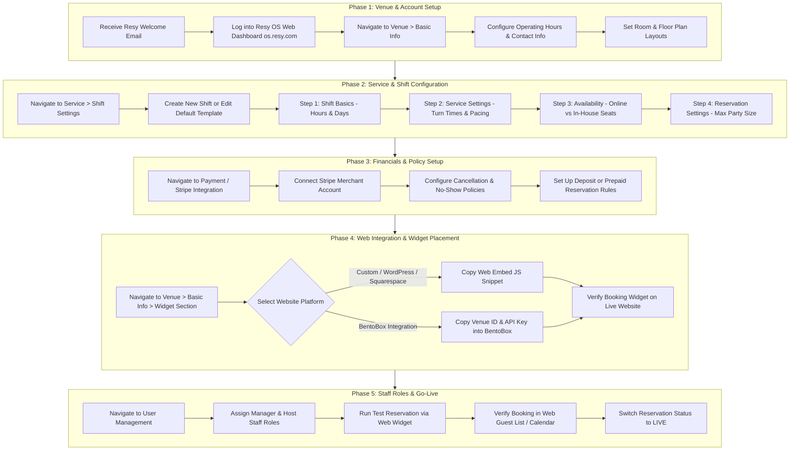

# Resy (American Express) Web Partner Onboarding & Implementation Journey

This document details the complete end-to-end onboarding and implementation journey for a restaurant partner using the **Resy Web Dashboard (Resy OS Web Interface)**.

---

## 1. Onboarding Lifecycle Overview

The Resy Web Partner Onboarding Lifecycle is structured into five sequential phases:

```
[Phase 1: Account Activation & Venue Setup] 
       ↓
[Phase 2: Service & Shift Configuration] 
       ↓
[Phase 3: Cancellation Policies & Payments] 
       ↓
[Phase 4: Web Widget & Channel Integration] 
       ↓
[Phase 5: Staff Permissions & Go-Live]
```

---

## 2. End-to-End Implementation Flowchart (Mermaid)



---

## 3. Step-by-Step Implementation Schemas (YAML)

### Phase 1: Venue Profile & Layout Setup

```yaml
phase: "Phase 1: Venue Profile & Layout Setup"
interface: "Resy OS Web Dashboard (os.resy.com)"
target_role: "Restaurant Owner / Operations Manager"
steps:
  - step_id: "P1_01"
    title: "Account Login & Initial Verification"
    navigation_path: "https://os.resy.com/ > Login"
    prerequisites:
      - "Completed Resy Partnership Agreement"
      - "Admin Welcome Email received"
    inputs_required:
      - field_name: "Admin Email"
        type: "string"
        required: true
      - field_name: "Temporary Password"
        type: "string"
        required: true
    actions:
      - "Authenticate into the Web Dashboard."
      - "Set up a new secure administrator password."
    outputs:
      - "Authenticated Admin Session"

  - step_id: "P1_02"
    title: "Configure Venue Basic Info"
    navigation_path: "Resy OS Web Dashboard > Venue > Basic Info"
    prerequisites:
      - "P1_01"
    inputs_required:
      - field_name: "Restaurant Display Name"
        type: "string"
        required: true
      - field_name: "Primary Phone Number"
        type: "string"
        required: true
      - field_name: "Physical Address"
        type: "string"
        required: true
      - field_name: "Cuisine Category"
        type: "array"
        required: true
      - field_name: "High-Res Photography & Logo"
        type: "image_files"
        required: true
    actions:
      - "Fill in venue profile details and public description."
      - "Upload branding assets for guest-facing Resy portal."
    outputs:
      - "Live Venue Profile Page on Resy Marketplace"

  - step_id: "P1_03"
    title: "Configure Dining Rooms & Floor Plans"
    navigation_path: "Resy OS Web Dashboard > Service > Service Settings > Floor Plans"
    prerequisites:
      - "P1_02"
    inputs_required:
      - field_name: "Room Names (e.g., Main Dining, Patio, Bar)"
        type: "string"
        required: true
      - field_name: "Table Numbers & Capacities"
        type: "object"
        required: true
      - field_name: "Combinable Table Groups"
        type: "array"
        required: false
    actions:
      - "Define dining rooms and active seating areas."
      - "Input min/max covers per table."
      - "Configure table combination rules."
    outputs:
      - "Configured Digital Floor Plan Matrix"
```

---

### Phase 2: Service & Shift Management

```yaml
phase: "Phase 2: Service & Shift Management"
interface: "Resy OS Web Dashboard (os.resy.com)"
target_role: "General Manager / Head Host"
steps:
  - step_id: "P2_01"
    title: "Create Base Shift Schedule"
    navigation_path: "Resy OS Web Dashboard > Service > Shift Settings > New Shift"
    prerequisites:
      - "P1_03"
    inputs_required:
      - field_name: "Shift Name (e.g., Dinner Default)"
        type: "string"
        required: true
      - field_name: "Days Active"
        type: "array"
        required: true
      - field_name: "Start and End Times"
        type: "time_range"
        required: true
    actions:
      - "Click 'New Shift'."
      - "Step 1 (Shift Basics): Define operating hours and recurring days."
    outputs:
      - "Base Shift Shell"

  - step_id: "P2_02"
    title: "Configure Service Settings (Pacing & Turn Times)"
    navigation_path: "Resy OS Web Dashboard > Service > Shift Settings > Step 2: Service Settings"
    prerequisites:
      - "P2_01"
    inputs_required:
      - field_name: "Global Pacing (Covers / 15-min interval)"
        type: "integer"
        required: true
      - field_name: "Pacing by Room / Floor Plan"
        type: "object"
        required: false
      - field_name: "Turn Time Matrix (by Party Size)"
        type: "map"
        required: true
    actions:
      - "Set maximum seating pacing per 15-minute slot to prevent kitchen bottlenecks."
      - "Define turn times based on party size (e.g., 2 covers = 90 mins, 4 covers = 120 mins)."
    outputs:
      - "Automated Pacing & Duration Rules"

  - step_id: "P2_03"
    title: "Availability & Channel Allocation"
    navigation_path: "Resy OS Web Dashboard > Service > Shift Settings > Step 3: Availability"
    prerequisites:
      - "P2_02"
    inputs_required:
      - field_name: "Online Table Inventory"
        type: "array"
        required: true
      - field_name: "In-House / Walk-In Table Inventory"
        type: "array"
        required: true
      - field_name: "Reservation Release Lead Time (e.g., 30 days in advance)"
        type: "integer"
        required: true
    actions:
      - "Assign specific tables/rooms for online web booking vs internal hold."
      - "Set automated reservation window release rules."
    outputs:
      - "Inventory Distribution Matrix"
```

---

### Phase 3: Financials & Policy Configuration

```yaml
phase: "Phase 3: Financials & Policy Configuration"
interface: "Resy OS Web Dashboard (os.resy.com)"
target_role: "Finance Director / Owner"
steps:
  - step_id: "P3_01"
    title: "Connect Stripe Merchant Account"
    navigation_path: "Resy OS Web Dashboard > Integration > Payment Gateway"
    prerequisites:
      - "P1_01"
    inputs_required:
      - field_name: "Stripe Credentials / Merchant ID"
        type: "string"
        required: true
    actions:
      - "Authorize Resy OS to process credit card authorizations and cancellation charges."
    outputs:
      - "Verified Payment Gateway Connection"

  - step_id: "P3_02"
    title: "Configure Cancellation & No-Show Policies"
    navigation_path: "Resy OS Web Dashboard > Service > Shift Settings > Step 4: Reservation Settings"
    prerequisites:
      - "P3_01"
      - "P2_03"
    inputs_required:
      - field_name: "Cancellation Cut-off Window (e.g., 24 hours prior)"
        type: "integer"
        required: true
      - field_name: "Per-Person Cancellation Fee Amount"
        type: "currency"
        required: false
      - field_name: "Large Party Threshold & Rules"
        type: "object"
        required: false
    actions:
      - "Set policy terms shown to guests during online booking."
      - "Configure auto credit-card capture rules for party sizes meeting criteria."
    outputs:
      - "Active Cancellation & Guarantee Policy"
```

---

### Phase 4: Web Widget & Channel Integration

```yaml
phase: "Phase 4: Web Widget & Channel Integration"
interface: "Resy OS Web Dashboard (os.resy.com) + Partner Website CMS"
target_role: "Webmaster / Marketing Manager"
steps:
  - step_id: "P4_01"
    title: "Retrieve Booking Widget Embed Code"
    navigation_path: "Resy OS Web Dashboard > Venue > Basic Info > Widget Section"
    prerequisites:
      - "P1_02"
    inputs_required:
      - field_name: "Website Domain URL"
        type: "string"
        required: true
    actions:
      - "Locate unique Resy Widget JS Snippet."
      - "Copy API Key and Venue ID for third-party CMS integrations."
    outputs:
      - "Resy Web Widget JavaScript Code Snippet"

  - step_id: "P4_02"
    title: "Embed Widget on Restaurant Website"
    navigation_path: "Partner CMS (WordPress, Squarespace, BentoBox, Custom HTML)"
    prerequisites:
      - "P4_01"
    inputs_required:
      - field_name: "CMS HTML / Embed Block"
        type: "code"
        required: true
    actions:
      - "Paste the Resy JS snippet before the closing `</body>` tag or in an HTML Block."
      - "For BentoBox: Enter Venue ID & API Key into Integrations tab."
    outputs:
      - "Functional 'Book Now' Resy Widget on Partner Web Domain"

  - step_id: "P4_03"
    title: "Verify Booking Flow & Analytics Tracking"
    navigation_path: "Partner Website (Front-End)"
    prerequisites:
      - "P4_02"
    inputs_required: None
    actions:
      - "Trigger the web widget on desktop and mobile browsers."
      - "Confirm seamless overlay rendering without popup blocker conflicts."
    outputs:
      - "Validated Web Booking Interface"
```

---

### Phase 5: User Management & Go-Live Verification

```yaml
phase: "Phase 5: User Management & Go-Live Verification"
interface: "Resy OS Web Dashboard (os.resy.com)"
target_role: "Restaurant Owner"
steps:
  - step_id: "P5_01"
    title: "Staff Permission & Role Provisioning"
    navigation_path: "Resy OS Web Dashboard > User Management > Invites"
    prerequisites:
      - "P1_01"
    inputs_required:
      - field_name: "Staff Email Addresses"
        type: "array"
        required: true
      - field_name: "Assigned Role (Admin, Manager, Host)"
        type: "enum"
        required: true
    actions:
      - "Send web portal access invites to operations team members."
      - "Define permission bounds for shift editing vs view-only access."
    outputs:
      - "Provisioned Restaurant Team Accounts"

  - step_id: "P5_02"
    title: "End-to-End Go-Live Verification"
    navigation_path: "Resy OS Web Dashboard > Service > Calendar"
    prerequisites:
      - "P2_03"
      - "P4_03"
      - "P5_01"
    inputs_required: None
    actions:
      - "Place a test reservation via the embedded web widget."
      - "Verify real-time reflection of test reservation in the Web Dashboard Calendar & Guest List."
      - "Cancel test reservation and verify refund/email notification trigger."
      - "Toggle Venue Status to LIVE."
    outputs:
      - "Fully Operational Live Resy Restaurant Partner"
```

---

## 4. Key Implementation Constraints & Rules (Web Dashboard Specific)

1. **Browser Compatibility**: Resy OS Web Dashboard is optimized for Google Chrome. Firefox and Safari are supported for basic management, but shift building is best performed on Chrome.
2. **Pacing Rules**: Pacing limits set in the web dashboard strictly govern the total number of covers accepted per 15-minute window across both online widgets and third-party booking channels.
3. **Cancellation Fee Processing**: Credit card authorization is captured via the web widget, but actual fee enforcement/charging must be explicitly triggered by staff if a guest no-shows.
