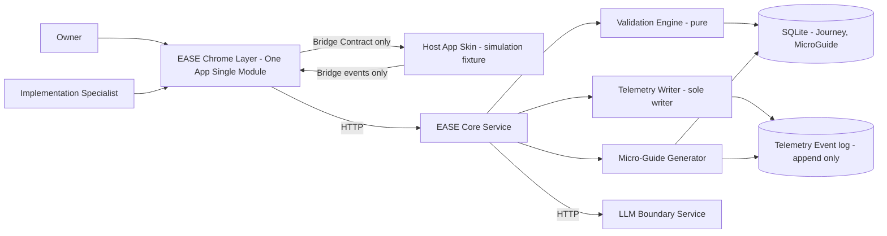
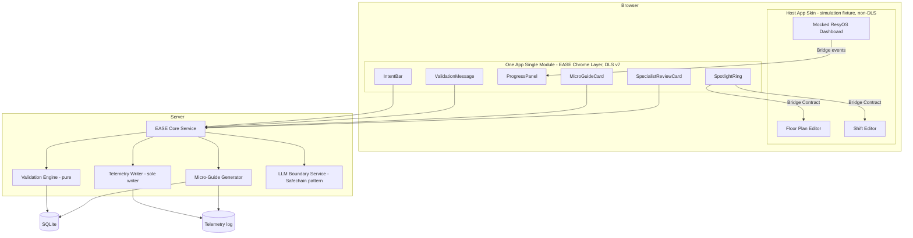
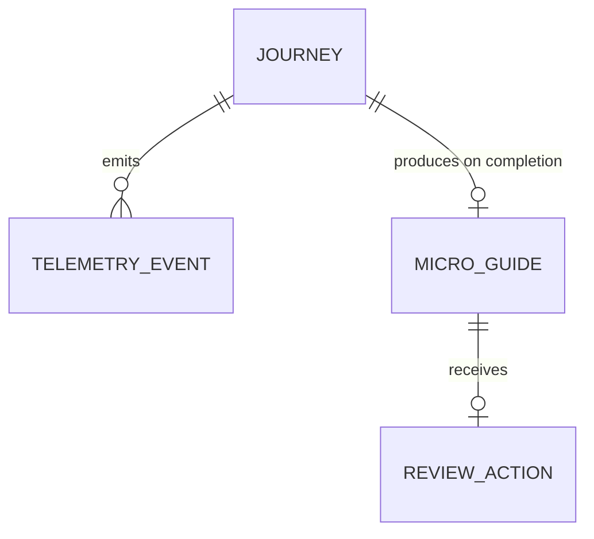

# Architecture Spine — EASE GrowthHack 2026 MVP

## Design Paradigm

**Layered guided-execution overlay over a simulated host application.** Three separately-owned parts, each with a single owner and one documented contract between them:

- **Host App Skin** — a *simulation fixture*: a mocked ResyOS Dashboard standing in for a third-party partner product EASE guides a user through. It is stage scenery, not an AmEx UI deliverable (see AD-2 and the Exception Register).
- **EASE Chrome Layer** — the actual AmEx-built product surface: Intent Bar, Spotlight Ring, Progress Panel, Validation Message, Micro-Guide, Specialist Review. A One App Single Module, strictly DLS v7.
- **EASE Core Service** — the non-visual brain: deterministic validation, telemetry, Micro-Guide generation, Specialist Review state. Plus a separately-deployed **LLM Boundary Service** holding the only two model call sites.

The Chrome Layer never reaches into Host App Skin internals; it observes and points at it through one versioned **Bridge Contract** (AD-10). This is the code-level enforcement of the two-layer brand split `DESIGN.md`/`EXPERIENCE.md` mandate visually.

## Inherited Invariants

| Inherited | From parent | Binds here |
| --- | --- | --- |
| Two-layer brand model (Host App Skin vs EASE Chrome Layer) | `DESIGN.md` §Brand & Style | AD-1, AD-2 |
| EASE Chrome Layer strictly DLS v7; Host App Skin deliberately non-DLS | `DESIGN.md` §Colors/Components | AD-2, AD-9, Exception Register |
| LLM never decides completion; validation is deterministic | `prd.md` §10 Constraints and Guardrails | AD-3, AD-4 |
| Web-only, single surface, Steps 1–6 (Step 7 excluded) | `prd.md` §6.2; `EXPERIENCE.md` Foundation | Scope, AD-8 |
| No real external system integration (Resy/Toast/Salesforce) | `prd.md` §5 Non-Goals | AD-8 |
| WCAG 2.2 AA floor for all EASE-authored chrome | `EXPERIENCE.md` §Accessibility Floor | AD-11 |
| GrowthHack-supported models only; capabilities Redaction/Substitution/Safechain/Local Memory | `prd.md` §10 | AD-3, Stack |

## Invariants & Rules



### AD-1 — Three-part code boundary `[ADOPTED]`

- **Binds:** all Host App Skin, EASE Chrome Layer, and EASE Core Service code.
- **Prevents:** shared components, shared stylesheets, or direct imports across the parts — the drift that would blur the brand split and let one team's refactor break another's.
- **Rule:** Host App Skin and EASE Chrome Layer share no build, no package, and no import. Their only contact is the Bridge Contract (AD-10). The Chrome Layer holds no validation logic and no direct datastore access — it reaches the Core Service over HTTP only.

### AD-2 — Host App Skin is a simulation fixture, reusing the existing prototype

- **Binds:** Host App Skin implementation; resolves `prd.md` §8 Open Question #2.
- **Prevents:** rebuilding a working mocked dashboard under a two-day clock; treating the empty `prototype/` Next.js stub as usable code; and — critically — anyone reading the non-DLS Host App Skin as an AmEx UI surface that violated the DLS ADR.
- **Rule:** `prototype/walkthrough-assistant/` is retained as the Host App Skin and **extended** (it does not yet mock all six Steps' screens — Floor Plan Settings, table config, combinations, Shift activation — so expect real additions, not a frozen copy). It is labelled in-repo as a third-party simulation fixture, is never shipped as an AmEx user-facing surface, and imports no DLS package. Any new EASE-authored UI goes in the Chrome Layer instead. The root `prototype/package.json` Next.js stub is superseded and deleted.

### AD-3 — LLM confined to one isolated advisory service `[ADR-grounded]`

- **Binds:** FR-1 (intent → Journey), FR-2 (screen state → Step).
- **Prevents:** scattered inline model calls; the LLM ever being consulted for completion; and the "two things both claim to know the current Step" clash between inference and validation.
- **Rule:** both call sites live in one stateless **LLM Boundary Service** (Safechain-pattern per the AI/ML ADR: real-time, OLTP-shaped, code-based GenAI microservice — not AIDA's batch/no-code shape). No other component imports a model SDK. Its output is **advisory only**: where LLM-inferred Step and validation-derived Step disagree, **validation wins** (AD-4). Model choice and credentials come from config, never from code. The service must answer within a fixed timeout and has a deterministic fallback (AD-12) so an unavailable model degrades the demo rather than stopping it. FR-1's non-match path is part of this service's contract: an intent that does not resolve to the Hero Journey returns an explicit `not_supported` result, never a low-confidence guess.

### AD-4 — Validation is a pure, deterministic engine and the sole owner of Journey state `[ADOPTED]`

- **Binds:** FR-2, FR-4, FR-5, FR-6, FR-7, FR-8.
- **Prevents:** validation logic leaking into prompts; the UI optimistically advancing a Step the engine hasn't cleared; and two components disagreeing about which Step is current.
- **Rule:** every Validation Checkpoint is a pure function over Host App Skin state plus Journey state — no network call, no model inference, runnable in a unit test with no LLM present. The engine is the **only** writer of Journey/Step state; the Chrome Layer renders the Step the engine reports and never derives its own. FR-7 requires two independently-checkable conditions — *plan saved* and *plan selected in a Shift such that its tables are visible under Shift Availability* — and the Journey is not complete until both pass.

### AD-5 — Two stores, one journey identity `[ADR-grounded]`

- **Binds:** FR-4, FR-7, FR-9, FR-10, FR-11.
- **Prevents:** forcing one store shape onto two different consistency needs; and the Micro-Guide Generator being unable to join a run's relational record to its event stream because the two sides minted different IDs.
- **Rule:** per the Database ADR's type-selection guidance — Journey and Micro-Guide records are **relational** (ACID; workflow correctness); Telemetry Events are an **append-only, schema-flexible log**. `journey_id` is minted exactly once, by the Core Service, when a Journey run starts, and is carried into every write on both sides; no component generates its own. The Generator joins on `journey_id` and orders by event `sequence` (a monotonic per-run counter, not wall-clock time, so same-millisecond events stay ordered). The Generator runs only after the run's event log is flushed and the relational record is committed — a run whose two sides disagree is reported as a failed generation, never silently half-rendered.

### AD-6 — One telemetry writer, OTel-shaped events

- **Binds:** FR-9.
- **Prevents:** the same logical occurrence being emitted twice (once by a UI component, once by the engine) or zero times; and a demo-only event schema that would need a rewrite to feed real observability.
- **Rule:** the Core Service's Telemetry Writer is the **sole** emitter — Chrome Layer components never write events directly, they report user actions to the Core Service which decides what to emit. Every event carries `timestamp` (ISO 8601 UTC), `sequence` (monotonic per run), `event_type` (exactly one of the PRD §4.5 eight types), `journey_id`, `step` (1–6 or null), and an `attributes` map. This shape is OpenTelemetry-log-semantics compatible without adopting the OTel SDK; ELF/OTel wiring itself is a documented demo-scope exception (see Exception Register).

### AD-7 — Build vs buy boundary `[ADR-grounded, informal]`

- **Binds:** all components.
- **Prevents:** re-implementing commodity capability, and inversely outsourcing the differentiated IP to a generic tool.
- **Rule:** **Bought/reused** — One App, DLS v7, the GrowthHack-supplied LLM API, SQLite, and the existing prototype fixture. **Built** — the Journey model, the deterministic Validation Checkpoints, the Bridge Contract, the Telemetry Event schema, the Micro-Guide generator, and the Specialist Review workflow. Anything not on the "built" list defaults to reuse. (The BvB Guidebook's formal process triggers at >$500K spend / Enterprise Top Priority / Critical inherent risk — none apply at this scale, so the scorecard's *spirit* is applied without the submission.)

### AD-8 — Closed system boundary `[ADOPTED]`

- **Binds:** all components.
- **Prevents:** scope creep into real Resy/Toast/Salesforce/POS integration, and any component assuming a second real system exists to validate against.
- **Rule:** the Host App Skin, its seed data, and the LLM Boundary Service's model endpoint are the entire system boundary. No outbound call to a real partner or enterprise system anywhere in the codebase. Step 7 (Single Day Edit), Assigned Seating Events, multi-plan Shift activation, and cross-system table-name matching are modelled nowhere.

### AD-9 — EASE Chrome Layer is a One App Single Module `[ADR-grounded]`

- **Binds:** all EASE Chrome Layer code; the frontend Stack rows.
- **Prevents:** the frontend diverging from the enterprise-prescribed web platform, and a Chrome Layer built as a standalone SPA that cannot be lifted toward production without a rewrite.
- **Rule:** the Chrome Layer is built as a **One App Holocron module** in Single Module configuration — the arrangement the One App ADR explicitly sanctions for small applications — not as a standalone Next.js/CRA/Vite app. Routing uses `holocron-module-route`; shared state uses `one-app-ducks` (Redux); the module is served by `one-app-runner` in development. Because One App is the frontend server, **no HTTP API is implemented inside the module** — all server work lives in the EASE Core Service (AD-1). This is the primary conformance answer to the judging criterion "is the hack feasible for Production Rollout / does it adhere to Amex control and compliance requirements."

### AD-10 — One versioned Bridge Contract

- **Binds:** FR-2, FR-3; every Host App Skin ↔ EASE Chrome Layer interaction.
- **Prevents:** the highest-risk divergence in this build — two developers inventing two selector conventions or two event vocabularies while both technically "obeying" the layer split; and a Spotlight Ring silently pointing at nothing after the fixture's markup changes.
- **Rule:** one file is the single source of truth for the contract: a **versioned selector map** (Step → stable `data-ease-*` attribute, never a CSS class or DOM path) plus a **closed event vocabulary** (a fixed enum of event names with typed payloads). The Host App Skin owns *adding* `data-ease-*` attributes; the Chrome Layer owns the map. Both sides validate the contract **at startup** and fail loudly — a missing selector or an unknown event name is a hard error, never a silent no-op. The Chrome Layer observes only: it never intercepts, blocks, or synthesises a click on a host control (`EXPERIENCE.md` — the owner acts on the real control underneath), and the ring re-anchors on scroll and resize.

### AD-11 — Accessibility is an architectural invariant, not a styling detail `[ADR-grounded]`

- **Binds:** all EASE Chrome Layer components; `EXPERIENCE.md` §Accessibility Floor.
- **Prevents:** WCAG 2.2 AA being assumed to come free with DLS and therefore never verified — particularly at the one place DLS cannot guarantee it, where EASE chrome is drawn over non-DLS host colours.
- **Rule:** Chrome Layer UI is composed from DLS v7 components; hand-rolled interactive elements and custom CSS are not permitted where a DLS component or documented utility exists. Two obligations do not inherit from DLS and are owned by the Chrome Layer: the Spotlight Ring must hold **≥3:1 contrast** against every Host App Skin background it is drawn over (`DESIGN.md` §Colors), and the Spotlight Ring must not remove, hide, or relabel the underlying host control's native focus order or accessible name. Every validation state is conveyed by text as well as colour (also FR-8).

### AD-12 — One error envelope; every failure degrades rather than stops

- **Binds:** FR-8; all cross-process calls.
- **Prevents:** each workstream inventing its own error shape, and an unavailable model or failed write killing a live demo.
- **Rule:** every failure crossing a boundary uses one envelope — `{ code, message, step?, field? }` — where `message` is user-safe and names the specific field or state at issue (never "something went wrong"). Three failures have mandated behaviour: an LLM Boundary timeout falls back to the last validation-derived Step and a plain "tell me what you'd like to do" prompt rather than blocking; a telemetry write failure is logged and the Journey continues (telemetry is never on the critical path); a relational write failure blocks the Step and surfaces the envelope.

### AD-13 — The validation layer is testable without the UI or the model

- **Binds:** SM-1, SM-2 (`prd.md` §7); FR-1, FR-5, FR-6, FR-7.
- **Prevents:** correctness that can only be checked by clicking through the demo — the exact fragility that makes a rehearsal-day regression invisible until it happens on stage.
- **Rule:** Validation Checkpoints ship with unit tests that run headless, with no browser and no LLM. FR-1's acceptance bound is a committed fixture: a named set of **at least 8** intent paraphrasings that must all resolve to the Hero Journey, plus at least one out-of-scope intent that must return `not_supported`. A rehearsal run that changes validation behaviour without updating these fixtures is a broken build.

## Consistency Conventions

| Concern | Convention |
| --- | --- |
| Naming (entities, files, interfaces, events) | PRD Glossary terms verbatim in identifiers: `Journey`, `Step`, `ValidationCheckpoint`, `TelemetryEvent`, `MicroGuide`, `SaveVsActivateGap`, `Intent`. Component names match the UX spines exactly: `IntentBar`, `SpotlightRing`, `ProgressPanel`, `ValidationMessage`, `MicroGuideCard`, `SpecialistReviewCard`. Host App Skin hooks follow the pattern `data-ease-step-N-CONTROL` (for example `data-ease-step-5-save-plan`). |
| Data & formats | IDs: UUIDv4, minted only by the Core Service (AD-5). Dates: ISO 8601 UTC everywhere. Event ordering: monotonic per-run `sequence`, not wall-clock. Error envelope: `{ code, message, step?, field? }` (AD-12). Telemetry envelope: one flat JSON object per line, no batching. |
| State & cross-cutting | Journey/Step state mutated only by the Validation Engine (AD-4). Micro-Guide state machine is exactly `pending_review → approved \| rejected`; `rejected` discards the candidate and leaves any previously `approved` guide canonical, with no automatic retry; a re-run of the Journey reflects the currently canonical guide (FR-11). Chrome Layer state uses `one-app-ducks`; no second state library. Config (model choice, credentials, service URLs) lives in one env module — swapping the supplied model is a config change, not a code change. No auth flow is modelled (already-authenticated entry state per `prd.md` §2.3). |

## Stack

| Name | Version |
| --- | --- |
| One App | 6.12.1 (public OSS release; **confirm the internal build** — the internal registry may carry a newer one) |
| `@americanexpress/one-app-runner` | ^6.19.0 |
| `holocron` / `holocron-module-route` | ^1.10.3 |
| `@americanexpress/one-app-ducks` | ^4.5.1 |
| `@americanexpress/dls-react` | ^7.15.0 (internal registry; matches the vendored design-system skill) |
| React | whatever the pinned One App build requires — not independently chosen (One App owns this peer) |
| Node.js | 18.20.x — pinned to what One App targets; also the version already installed on the build machine |
| Host App Skin runtime | Vanilla HTML/CSS/JS, zero dependencies (existing `prototype/walkthrough-assistant/`, extended per AD-2) |
| EASE Core Service | Node 18 + Fastify (or Express) — a plain HTTP service, no framework ceremony |
| Relational store | SQLite via `better-sqlite3` ^11.10.0 — **pinned to v11 deliberately**: v12+ requires Node 20+, v13+ requires Node 22+, neither of which One App targets |
| Telemetry Event log | JSON Lines file, append-only, local filesystem |
| LLM Boundary Service | GrowthHack-supplied model, selected at config time from the supported set — Azure GPT 5.2, Gemini-3.1-flash-lite (closed source) or LLAMA 3.2/3.3 (open source); credentials issued 2 days before the event |
| LLM Boundary Service runtime | `[ASSUMPTION]` Python + FastAPI, matching the AI/ML ADR's Safechain reference implementation. Fallback: Node, if Team EASE's AI-Intent workstream is already building in Node — AD-3's invariant is the service's *separateness*, not its language. Confirm with Yashwant before Build starts. |

## Structural Seed





```text
prototype/
  walkthrough-assistant/      # Host App Skin — simulation fixture (AD-2)
    index.html                #   + data-ease-* hooks per the Bridge Contract
    css/  js/
  ease-chrome/                # EASE Chrome Layer — One App Single Module (AD-9)
    src/
      components/             #   IntentBar, SpotlightRing, ProgressPanel,
                              #   ValidationMessage, MicroGuideCard, SpecialistReviewCard
      bridge/                 #   selector map + event vocabulary — the contract (AD-10)
      ducks/                  #   one-app-ducks state
      index.js                #   Holocron module entry
    package.json              #   "one-amex" runner/bundler config
  ease-core/                  # EASE Core Service (AD-1)
    validation/               #   pure Validation Checkpoints + their headless tests (AD-4, AD-13)
    telemetry/                #   sole Telemetry Writer (AD-6)
    guide-generator/          #   Micro-Guide generation (AD-5)
    db/schema.sql             #   journeys, micro_guides
  ease-llm-boundary/          # LLM Boundary Service (AD-3) — Safechain pattern
```

**Deployment & environments.** The MVP runs entirely on the presenting laptop for the September 23–24 demo: `one-app-runner` serves the Chrome Layer, the Host App Skin is served as static files, and the Core and LLM Boundary services run locally alongside. There is no cloud environment, no CI/CD, and no environment promotion path in scope. The single external dependency at demo time is the GrowthHack model endpoint — AD-12's fallback exists precisely so a network failure on stage degrades the demo instead of ending it. A rehearsal must be run end-to-end on the actual presenting machine, not only on a developer's.

## ADR Conformance & Exception Register

Every deviation from a prescriptive AmEx ADR, stated openly. None is a silent departure; each is either conformant, or a scoped demo-only exception with the production path named.

| ADR | Status | Position |
| --- | --- | --- |
| One App (Web based experiences) | **Conforms** (AD-9) | Chrome Layer is a One App Single Module, the arrangement the ADR sanctions for small apps. No exemption needed. |
| Design Language System | **Conforms with scoped exception** (AD-2, AD-11) | All AmEx-built UI is DLS v7. The non-DLS surface is a *simulation fixture* representing a third-party partner product — not an AmEx application surface — so the ADR's scope does not reach it. It ships no DLS dependency and is never presented as an Amex experience. If a reviewer holds that the fixture is in scope, the mitigation is the EARB exception path, not a change of design. |
| AI/ML | **Conforms in pattern; implementation assumption open** (AD-3) | Real-time OLTP GenAI microservice per the ADR's Safechain prescription; AIDA's batch/no-code shape explicitly rejected. Whether the reference Safechain Framework itself is adopted depends on hackathon access — tracked as the Stack `[ASSUMPTION]`. |
| Database | **Conforms in type selection; platform is a demo fixture** (AD-5) | The ADR prescribes *type* before platform: relational for workflow state, append-only log for events — both followed. SQLite and JSON Lines are demo fixtures chosen for zero-setup, not enterprise platform decisions; a production build re-runs the ADR's drivers to pick real platforms. |
| Application Observability | **Scoped demo-only exception** (AD-6) | ELF is the enterprise default. This demo emits local structured JSON instead, because there is no deployed environment to observe. The exception is bounded by keeping every event OTel-log-semantics compatible, so production wiring to ELF is configuration, not a schema rewrite. A production build must raise the EA Playbook ADR the observability ADR calls for. |
| API & Integration Platforms | **Not applicable at this scale** | The Core and LLM Boundary services are loopback-only processes on one laptop, not exposed or enterprise-consumed APIs, so no gateway pattern applies. If either is ever exposed beyond the demo machine, it must be re-classified against this ADR first. |
| Event Brokers & Messaging | **Not applicable** | The Bridge event bus is in-browser and the telemetry log is a local append-only file. Neither is inter-service messaging, which is what the ADR governs. |
| Build vs Buy | **Conforms** (AD-7) | Below all three formal triggers (>$500K spend, Enterprise Top Priority, Critical inherent risk); the scorecard's reasoning is applied without a submission. |

## Capability → Architecture Map

| Capability | Lives in | Governed by |
| --- | --- | --- |
| FR-1 Intent → Journey (incl. `not_supported`) | `ease-llm-boundary/` | AD-3, AD-13 |
| FR-2 Screen state → Step (advisory) | `ease-llm-boundary/` + `ease-core/validation/` | AD-3, AD-4 |
| FR-3 Highlight next control | `ease-chrome/components/SpotlightRing`, `ease-chrome/bridge/` | AD-10, AD-11 |
| FR-4 Progress panel | `ease-chrome/components/ProgressPanel` | AD-4, Conventions |
| FR-5, FR-6, FR-7 Validation Checkpoints | `ease-core/validation/` | AD-4, AD-13 |
| FR-8 Actionable recovery messages | `ease-core/validation/` + `ValidationMessage` | AD-12, AD-11 |
| FR-9 Telemetry Events | `ease-core/telemetry/` | AD-5, AD-6 |
| FR-10 Micro-Guide generation | `ease-core/guide-generator/` | AD-5 |
| FR-11 Specialist Review | `SpecialistReviewCard` + `micro_guides` table | AD-5, Conventions |
| UJ-1 Owner builds/activates floor plan | Fixture + Chrome + Core, end to end | AD-1 – AD-4, AD-10 |
| UJ-2 Specialist reviews guide | Chrome Layer review route + Core | AD-5, AD-9 |
| WCAG 2.2 AA floor | All Chrome Layer components | AD-11 |
| SM-1, SM-2 validation accuracy | `ease-core/validation/` headless tests | AD-13 |

## Deferred

- **LLM Boundary Service language** — Python/FastAPI assumed (AD-3, Stack). The invariant is the service's separateness, not its language; confirm against the AI-Intent workstream's actual progress at Build kickoff.
- **Production observability (ELF/OTel), production database platform, and any EA Playbook exception ADRs** — all named in the Exception Register with their production paths; none can cause two MVP units to diverge, so all wait.
- **Deployment beyond the presenting laptop** — no cloud, CI/CD, or promotion path in MVP scope. Revisit only if the team decides to host a persistent demo link before judging.
- **Authentication and authorisation** — not modelled; the Specialist Review surface is reachable without a role check in the demo. A production build needs a real role boundary between owner and Implementation Specialist.
- **Micro-Guide versioning, multi-run history, and comparison** — single-run generation only (FR-10 Out of Scope); the full EASE Studio workflow is out of scope.
- **Step 7 (Single Day Edit), Assigned Seating Events, multi-plan Shift activation, iPad/native surface, POS table-name matching** — out of scope per PRD/UX spines; AD-8 keeps them out of the codebase.
